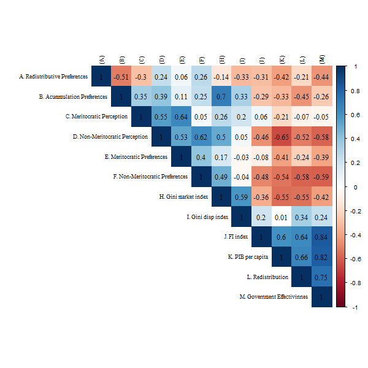
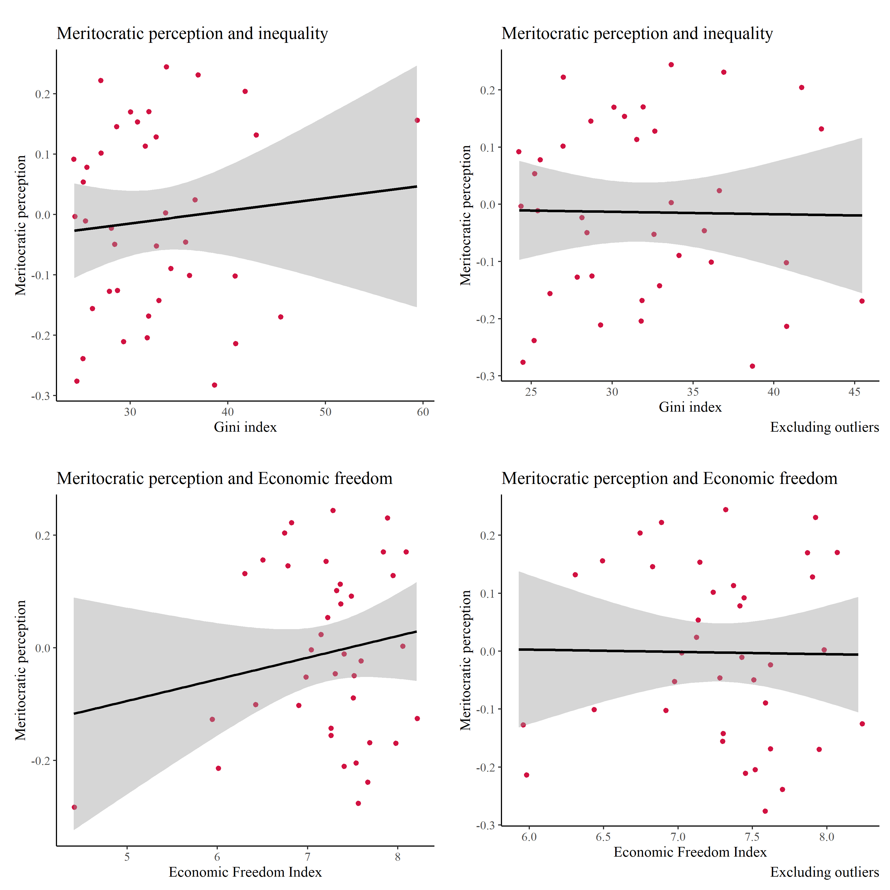
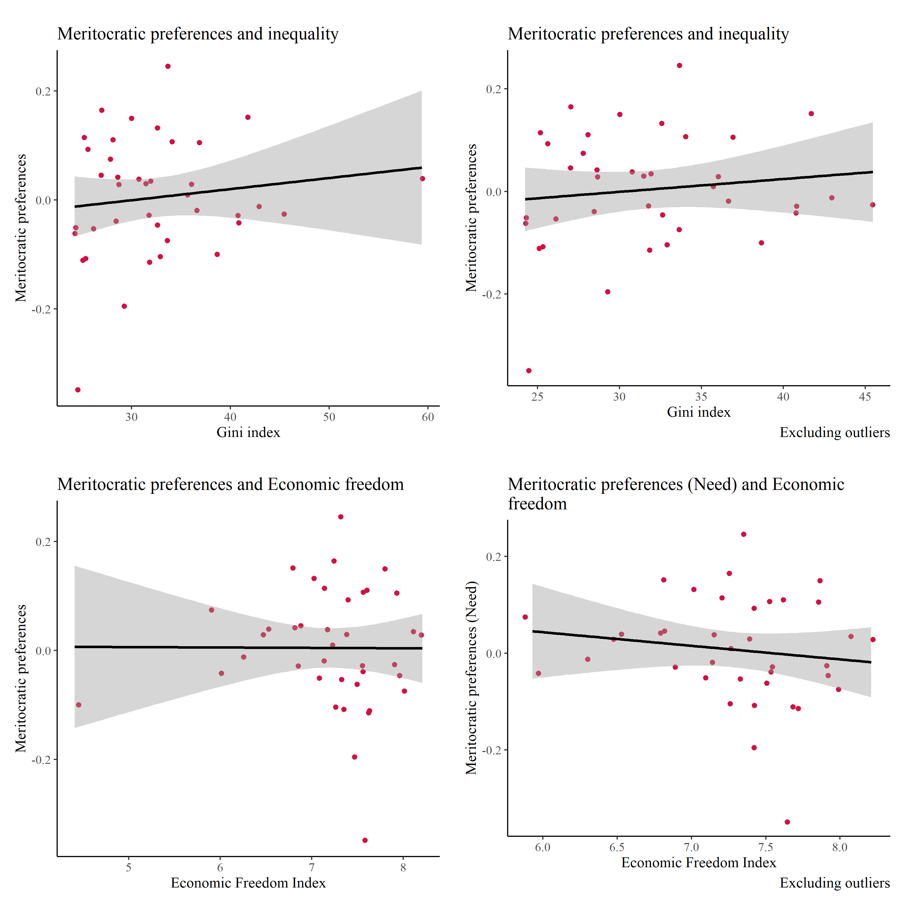
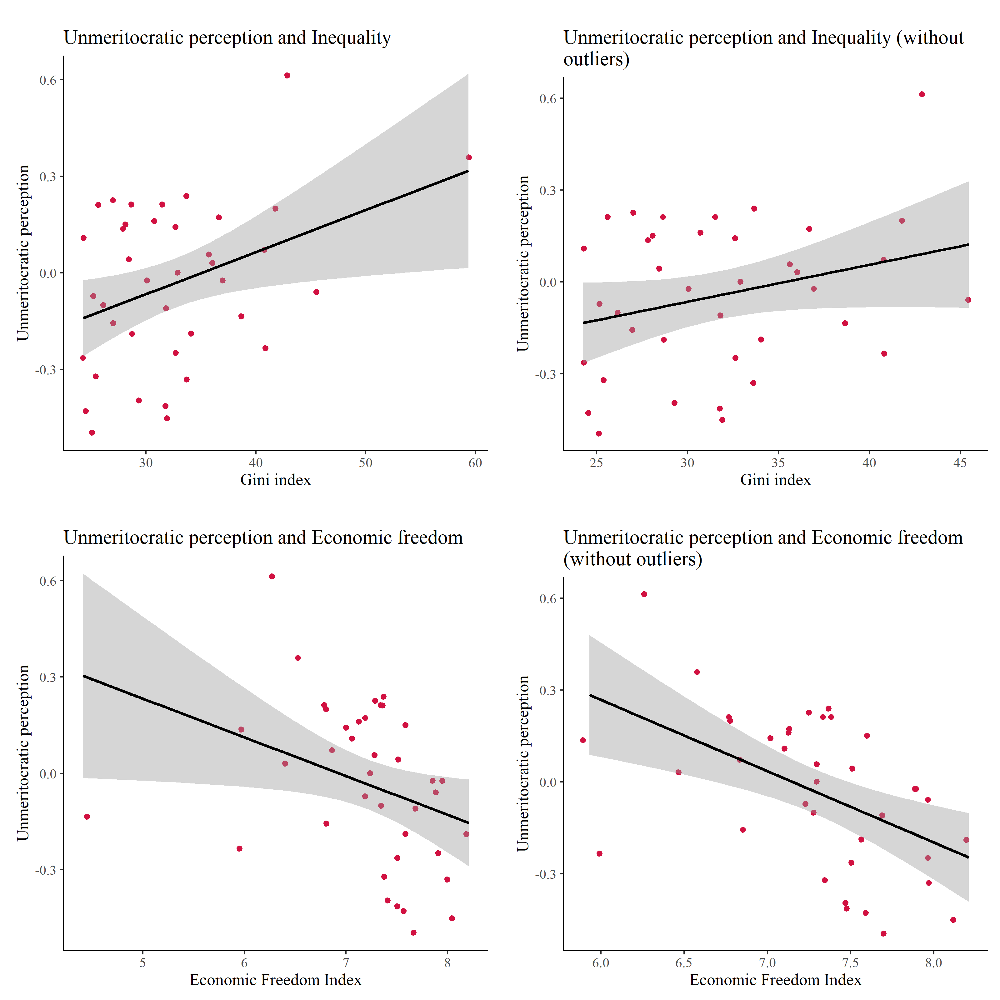

<div style="text-align: justify">

En el presente documento se exponen los análisis realizados a la base de datos creada en data-prep. 

En la primera sección se entregan análisis descriptivos de las principales variables dependientes e independientes.

En la segunda sección se exponen los análisis factoriales a partir de los cuales se imputan valores  para utilizar en la seccion de analisis multinivel. Además, en la segunda sección se incorpora un análisis de invarianza de medida y una ecuación estructural que resume los modelos a testear. 

En la tercera sección se presentan los modelos multinivel que son utilizados para el artículo. Se calcula la correlación intraclase, se evalúan los efectos de las variables nacionales e individuales, para posteriormente evaluar pendientes aleatorias e interacciones entre niveles. 

resultados. 
pese a que la educacion y la sal son formas de redistribucion la gente no lo considera lo mismo.

***

```{r eval=FALSE, include=FALSE}
rmarkdown::render(input = "production/prod_analysis-cfa.rmd",output_format = "html_document"); browseURL(url = "production/prod_analysis-cfa.html")
```

```{r include=FALSE}
knitr::opts_chunk$set(warning = FALSE,message = FALSE, cache = FALSE)
knitr::opts_knit$set(root.dir = "../")
options(scipen=999)
rm(list=ls())
options(knitr.kable.NA = '')
```

**Libraries**
```{r}
library(sjPlot)
library(sjmisc) # several functions,ej read_stata
library(descr)
library(memisc)  # codebook
library(psych) # cor2latex
library(corrplot) # graph correlations
library(lavaan)
library(stargazer) 
library(semTools)
library(plyr) # count
library(dplyr)
library(car) # recode
library(ggplot2)
library(Hmisc)
library(tidyverse)
library(data.table)
library(stringr)
library(countrycode)
library(lme4)
library(texreg)
library(mice)
library(ggrepel) # for scatter labels in sjp.scatter	
library(semPlot)
library(haven)
library(sjlabelled) 
library(kableExtra)
library(ggeffects)
library(influence.ME)
library(lattice)
```

**Load data**

```{r}
load(file = "input/data/proc/redistrib.rda")
load(file = "input/data/proc/mer_pref.rda")
load("input/data/proc/redistrib.rda")
load("input/data/proc/getahead.rda")
load("input/data/proc/detearn.rda")
```

# Descriptives
```{r results='asis'}
# Summary table to latex
sink("output/results/desctab_red.html")
stargazer(redistrib[-c(1, 2)], type = "html")
sink()
```

```{r}
set_theme(base = theme_bw(),
          theme.font = "serif", 
          axis.textsize.x = 1.2,
          axis.textsize.y = 1.2, 
          geom.label.size = 4, 
          legend.just = 0.35, 
          legend.size = 1.2,
          legend.backgroundcol = "white")
```


```{r echo=FALSE}
 # short var labels
items <- c("Gov. reduce income dif.", "Gov. decent unemp.",
           "High income taxes", "Buy better health", 
           "Buy better education") 

# cambiar orden para la leyenda  
labels= c("Strongly agree", "Agree", "Disagree",
          "Strongly disagree", "(neither/nor)" )  ### E
png<-sjPlot::plot_likert((redistrib[3:7]), 
                         axis.labels   = items,
                         legend.labels = labels,
                         legend.pos = "bottom",
                         cat.neutral   = 5, # identifica a indiferentes
                         geom.colors   = c("#9ecae1", "#6baed6", "#4292c6",
                                           "#2171b5"), # colorbrewer2.org
                         sort.frq      = "neg.asc", # sort descending)
                         title         = "Redistributive preferences",
                         intercept.line.color = "white", # vertical middle
                         expand.grid   = F, # no inner margins in plot
                         show.n        = FALSE, # hide N's in axis labels
                         grid.range    = 1.8,
                         geom.size = 0.6, values = "sum.outside") + set_theme(legend.pos  ="bottom",
                                    base = theme_classic(),
                                    theme.font = "serif", 
                                    axis.textsize.x = 1.2,
                                    axis.textsize.y = 1.2, 
                                    geom.label.size = 4, 
                                    legend.just = 0.35,
                                    legend.size = 1.2,  legend.backgroundcol = "white") # expand axis 130% )


ggsave(png,filename = "output/images/plotlikert.png",device = "png", width=15, height=5)
```


 
```{r echo=FALSE}
# short var labels
# cambiar orden para la leyenda  
labels= c("Strongly agree", "Agree", "Disagree", "Strongly disagree", "(neither/nor)" )  ### E

items <- c("Wealthy parents", "Educated parents",
           "Ambition", "Hard work", 
           "Right people", "political contacts") 

png<-sjPlot::plot_likert((getahead[3:8]), 
                        axis.labels   = items,
                        legend.labels = labels,
                        cat.neutral   = 5, # identifica a indiferentes
                        geom.colors   = c("#9ecae1", "#6baed6","#4292c6", 
                                            "#2171b5"), # colorbrewer2.org 
                        sort.frq      = "neg.asc", # sort descending)
                        title         = "Get Ahead scale",
                        intercept.line.color = "white", # vertical middle
                        expand.grid   = F, # no inner margins in plot
                        show.n        = FALSE, # hide N's in axis labels
                        grid.range    = 1.8,
                        geom.size = 0.6, values = "sum.outside") + set_theme(legend.pos  ="bottom",
                                    base = theme_classic(),
                                    theme.font = "serif", 
                                    axis.textsize.x = 1.2,
                                    axis.textsize.y = 1.2, 
                                    geom.label.size = 4, 
                                    legend.just = 0.35,
                                    legend.size = 1.2,  legend.backgroundcol = "white") # expand axis 130% )

# Save
ggsave(png,filename = "output/images/plotlikert_getahead.png",device = "png", width=15, height=5)
```

 


```{r echo=FALSE}
# short var labels
# cambiar orden para la leyenda  
labels= c("Essential", "Very important", "Fairly important",
              "Not very important", "Not important at all" )  ### E

items <- c("have children to support", "have family to support",
           "Education and training", "how well does the job", 
           "how hard works at the job", "how much responsibility goes with the job") 
set_theme(legend.pos  ="bottom") # expand axis 130% )

png<-sjPlot::plot_likert((detearn[3:8]), 
                        axis.labels   = items,
                        legend.labels = labels,
                        cat.neutral = 5,
                        geom.colors   = c("#9ecae1", "#6baed6","#4292c6", "#2171b5"), # colorbrewer2.org 
                        sort.frq      = "neg.asc", # sort descending)
                        title         = "Pay preferences",
                        intercept.line.color = "white", # vertical middle
                        expand.grid   = F, # no inner margins in plot
                        show.n        = FALSE, # hide N's in axis labels
                        grid.range    = 1.8,
                        geom.size = 0.6, values = "sum.outside") + set_theme(legend.pos  ="bottom",
                                    base = theme_classic(),
                                    theme.font = "serif", 
                                    axis.textsize.x = 1.2,
                                    axis.textsize.y = 1.2, 
                                    geom.label.size = 4, 
                                    legend.just = 0.35,
                                    legend.size = 1.2,  legend.backgroundcol = "white") # expand axis 130% )


# Save
ggsave(png,filename = "output/images/plotlikert_detearn.png",device = "png", width=15, height=5)
```

 

# Measurement models {.tabset .tabset-fade .tabset-pills}

```{r}
# 4.1 Merge objects --------------------- ---- 
load("input/data/proc/redistrib.rda")
load("input/data/proc/getahead.rda")
load("input/data/proc/detearn.rda")

aux1 <- merge(getahead, redistrib, by = c("id", "v5"))
merit_redist = merge(aux1, detearn, by = c("id", "v5"))
```

## Redistributive preferences.

```{r, cache=TRUE}
cfa_red1 <- '
	# latent variables
	redist =~ income_dif + unemployed + taxes
	accum  =~ health + educ
	'
#--- continous fit-----
fit_mer_redis <- cfa(cfa_red1,data=merit_redist,missing = "ML") 
#	 summary(fit_mer_red1, fit.measures=TRUE,standardized=TRUE)

#--- ordinal fit  -----	 		  
fit_mer_redisc <- cfa(cfa_red1,data=merit_redist,ordered = names(merit_redist[3:10,19:23]))
#	summary(fit_mer_redc, fit.measures=TRUE,standardized=TRUE)

#--- group    fit-----	 		  
fit_mer_redisc_group <- cfa(cfa_red1,data=merit_redist, group = "v5")
#summary(fit_mer_redisc_group, fit.measures=TRUE,standardized=TRUE)
```

```{r}
sum_fit<- bind_rows(fitmeasures(fit_mer_redis)[c("chisq","df","cfi","rmsea","rmsea.ci.lower","rmsea.ci.upper")],
                    fitmeasures(fit_mer_redisc)[c("chisq","df","cfi","rmsea","rmsea.ci.lower","rmsea.ci.upper")],    
                    fitmeasures(fit_mer_redisc_group)[c("chisq","df","cfi","rmsea","rmsea.ci.lower","rmsea.ci.upper")])

sum_fit$mod <- c("Model 1","Model 2", "Model 3")
sum_fit$est <- c("ML","DWLS", "ML")
sum_fit <- sum_fit %>% dplyr::select("mod","est","chisq","df","cfi","rmsea","rmsea.ci.lower","rmsea.ci.upper")

colnames <- c("Model","Estimator","$\\chi2$","df","CFI","RMSEA","RMSEA CI lower", "RMSEA CI upper")
	  
sumtable01<- kable(sum_fit,digits = 3,format = "html",row.names = F,booktabs=T, 
                   caption = "Meritocratic belief measurement model summary fit",
                   col.names = colnames,escape = FALSE) %>%
  kable_styling(full_width = F)  %>%
      collapse_rows(columns = 1,valign = "middle")  %>%
      footnote(number = c("Model 1: Continue item",
                          "Model 2: Ordered item",
                          "Model 3: Multigroup CFA"));sumtable01
```

```{r}
semPlot::semPaths(
  fit_mer_redis,
  layout = "tree",
  rotation = 3,
  intercepts = FALSE,
  style = "lisrel",
  curvePivot = TRUE,
  sizeMan = 4,
  sizeLat = 6)
```


> A partir del buen ajuste de lo modelos se infiere que la dimensionalidad propuesta posee evidencia de valides. No existe gran diferencia entre los resultados de los distintos estimadores. Podemos decir ademas, en función del modelo que incluye grupos, que esta dimensionalidad funciona en distintos países. 


```{r, cache=TRUE}
# por paises   
merit_redist_arg        <- merit_redist %>% filter(v5 == 32)
fit_mer_redis_arg       <- cfa(cfa_red1,data=merit_redist_arg,missing = "ML" , estimator="MLR")
merit_redist_australia  <- merit_redist %>% filter(v5==36)
fit_mer_redis_australia <- cfa(cfa_red1,data=merit_redist_australia,missing = "ML" , estimator="MLR")
merit_redist_austria    <- merit_redist %>% filter(v5==40)
fit_mer_redis_austria   <- cfa(cfa_red1,data=merit_redist_austria,missing = "ML" , estimator="MLR")
merit_redist_belgium    <- merit_redist %>% filter(v5==56)
fit_mer_redis_belgium   <- cfa(cfa_red1,data=merit_redist_belgium,missing = "ML" , estimator="MLR")
merit_redist_bulgaria   <- merit_redist %>% filter(v5==100)
fit_mer_redis_bulgaria  <- cfa(cfa_red1,data=merit_redist_bulgaria,missing = "ML" , estimator="MLR")
merit_redist_chile      <- merit_redist %>% filter(v5==152)
fit_mer_redis_chile     <- cfa(cfa_red1,data=merit_redist_chile,missing = "ML" , estimator="MLR")
merit_redist_china      <- merit_redist %>% filter(v5==156)
fit_mer_redis_china     <- cfa(cfa_red1,data=merit_redist_china,missing = "ML" , estimator="MLR")
merit_redist_taiwan     <- merit_redist %>% filter(v5==158)
fit_mer_redis_taiwan    <- cfa(cfa_red1,data=merit_redist_taiwan,missing = "ML" , estimator="MLR")
merit_redist_croatia    <- merit_redist %>% filter(v5==191)
fit_mer_redis_croatia   <- cfa(cfa_red1,data=merit_redist_croatia,missing = "ML" , estimator="MLR")

#merit_redist_cyprus <-  merit_redist %>% filter(v5==196)
#fit_mer_redis_cyprus <- cfa(cfa_red1,data=merit_redist_cyprus,missing = "ML" , estimator="MLR")

#merit_redist_cyprus <-  merit_redist %>% filter(v5==196)
#fit_mer_redis_cyprus <- cfa(cfa_red1,data=merit_redist_cyprus, ordered = names(merit_redist[3:10,19:23]))

merit_redist_chequia     <- merit_redist %>% filter(v5 == 203)
fit_mer_redis_chequia    <- cfa(cfa_red1,data=merit_redist_chequia,missing = "ML" , estimator="MLR")
merit_redist_denmark     <- merit_redist %>% filter(v5==208)
fit_mer_redis_denmark    <- cfa(cfa_red1,data=merit_redist_denmark,missing = "ML" , estimator="MLR")
merit_redist_est         <- merit_redist %>% filter(v5==233)
fit_mer_redis_est        <- cfa(cfa_red1,data=merit_redist_est,missing = "ML" , estimator="MLR")
merit_redist_finlandia   <- merit_redist %>% filter(v5==246)
fit_mer_redis_finlandia  <- cfa(cfa_red1,data=merit_redist_finlandia,missing = "ML" , estimator="MLR")
merit_redist_francia     <- merit_redist %>% filter(v5==250)
fit_mer_redis_francia    <- cfa(cfa_red1,data=merit_redist_francia,missing = "ML" , estimator="MLR")
merit_redist_deutschland <- merit_redist %>% filter(v5==276)
fit_mer_redis_deutschland<- cfa(cfa_red1,data=merit_redist_deutschland,missing = "ML" , estimator="MLR")
merit_redist_hunria      <- merit_redist %>% filter(v5==348)
fit_mer_redis_hunria     <- cfa(cfa_red1,data=merit_redist_hunria,missing = "ML" , estimator="MLR")
merit_redist_islandia    <- merit_redist %>% filter(v5==352)
fit_mer_redis_islandia   <- cfa(cfa_red1,data=merit_redist_islandia,missing = "ML" , estimator="MLR")
merit_redist_israel      <- merit_redist %>% filter(v5==376)
fit_mer_redis_israel     <- cfa(cfa_red1,data=merit_redist_israel,missing = "ML" , estimator="MLR")
merit_redist_italia      <- merit_redist %>% filter(v5==380)
fit_mer_redis_italia     <- cfa(cfa_red1,data=merit_redist_italia,missing = "ML" , estimator="MLR")
merit_redist_japon       <- merit_redist %>% filter(v5==392)
fit_mer_redis_japon      <- cfa(cfa_red1,data=merit_redist_japon,missing = "ML" , estimator="MLR")
merit_redist_letonia     <-  merit_redist %>% filter(v5==428)
fit_mer_redis_letonia    <- cfa(cfa_red1,data=merit_redist_letonia,missing = "ML" , estimator="MLR")
merit_redist_lituania    <-  merit_redist %>% filter(v5==440)
fit_mer_redis_lituania   <- cfa(cfa_red1,data=merit_redist_lituania,missing = "ML" , estimator="MLR")
merit_redist_nuevazelanda<-  merit_redist %>% filter(v5==554)
fit_mer_redis_nuevazelanda<- cfa(cfa_red1,data=merit_redist_nuevazelanda,missing = "ML" , estimator="MLR")
merit_redist_noruega     <-  merit_redist %>% filter(v5==578)
fit_mer_redis_noruega    <- cfa(cfa_red1,data=merit_redist_noruega,missing = "ML" , estimator="MLR")
merit_redist_filipinas   <-  merit_redist %>% filter(v5==608)
fit_mer_redis_filipinas  <- cfa(cfa_red1,data=merit_redist_filipinas,missing = "ML" , estimator="MLR")
merit_redist_polonia     <-  merit_redist %>% filter(v5==616)
fit_mer_redis_polonia    <- cfa(cfa_red1,data=merit_redist_polonia,missing = "ML" , estimator="MLR")
merit_redist_rusia       <-  merit_redist %>% filter(v5==643)
fit_mer_redis_rusia      <- cfa(cfa_red1,data=merit_redist_rusia,missing = "ML" , estimator="MLR")
merit_redist_eslovaquia  <-  merit_redist %>% filter(v5==703)
fit_mer_redis_eslovaquia <- cfa(cfa_red1,data=merit_redist_eslovaquia,missing = "ML" , estimator="MLR")
merit_redist_eslovenia   <-  merit_redist %>% filter(v5==705)
fit_mer_redis_eslovenia  <- cfa(cfa_red1,data=merit_redist_eslovenia,missing = "ML" , estimator="MLR")
merit_redist_sudafrica   <-  merit_redist %>% filter(v5==710)
fit_mer_redis_sudafrica  <- cfa(cfa_red1,data=merit_redist_sudafrica,missing = "ML" , estimator="MLR")
merit_redist_sudafrica   <-  merit_redist %>% filter(v5==710)
fit_mer_redis_sudafrica  <- cfa(cfa_red1,data=merit_redist_sudafrica,missing = "ML" , estimator="MLR")
merit_redist_espana      <- merit_redist %>% filter(v5==724)
fit_mer_redis_espana     <- cfa(cfa_red1,data=merit_redist_espana,missing = "ML" , estimator="MLR")
merit_redist_suecia      <-  merit_redist %>% filter(v5==752)
fit_mer_redis_suecia     <- cfa(cfa_red1,data=merit_redist_suecia,missing = "ML" , estimator="MLR")
merit_redist_suiza       <-  merit_redist %>% filter(v5==756)
fit_mer_redis_suiza      <- cfa(cfa_red1,data=merit_redist_suiza,missing = "ML" , estimator="MLR")
merit_redist_turquia     <-  merit_redist %>% filter(v5==792)
fit_mer_redis_turquia    <- cfa(cfa_red1,data=merit_redist_turquia,missing = "ML" , estimator="MLR")
merit_redist_ucrania     <-  merit_redist %>% filter(v5==804)
fit_mer_redis_ucrania    <- cfa(cfa_red1,data=merit_redist_ucrania,missing = "ML" , estimator="MLR")
merit_redist_reinounido  <-  merit_redist %>% filter(v5==826)
fit_mer_redis_reinounido <- cfa(cfa_red1,data=merit_redist_reinounido,missing = "ML" , estimator="MLR")
merit_redist_estadosunidos<-  merit_redist %>% filter(v5==840)
fit_mer_redis_estadosunidos<- cfa(cfa_red1,data=merit_redist_estadosunidos,missing = "ML" , estimator="MLR")

#merit_redist_venezuela<-  merit_redist %>% filter(v5==862)
#fit_mer_redis_venezuela <- cfa(cfa_red1,data=merit_redist_venezuela,missing = "ML")

#merit_redist_venezuela<-  merit_redist %>% filter(v5==862)
#fit_mer_redis_venezuela <- cfa(cfa_red1,data=merit_redist_venezuela,ordered = names(merit_redist[3:10,19:23]))
```

```{r}
sum_fit<- bind_rows(fitmeasures(fit_mer_redis_arg)[c("chisq","df","cfi.robust","rmsea.robust","rmsea.ci.lower.robust","rmsea.ci.upper.robust")],    
                    fitmeasures(fit_mer_redis_australia)[c("chisq","df","cfi.robust","rmsea.robust","rmsea.ci.lower.robust","rmsea.ci.upper.robust")],
                    fitmeasures(fit_mer_redis_austria)[c("chisq","df","cfi.robust","rmsea.robust","rmsea.ci.lower.robust","rmsea.ci.upper.robust")],
                    fitmeasures(fit_mer_redis_belgium)[c("chisq","df","cfi.robust","rmsea.robust","rmsea.ci.lower.robust","rmsea.ci.upper.robust")],
                    fitmeasures(fit_mer_redis_bulgaria)[c("chisq","df","cfi.robust","rmsea.robust","rmsea.ci.lower.robust","rmsea.ci.upper.robust")],
                    fitmeasures(fit_mer_redis_chile)[c("chisq","df","cfi.robust","rmsea.robust","rmsea.ci.lower.robust","rmsea.ci.upper.robust")],
                    fitmeasures(fit_mer_redis_china)[c("chisq","df","cfi.robust","rmsea.robust","rmsea.ci.lower.robust","rmsea.ci.upper.robust")],
                    fitmeasures(fit_mer_redis_taiwan)[c("chisq","df","cfi.robust","rmsea.robust","rmsea.ci.lower.robust","rmsea.ci.upper.robust")],
                    fitmeasures(fit_mer_redis_croatia)[c("chisq","df","cfi.robust","rmsea.robust","rmsea.ci.lower.robust","rmsea.ci.upper.robust")],
#                   fitmeasures(fit_mer_redis_cyprus)[c("chisq","df","cfi.robust","rmsea.robust","rmsea.ci.lower.robust","rmsea.ci.upper.robust")],
                    fitmeasures(fit_mer_redis_chequia)[c("chisq","df","cfi.robust","rmsea.robust","rmsea.ci.lower.robust","rmsea.ci.upper.robust")],
                    fitmeasures(fit_mer_redis_denmark)[c("chisq","df","cfi.robust","rmsea.robust","rmsea.ci.lower.robust","rmsea.ci.upper.robust")],
                    fitmeasures(fit_mer_redis_est)[c("chisq","df","cfi.robust","rmsea.robust","rmsea.ci.lower.robust","rmsea.ci.upper.robust")],
                    fitmeasures(fit_mer_redis_finlandia)[c("chisq","df","cfi.robust","rmsea.robust","rmsea.ci.lower.robust","rmsea.ci.upper.robust")],
                    fitmeasures(fit_mer_redis_francia)[c("chisq","df","cfi.robust","rmsea.robust","rmsea.ci.lower.robust","rmsea.ci.upper.robust")],
                    fitmeasures(fit_mer_redis_deutschland)[c("chisq","df","cfi.robust","rmsea.robust","rmsea.ci.lower.robust","rmsea.ci.upper.robust")],
#                   fitmeasures(fit_mer_redis_venezuela)[c("chisq","df","cfi.robust","rmsea.robust","rmsea.ci.lower.robust","rmsea.ci.upper.robust")],
                    fitmeasures(fit_mer_redis_islandia)[c("chisq","df","cfi.robust","rmsea.robust","rmsea.ci.lower.robust","rmsea.ci.upper.robust")],
                    fitmeasures(fit_mer_redis_israel)[c("chisq","df","cfi.robust","rmsea.robust","rmsea.ci.lower.robust","rmsea.ci.upper.robust")],
                    fitmeasures(fit_mer_redis_italia)[c("chisq","df","cfi.robust","rmsea.robust","rmsea.ci.lower.robust","rmsea.ci.upper.robust")],
                    fitmeasures(fit_mer_redis_japon)[c("chisq","df","cfi.robust","rmsea.robust","rmsea.ci.lower.robust","rmsea.ci.upper.robust")],
                    fitmeasures(fit_mer_redis_letonia)[c("chisq","df","cfi.robust","rmsea.robust","rmsea.ci.lower.robust","rmsea.ci.upper.robust")],
                    fitmeasures(fit_mer_redis_lituania)[c("chisq","df","cfi.robust","rmsea.robust","rmsea.ci.lower.robust","rmsea.ci.upper.robust")],
                    fitmeasures(fit_mer_redis_nuevazelanda)[c("chisq","df","cfi.robust","rmsea.robust","rmsea.ci.lower.robust","rmsea.ci.upper.robust")],
                    fitmeasures(fit_mer_redis_noruega)[c("chisq","df","cfi.robust","rmsea.robust","rmsea.ci.lower.robust","rmsea.ci.upper.robust")],
                    fitmeasures(fit_mer_redis_filipinas)[c("chisq","df","cfi.robust","rmsea.robust","rmsea.ci.lower.robust","rmsea.ci.upper.robust")],
                    fitmeasures(fit_mer_redis_polonia)[c("chisq","df","cfi.robust","rmsea.robust","rmsea.ci.lower.robust","rmsea.ci.upper.robust")],
                    fitmeasures(fit_mer_redis_rusia)[c("chisq","df","cfi.robust","rmsea.robust","rmsea.ci.lower.robust","rmsea.ci.upper.robust")],
                    fitmeasures(fit_mer_redis_eslovaquia)[c("chisq","df","cfi.robust","rmsea.robust","rmsea.ci.lower.robust","rmsea.ci.upper.robust")],
                    fitmeasures(fit_mer_redis_eslovenia)[c("chisq","df","cfi.robust","rmsea.robust","rmsea.ci.lower.robust","rmsea.ci.upper.robust")],
                    fitmeasures(fit_mer_redis_sudafrica)[c("chisq","df","cfi.robust","rmsea.robust","rmsea.ci.lower.robust","rmsea.ci.upper.robust")],
                    fitmeasures(fit_mer_redis_espana)[c("chisq","df","cfi.robust","rmsea.robust","rmsea.ci.lower.robust","rmsea.ci.upper.robust")],
                    fitmeasures(fit_mer_redis_suecia)[c("chisq","df","cfi.robust","rmsea.robust","rmsea.ci.lower.robust","rmsea.ci.upper.robust")],
                    fitmeasures(fit_mer_redis_suiza)[c("chisq","df","cfi.robust","rmsea.robust","rmsea.ci.lower.robust","rmsea.ci.upper.robust")],
                    fitmeasures(fit_mer_redis_turquia)[c("chisq","df","cfi.robust","rmsea.robust","rmsea.ci.lower.robust","rmsea.ci.upper.robust")],
                    fitmeasures(fit_mer_redis_ucrania)[c("chisq","df","cfi.robust","rmsea.robust","rmsea.ci.lower.robust","rmsea.ci.upper.robust")],
                    fitmeasures(fit_mer_redis_reinounido)[c("chisq","df","cfi.robust","rmsea.robust","rmsea.ci.lower.robust","rmsea.ci.upper.robust")],
                    fitmeasures(fit_mer_redis_estadosunidos)[c("chisq","df","cfi.robust","rmsea.robust","rmsea.ci.lower.robust","rmsea.ci.upper.robust")])
```

```{r}
sum_fit$mod <- c("Argentina","Australia","Austria", "Belguim","Bulgaria","Chile","China","Taiwan", "Croatia", "Chequia","Dinamarca","EST","Finlandia","Francia","Deutschland", "Islandia", "Israel","Italia", "Japon", "Letonia","Lituania","Nueva Zelanda", "Noruega", "Filipinas", "Polonia", "Rusia","Eslovequia","Eslovenia","Sudafrica", "España","Suecia","Suiza","Truquia","Ucrania","Reino Unido", "Estados Unidos.")

colnames <- c("Model","$\\chi2$","df","CFI","RMSEA","RMSEA CI lower", "RMSEA CI upper")
sum_fit <- sum_fit %>% dplyr::select("mod","chisq","df","cfi.robust","rmsea.robust","rmsea.ci.lower.robust","rmsea.ci.upper.robust")
sumtable01<- kable(sum_fit,digits = 3,format = "html",row.names = F,booktabs=T, caption = "Summary fit  countries",col.names = colnames,escape = FALSE) %>%
  kable_styling(full_width = F)  %>%
  collapse_rows(columns = 1,valign = "middle");sumtable01
```

> El modelo no converge ni en Chipre ni en Venezuela (ni utilizando ordinales) 

## Meritocratic beliefs 

```{r, cache=TRUE}
cfa_perpref2 <- '
	  # latent variables
	  merit =~ hwork + ambition
	  parent=~ wealthy + pareduc
	  backg=~ race + gender
		network=~ people + polcone
		unmerit=~ parent + backg + network # 2nd order
	  bmerit =~ welljob + hardjob
	  need=~ family + child
	    '
#--- continous fit-----
fit_mer_mer <- cfa(cfa_perpref2,data=merit_redist,missing = "ML") 
#	 summary(fit_mer_red1, fit.measures=TRUE,standardized=TRUE)

#--- ordinal fit  -----	 	
fit_mer_merc <- cfa(cfa_perpref2,data=merit_redist,ordered = names(merit_redist[3:10,19:23]))
#	summary(fit_mer_redc, fit.measures=TRUE,standardized=TRUE)

#--- group    fit-----
fit_mer_mer_group <- cfa(cfa_perpref2,data=merit_redist, group = "v5")
#summary(fit_mer_redisc_group, fit.measures=TRUE,standardized=TRUE)
```

```{r}
sum_fit<- bind_rows(fitmeasures(fit_mer_mer)[c("chisq","df","cfi","rmsea","rmsea.ci.lower","rmsea.ci.upper")],
                    fitmeasures(fit_mer_merc)[c("chisq","df","cfi","rmsea","rmsea.ci.lower","rmsea.ci.upper")],    
                    fitmeasures(fit_mer_mer_group)[c("chisq","df","cfi","rmsea","rmsea.ci.lower","rmsea.ci.upper")])

sum_fit$mod <- c("Model 1","Model 2", "Model 3")
sum_fit$est <- c("MLR","DWLS", "MLR")
sum_fit <- sum_fit %>% dplyr::select("mod","est","chisq","df","cfi","rmsea","rmsea.ci.lower","rmsea.ci.upper")

colnames <- c("Model","Estimator","$\\chi2$","df","CFI","RMSEA","RMSEA CI lower", "RMSEA CI upper")
	  
sumtable01<- kable(sum_fit,digits = 3,format = "html",row.names = F,booktabs=T, caption = "Redistributive preferences measurement model summary fit",col.names = colnames,escape = FALSE) %>%
  kable_styling(full_width = F)  %>%
      collapse_rows(columns = 1,valign = "middle")  %>%
      footnote(number = c("Model 1: Continue item",
                          "Model 2: Ordered item",
                          "Model 3: multigroup"));sumtable01
```

```{r}
semPlot::semPaths(fit_mer_mer, layout = "tree", rotation = 3, intercepts = FALSE, style = "lisrel", curvePivot = TRUE, sizeMan = 4,  sizeLat = 6)
```

> A partir del buen ajuste de los modelos se infiere que la dimensionalidad propuesta posee evidencia de valides. No existe gran diferencia entre los resultados de los distintos estimadores. Podemos decir ademas, en función del modelo que incluye grupos, que esta dimensionalidad funciona en distintos países.

```{r, cache=TRUE}
# por paises   
merit_redist_arg<-  merit_redist %>% filter(v5==32)
fit_mer_redis_arg <- cfa(cfa_perpref2,data=merit_redist_arg,missing = "ML" , estimator="MLR" )
merit_redist_australia<-  merit_redist %>% filter(v5==36)
fit_mer_redis_australia <- cfa(cfa_perpref2,data=merit_redist_australia,missing = "ML" , estimator="MLR")
merit_redist_austria<-  merit_redist %>% filter(v5==40)
fit_mer_redis_austria <- cfa(cfa_perpref2,data=merit_redist_austria,missing = "ML" , estimator="MLR")
merit_redist_belgium<-  merit_redist %>% filter(v5==56)
fit_mer_redis_belgium <- cfa(cfa_perpref2,data=merit_redist_belgium,missing = "ML" , estimator="MLR")
merit_redist_bulgaria<-  merit_redist %>% filter(v5==100)
fit_mer_redis_bulgaria <- cfa(cfa_perpref2,data=merit_redist_bulgaria,missing = "ML" , estimator="MLR")
merit_redist_chile<-  merit_redist %>% filter(v5==152)
fit_mer_redis_chile <- cfa(cfa_perpref2,data=merit_redist_chile,missing = "ML" , estimator="MLR")
merit_redist_china <-  merit_redist %>% filter(v5==156)
fit_mer_redis_china <- cfa(cfa_perpref2,data=merit_redist_china,missing = "ML" , estimator="MLR")
merit_redist_taiwan <-  merit_redist %>% filter(v5==158)
fit_mer_redis_taiwan <- cfa(cfa_perpref2,data=merit_redist_taiwan,missing = "ML" , estimator="MLR")
merit_redist_croatia <-  merit_redist %>% filter(v5==191)
fit_mer_redis_croatia <- cfa(cfa_perpref2,data=merit_redist_croatia,missing = "ML" , estimator="MLR")
merit_redist_cyprus <-  merit_redist %>% filter(v5==196)
fit_mer_redis_cyprus <- cfa(cfa_perpref2,data=merit_redist_cyprus,missing = "ML" , estimator="MLR")
merit_redist_chequia <-  merit_redist %>% filter(v5==203)
fit_mer_redis_chequia <- cfa(cfa_perpref2,data=merit_redist_chequia,missing = "ML" , estimator="MLR")
merit_redist_denmark <-  merit_redist %>% filter(v5==208)
fit_mer_redis_denmark <- cfa(cfa_perpref2,data=merit_redist_denmark,missing = "ML" , estimator="MLR")
merit_redist_est <-  merit_redist %>% filter(v5==233)
fit_mer_redis_est <- cfa(cfa_perpref2,data=merit_redist_est,missing = "ML" , estimator="MLR")
merit_redist_finlandia <-  merit_redist %>% filter(v5==246)
fit_mer_redis_finlandia <- cfa(cfa_perpref2,data=merit_redist_finlandia,missing = "ML" , estimator="MLR")
merit_redist_francia <-  merit_redist %>% filter(v5==250)
fit_mer_redis_francia <- cfa(cfa_perpref2,data=merit_redist_francia,missing = "ML" , estimator="MLR")
merit_redist_deutschland <-  merit_redist %>% filter(v5==276)
fit_mer_redis_deutschland <- cfa(cfa_perpref2,data=merit_redist_deutschland,missing = "ML" , estimator="MLR")
merit_redist_hunria <-  merit_redist %>% filter(v5==348)
fit_mer_redis_hunria <- cfa(cfa_perpref2,data=merit_redist_hunria,missing = "ML" , estimator="MLR")
merit_redist_islandia <-  merit_redist %>% filter(v5==352)
fit_mer_redis_islandia <- cfa(cfa_perpref2,data=merit_redist_islandia,missing = "ML" , estimator="MLR")
merit_redist_israel <-  merit_redist %>% filter(v5==376)
fit_mer_redis_israel <- cfa(cfa_perpref2,data=merit_redist_israel,missing = "ML" , estimator="MLR")
merit_redist_italia <-  merit_redist %>% filter(v5==380)
fit_mer_redis_italia <- cfa(cfa_perpref2,data=merit_redist_italia,missing = "ML" , estimator="MLR")
merit_redist_japon <-  merit_redist %>% filter(v5==392)
fit_mer_redis_japon <- cfa(cfa_perpref2,data=merit_redist_japon,missing = "ML" , estimator="MLR")
merit_redist_letonia <-  merit_redist %>% filter(v5==428)
fit_mer_redis_letonia <- cfa(cfa_perpref2,data=merit_redist_letonia,missing = "ML" , estimator="MLR")
merit_redist_lituania <-  merit_redist %>% filter(v5==440)
fit_mer_redis_lituania <- cfa(cfa_perpref2,data=merit_redist_lituania,missing = "ML" , estimator="MLR")
merit_redist_nuevazelanda <-  merit_redist %>% filter(v5==554)
fit_mer_redis_nuevazelanda <- cfa(cfa_perpref2,data=merit_redist_nuevazelanda,missing = "ML" , estimator="MLR")
merit_redist_noruega <-  merit_redist %>% filter(v5==578)
fit_mer_redis_noruega <- cfa(cfa_perpref2,data=merit_redist_noruega,missing = "ML" , estimator="MLR")
merit_redist_filipinas <-  merit_redist %>% filter(v5==608)
fit_mer_redis_filipinas <- cfa(cfa_perpref2,data=merit_redist_filipinas,missing = "ML" , estimator="MLR")
merit_redist_polonia <-  merit_redist %>% filter(v5==616)
fit_mer_redis_polonia <- cfa(cfa_perpref2,data=merit_redist_polonia,missing = "ML" , estimator="MLR")
merit_redist_rusia <-  merit_redist %>% filter(v5==643)
fit_mer_redis_rusia <- cfa(cfa_perpref2,data=merit_redist_rusia,missing = "ML" , estimator="MLR")
merit_redist_eslovaquia <-  merit_redist %>% filter(v5==703)
fit_mer_redis_eslovaquia <- cfa(cfa_perpref2,data=merit_redist_eslovaquia,missing = "ML" , estimator="MLR")
merit_redist_eslovenia <-  merit_redist %>% filter(v5==705)
fit_mer_redis_eslovenia <- cfa(cfa_perpref2,data=merit_redist_eslovenia,missing = "ML" , estimator="MLR")
merit_redist_sudafrica <-  merit_redist %>% filter(v5==710)
fit_mer_redis_sudafrica <- cfa(cfa_perpref2,data=merit_redist_sudafrica,missing = "ML" , estimator="MLR")
merit_redist_sudafrica <-  merit_redist %>% filter(v5==710)
fit_mer_redis_sudafrica <- cfa(cfa_perpref2,data=merit_redist_sudafrica,missing = "ML" , estimator="MLR")
merit_redist_espana <-  merit_redist %>% filter(v5==724)
fit_mer_redis_espana <- cfa(cfa_perpref2,data=merit_redist_espana,missing = "ML" , estimator="MLR")
merit_redist_suecia <-  merit_redist %>% filter(v5==752)
fit_mer_redis_suecia <- cfa(cfa_perpref2,data=merit_redist_suecia,missing = "ML" , estimator="MLR")
merit_redist_suiza <-  merit_redist %>% filter(v5==756)
fit_mer_redis_suiza <- cfa(cfa_perpref2,data=merit_redist_suiza,missing = "ML" , estimator="MLR")
merit_redist_turquia<-  merit_redist %>% filter(v5==792)
fit_mer_redis_turquia <- cfa(cfa_perpref2,data=merit_redist_turquia,missing = "ML" , estimator="MLR")
merit_redist_ucrania<-  merit_redist %>% filter(v5==804)
fit_mer_redis_ucrania <- cfa(cfa_perpref2,data=merit_redist_ucrania,missing = "ML" , estimator="MLR")
merit_redist_reinounido<-  merit_redist %>% filter(v5==826)
fit_mer_redis_reinounido <- cfa(cfa_perpref2,data=merit_redist_reinounido,missing = "ML" , estimator="MLR")
merit_redist_estadosunidos<-  merit_redist %>% filter(v5==840)
fit_mer_redis_estadosunidos <- cfa(cfa_perpref2,data=merit_redist_estadosunidos,missing = "ML" , estimator="MLR")
merit_redist_venezuela<-  merit_redist %>% filter(v5==862)
fit_mer_redis_venezuela <- cfa(cfa_perpref2,data=merit_redist_venezuela,missing = "ML" , estimator="MLR")
```

```{r}
sum_fit<- bind_rows(fitmeasures(fit_mer_redis_arg)[c("chisq","df","cfi.robust","rmsea.robust","rmsea.ci.lower.robust","rmsea.ci.upper.robust")],    
                    fitmeasures(fit_mer_redis_australia)[c("chisq","df","cfi.robust","rmsea.robust","rmsea.ci.lower.robust","rmsea.ci.upper.robust")],
                    fitmeasures(fit_mer_redis_austria)[c("chisq","df","cfi.robust","rmsea.robust","rmsea.ci.lower.robust","rmsea.ci.upper.robust")],
                    fitmeasures(fit_mer_redis_belgium)[c("chisq","df","cfi.robust","rmsea.robust","rmsea.ci.lower.robust","rmsea.ci.upper.robust")],
                    fitmeasures(fit_mer_redis_bulgaria)[c("chisq","df","cfi.robust","rmsea.robust","rmsea.ci.lower.robust","rmsea.ci.upper.robust")],
                    fitmeasures(fit_mer_redis_chile)[c("chisq","df","cfi.robust","rmsea.robust","rmsea.ci.lower.robust","rmsea.ci.upper.robust")],
                    fitmeasures(fit_mer_redis_china)[c("chisq","df","cfi.robust","rmsea.robust","rmsea.ci.lower.robust","rmsea.ci.upper.robust")],
                    fitmeasures(fit_mer_redis_taiwan)[c("chisq","df","cfi.robust","rmsea.robust","rmsea.ci.lower.robust","rmsea.ci.upper.robust")],
#                   fitmeasures(fit_mer_redis_croatia)[c("chisq","df","cfi.robust","rmsea.robust","rmsea.ci.lower.robust","rmsea.ci.upper.robust")],
#                   fitmeasures(fit_mer_redis_cyprus)[c("chisq","df","cfi.robust","rmsea.robust","rmsea.ci.lower.robust","rmsea.ci.upper.robust")],
                    fitmeasures(fit_mer_redis_chequia)[c("chisq","df","cfi.robust","rmsea.robust","rmsea.ci.lower.robust","rmsea.ci.upper.robust")],
                    fitmeasures(fit_mer_redis_denmark)[c("chisq","df","cfi.robust","rmsea.robust","rmsea.ci.lower.robust","rmsea.ci.upper.robust")],
                    fitmeasures(fit_mer_redis_est)[c("chisq","df","cfi.robust","rmsea.robust","rmsea.ci.lower.robust","rmsea.ci.upper.robust")],
                    fitmeasures(fit_mer_redis_finlandia)[c("chisq","df","cfi.robust","rmsea.robust","rmsea.ci.lower.robust","rmsea.ci.upper.robust")],
                    fitmeasures(fit_mer_redis_francia)[c("chisq","df","cfi.robust","rmsea.robust","rmsea.ci.lower.robust","rmsea.ci.upper.robust")],
                    fitmeasures(fit_mer_redis_deutschland)[c("chisq","df","cfi.robust","rmsea.robust","rmsea.ci.lower.robust","rmsea.ci.upper.robust")],
                    fitmeasures(fit_mer_redis_venezuela)[c("chisq","df","cfi.robust","rmsea.robust","rmsea.ci.lower.robust","rmsea.ci.upper.robust")],
                    fitmeasures(fit_mer_redis_islandia)[c("chisq","df","cfi.robust","rmsea.robust","rmsea.ci.lower.robust","rmsea.ci.upper.robust")],
                    fitmeasures(fit_mer_redis_israel)[c("chisq","df","cfi.robust","rmsea.robust","rmsea.ci.lower.robust","rmsea.ci.upper.robust")],
#                   fitmeasures(fit_mer_redis_italia)[c("chisq","df","cfi.robust","rmsea.robust","rmsea.ci.lower.robust","rmsea.ci.upper.robust")],
                    fitmeasures(fit_mer_redis_japon)[c("chisq","df","cfi.robust","rmsea.robust","rmsea.ci.lower.robust","rmsea.ci.upper.robust")],
#                   fitmeasures(fit_mer_redis_letonia)[c("chisq","df","cfi.robust","rmsea.robust","rmsea.ci.lower.robust","rmsea.ci.upper.robust")],
                    fitmeasures(fit_mer_redis_lituania)[c("chisq","df","cfi.robust","rmsea.robust","rmsea.ci.lower.robust","rmsea.ci.upper.robust")],
                    fitmeasures(fit_mer_redis_nuevazelanda)[c("chisq","df","cfi.robust","rmsea.robust","rmsea.ci.lower.robust","rmsea.ci.upper.robust")],
                    fitmeasures(fit_mer_redis_noruega)[c("chisq","df","cfi.robust","rmsea.robust","rmsea.ci.lower.robust","rmsea.ci.upper.robust")],
                    fitmeasures(fit_mer_redis_filipinas)[c("chisq","df","cfi.robust","rmsea.robust","rmsea.ci.lower.robust","rmsea.ci.upper.robust")],
                    fitmeasures(fit_mer_redis_polonia)[c("chisq","df","cfi.robust","rmsea.robust","rmsea.ci.lower.robust","rmsea.ci.upper.robust")],
                    fitmeasures(fit_mer_redis_rusia)[c("chisq","df","cfi.robust","rmsea.robust","rmsea.ci.lower.robust","rmsea.ci.upper.robust")],
                    fitmeasures(fit_mer_redis_eslovaquia)[c("chisq","df","cfi.robust","rmsea.robust","rmsea.ci.lower.robust","rmsea.ci.upper.robust")],
                    fitmeasures(fit_mer_redis_eslovenia)[c("chisq","df","cfi.robust","rmsea.robust","rmsea.ci.lower.robust","rmsea.ci.upper.robust")],
                    fitmeasures(fit_mer_redis_sudafrica)[c("chisq","df","cfi.robust","rmsea.robust","rmsea.ci.lower.robust","rmsea.ci.upper.robust")],
                    fitmeasures(fit_mer_redis_espana)[c("chisq","df","cfi.robust","rmsea.robust","rmsea.ci.lower.robust","rmsea.ci.upper.robust")],
                    fitmeasures(fit_mer_redis_suecia)[c("chisq","df","cfi.robust","rmsea.robust","rmsea.ci.lower.robust","rmsea.ci.upper.robust")],
                    fitmeasures(fit_mer_redis_suiza)[c("chisq","df","cfi.robust","rmsea.robust","rmsea.ci.lower.robust","rmsea.ci.upper.robust")],
                    fitmeasures(fit_mer_redis_turquia)[c("chisq","df","cfi.robust","rmsea.robust","rmsea.ci.lower.robust","rmsea.ci.upper.robust")],
                    fitmeasures(fit_mer_redis_ucrania)[c("chisq","df","cfi.robust","rmsea.robust","rmsea.ci.lower.robust","rmsea.ci.upper.robust")],
                    fitmeasures(fit_mer_redis_reinounido)[c("chisq","df","cfi.robust","rmsea.robust","rmsea.ci.lower.robust","rmsea.ci.upper.robust")],
                    fitmeasures(fit_mer_redis_estadosunidos)[c("chisq","df","cfi.robust","rmsea.robust","rmsea.ci.lower.robust","rmsea.ci.upper.robust")])
```

```{r}
sum_fit$mod <- c("Argentina","Australia","Austria", "Belguim","Bulgaria","Chile","China","Taiwan", "Chequia","Dinamarca","EST","Finlandia","Francia","Deutschland", "Venezuela#", "Islandia", "Israel", "Japon","Lituania","Nueva Zelanda", "Noruega", "Filipinas", "Polonia", "Rusia","Eslovequia","Eslovenia","Sudafrica", "España","Suecia","Suiza","Truquia","Ucrania","Reino Unido", "Estados Unidos.")
colnames <- c("Model","$\\chi2$","df","CFI","RMSEA","RMSEA CI lower", "RMSEA CI upper")
	  sum_fit <- sum_fit %>% dplyr::select("mod","chisq","df","cfi.robust","rmsea.robust","rmsea.ci.lower.robust","rmsea.ci.upper.robust")
sumtable01<- kable(sum_fit,digits = 3,format = "html",row.names = F,booktabs=T, caption = "Summary fit country",col.names = colnames,escape = FALSE) %>%
  kable_styling(full_width = F)  %>%
      collapse_rows(columns = 1,valign = "middle");sumtable01
```

**El modelo no converge ni en croatia, Chipre, Italia ni Letonia**

## Meritocracy and Redistributive preferences  

```{r, cache=TRUE}
# CFA with secon order unmerit
cfa_mer_red2 <- '
	  # latent variables
		  merit =~ hwork + ambition 
		  parent=~ wealthy + pareduc
		  backg=~ race + gender
			network=~ people + polcone
		  bmerit =~ welljob + hardjob 
		  need=~ family + child
			redist =~ income_dif + unemployed + taxes 
	  	accum  =~ health + educ
			unmerit =~ parent + backg + network
	  '     
fit_mer_red2 <- cfa(cfa_mer_red2,data=merit_redist, missing = "ML") 
#	 summary(fit_mer_red1, fit.measures=TRUE,standardized=TRUE)
fit_mer_red2c <- cfa(cfa_mer_red2,data=merit_redist,ordered = names(merit_redist[3:10,19:29]))
#	summary(fit_mer_redc, fit.measures=TRUE,standardized=TRUE)
sum_fit<- bind_rows(fitmeasures(fit_mer_red2)[c("chisq","df","cfi","rmsea","rmsea.ci.lower","rmsea.ci.upper")],
                    fitmeasures(fit_mer_red2c)[c("chisq","df","cfi","rmsea","rmsea.ci.lower","rmsea.ci.upper")])

sum_fit$mod <- c("Model 1","Model 2")
sum_fit$est <- c("MLR","DWLS")
sum_fit <- sum_fit %>% dplyr::select("mod","est","chisq","df","cfi","rmsea","rmsea.ci.lower","rmsea.ci.upper")

colnames <- c("Model","Estimator","$\\chi2$","df","CFI","RMSEA","RMSEA CI lower", "RMSEA CI upper")
	  
sumtable01<- kable(sum_fit,digits = 3,format = "html",row.names = F,booktabs=T, caption = "Redistributive preferences and Meritocratic measurement Summary fit",col.names = colnames,escape = FALSE) %>%
  kable_styling(full_width = F)  %>%
      collapse_rows(columns = 1,valign = "middle")  %>%
      footnote(number = c("Model 1: Continue item",
                          "Model 2: Ordered item"));sumtable01
     
semPlot::semPaths(fit_mer_red2,layout = "circle", rotation = 3, 
			  	intercepts = FALSE, style = "lisrel", curvePivot = TRUE,
			  	sizeMan = 4, sizeLat = 6)
```
  
  
```{r}
sum_fit$mod <- c("Model 1","Model 2")
sum_fit$est <- c("MLR","DWLS")
sum_fit <- sum_fit %>% dplyr::select("mod","est","chisq","df","cfi","rmsea","rmsea.ci.lower","rmsea.ci.upper")

colnames <- c("Model","Estimator","$\\chi2$","df","CFI","RMSEA","RMSEA CI lower", "RMSEA CI upper")
	  
sumtable01<- kable(sum_fit,digits = 3,format = "html",row.names = F,booktabs=T, caption = "Redistributive preferences and Meritocratic measurement Summary fit",col.names = colnames,escape = FALSE) %>%
  kable_styling(full_width = F)  %>%
      collapse_rows(columns = 1,valign = "middle")  %>%
      footnote(number = c("Model 1: Continue item",
                          "Model 2: Ordered item"));sumtable01

```


```{r}
semPlot::semPaths(fit_mer_red2,layout = "circle", rotation = 3, 
			  	intercepts = FALSE, style = "lisrel", curvePivot = TRUE,
			  	sizeMan = 4, sizeLat = 6)
```

  
## Correlation factor scores

```{r}
# Factor scores
fscores <- as.data.frame(lavPredict(fit_mer_red2))

# Correlations
cormat=cor(fscores[c(7,8,1,9,5,6)],use="pairwise.complete.obs")

#save
png("output/results/corplot_totscores.png",width=600,height=600)
	
windowsFonts(A = windowsFont("Times New Roman"))
rownames(cormat) <-c(
    "A. Redistributive Preferences",
    "B. Acummulation Preferences",
    "C. Meritocratic Perception",
    "D. Non-Meritocratic Perception",
    "E. Meritocratic Preferences",
    "F. Non-Meritocratic Preferences")
colnames(cormat) <-c("(A)", "(B)","(C)","(D)","(E)","(F)")

corrplot(
cormat,
  method = "color",
  type = "upper",
  tl.col = "black",
  addCoef.col = "black",
  diag = TRUE,
  family = "A", 
  number.font = 6,
  tl.cex =0.75,
  number.cex = 1)
	
dev.off()
```


# Macro Bivariados. {.tabset .tabset-fade .tabset-pills}


## Macro level correlation

```{r, results='hide'}

#Se agrega la base de datos dejando paises como
mer_pref_agg = aggregate(mer_pref,
                         by = list(mer_pref$v5c),
                         FUN = mean,
                         na.rm = TRUE)
names(mer_pref_agg)[names(mer_pref_agg) == "Group.1"] = "v5c"

load("input/data/proc/meritocracy.rda")

# Adjust data
merit_agg=aggregate(meritocracy, by=list(meritocracy$v5c),FUN=mean, na.rm=TRUE)
names(merit_agg)[names(merit_agg)=="Group.1"]="v5c"
#   names(merit_agg)
#  dim(merit_agg)

load("input/data/proc/mer_pref_polycor.rda")

corMat <- cor(mer_pref_polycor, use="pairwise.complete.obs")

png("output/results/macrocor.png",width=600,height=600)
	
windowsFonts(A = windowsFont("Times New Roman"))
rownames(corMat) <-c(
    "A. Redistributive Preferences",
    "B. Acummulation Preferences",
    "C. Meritocratic Perception",
    "D. Non-Meritocratic Perception",
    "E. Meritocratic Preferences",
    "F. Non-Meritocratic Preferences",
    "H. Gini market index",
    "I. Gini disp index",
    "J. FI index",
    "K. PIB per capita",
    "L. Redistribution"
    )
colnames(corMat) <-c("(A)", "(B)","(C)","(D)","(E)","(F)","(H)","(I)","(J)", "(K)", "(L)")

corrplot(
corMat,
  method = "color",
  type = "upper",
  tl.col = "black",
  addCoef.col = "black",
  diag = TRUE,
  family = "A", 
  number.font = 6,
  tl.cex =0.75,
  number.cex = 1)
dev.off()
```




## Preferencias redistributivas. 

```{r}
set_theme(base = theme_classic(),
          theme.font = "serif", 
          axis.textsize.x = 1.2,
          axis.textsize.y = 1.2, 
          geom.label.size = 4, 
          legend.just = 0.35, 
          legend.size = 1.2,
          legend.backgroundcol = "white")

old <- theme_set(theme_classic())
theme_update(plot.caption = element_text(size = 12),
             text=element_text(size=12,  family="serif"))
```

```{r results='hide'}
plotredistgini <- plot_scatter(mer_pref_agg, gini_neto, redist,
                               title = "Redistributive preferences and Inequality",
                             #dot.labels = merit_agg$v5c,
                             fit.line = "lm", 
                             show.ci = TRUE)  + ylab("Redistributive preferences") + xlab("Gini index")

mer_pref_agg_zaf <- mer_pref_agg[which(mer_pref_agg$v5c != 'ZAF'),]

plotredistgini_outliers <- plot_scatter(mer_pref_agg_zaf, gini_neto, redist, 
                                        title = "Redistributive preferences and inequality ",
                                        fit.line = lm,
                                        show.ci = TRUE) + ylab("Redistributive preferences") +xlab("Gini index") + labs(caption = "Excluding outliers") 

plotredistfi <- plot_scatter(mer_pref_agg,  fi_index, redist,
                             title = "Redistributive preferences and Economic Freedom Index",
                           #dot.labels = merit_agg$v5c,
                           fit.line = "lm",
                           show.ci = TRUE) +  ylab("Redistributive preferences") + xlab("Economic Freedom Index")

mer_pref_agg_ven <- mer_pref_agg[which(mer_pref_agg$v5c != 'VEN'),]

plotredistfi_outliers<-plot_scatter(mer_pref_agg_ven,  fi_index, redist, 
                                    title = "Redistributive preferences and Economic Freedom Index",
                                    #dot.labels = merit_agg$v5c,
                                    fit.line = "lm",
                                    show.ci = TRUE) +  ylab("Redistributive preferences") + xlab("Economic Freedom Index") +labs(caption = "Excluding outliers")

ggsave(plot = plot_grid(list(plotredistgini, plotredistgini_outliers, plotredistfi, plotredistfi_outliers),
                        margin = c(0.3,0.3,0.3,0.3), 
                        tags = c(" ", " ", " ", " ", " ", " ")), 
       filename = "output/results/plot_redistmacro.png", width = 10, height = 10, dpi= "retina")
```


```{r results='hide'}
plotredistmerit <- plot_scatter(mer_pref_agg,  merit, redist, 
                                title = "Redistributive preferences and Meritocratic perception",
                                #	dot.labels = merit_agg$v5c,
                                fit.line = "lm",
                                show.ci = TRUE) + ylab("Redistributive preferences") + xlab("Meritocratic perception") 
  

plotredistbmerit <-plot_scatter(mer_pref_agg,  bmerit, redist, 
                                title = "Redistributive preferences and Meritocratic preferences",
                                #	dot.labels = merit_agg$v5c,
                                fit.line = "lm",
                                show.ci = TRUE) + ylab("Redistributive preferences") + xlab("Meritocratic preferences") 

plotredistunmerit <-plot_scatter(mer_pref_agg,  unmerit, redist, 
                                 title = "Redistributive preferences and Unmeritocratic perception",
                                 #dot.labels = merit_agg$v5c,
                                 fit.line = "lm",
                                 show.ci = TRUE) + ylab("Redistributive preferences") + xlab("Unmeritocratic perception") 

plotredistneed <-plot_scatter(mer_pref_agg,  need, redist, 
                              title = "Redistributive preferences and Unmeritocratic preferences (Need)",
                              #dot.labels = merit_agg$v5c,
                              fit.line = "lm",
                              show.ci = TRUE) + ylab("Redistributive preferences") + xlab("Unmeritocratic preferences (Need)") 

ggsave(plot = plot_grid(list(plotredistmerit, plotredistbmerit, plotredistunmerit, plotredistneed),
                        margin = c(0.3,0.3,0.3,0.3), 
                        tags = c(" ", " ", " ", " ", " ", " ")), 
       filename = "output/results/plot_redistmerit.png", width = 10, height = 10, dpi= "retina")
```


## Preferencias de Mercantilizacion.

```{r results='hide'}
plotaccumgini<-plot_scatter(mer_pref_agg, gini_neto, accum, 
                            title = "Accumulation and Inequality ",
                            #dot.labels = merit_agg$v5c,
                            fit.line = "lm",
                            show.ci = TRUE) + ylab("Accumulation preferences") + xlab("Gini index")

mer_pref_agg_zaf <- mer_pref_agg[which(mer_pref_agg$v5c!='ZAF'), ]
		  
plotaccumgini_outliers <- plot_scatter(mer_pref_agg_zaf, gini_neto, accum, 
                                       title = "Accumulation and Inequality",
                                       #dot.labels = merit_agg$v5c,
                                       fit.line = lm,
                                       show.ci = TRUE) + ylab("Accumulation preferences") + xlab("Gini index") +labs(caption = "Excluding outliers")

mer_pref_agg_ven <- mer_pref_agg[which(mer_pref_agg$v5c!='VEN'), ]

plotaccumfi <- plot_scatter(mer_pref_agg, fi_index, accum,
                            title = "Accumulation and Economic freedom",
                            #dot.labels = mer_pref_agg$v5c,
                            fit.line = "lm",
                            show.ci = TRUE) + ylab("Accumulation preferences") + xlab("Ecconomic freedom index")

plotaccumfi_outliers<-plot_scatter(mer_pref_agg_ven,  fi_index, accum, 
                                   title = "Accumulation and Economic freedom",
                                   #dot.labels = merit_agg$v5c,
                                   fit.line = "lm",
                                   show.ci = TRUE) + ylab("Accumulation preferences") + xlab("Ecconomic freedom index") +labs(caption = "Excluding outliers")

ggsave(plot = plot_grid(list(plotaccumgini, plotaccumgini_outliers, plotaccumfi, plotaccumfi_outliers),
                        margin = c(0.3,0.3,0.3,0.3), 
                        tags = c(" ", " ", " ", " ", " ", " ")), 
       filename = "output/results/plot_accumginifi.png", width = 10, height = 10, dpi= "retina")
```

 


```{r results='hide'}
plotaccummerit <- plot_scatter(mer_pref_agg,  merit, accum, 
                               title = "Accumulation and Meritocratic perception",
                               #	dot.labels = merit_agg$v5c,
                               fit.line = "lm",
                               show.ci = TRUE) + ylab("Accumulation preferences") + xlab("Meritocratic perception")

plotaccumbmerit <-plot_scatter(mer_pref_agg,  bmerit, accum, 
                               title = "Accumulation and Meritocratic preferences",
                               #	dot.labels = merit_agg$v5c,
                               fit.line = "lm",
                               show.ci = TRUE) + ylab("Accumulation preferences") + xlab("Meritocratic preferences")

plotaccumunmerit <-plot_scatter(mer_pref_agg,  unmerit, accum, 
                                title = "Accumulation and Unmeritocratic perception",
                                #dot.labels = merit_agg$v5c,
                                fit.line = "lm",
                                show.ci = TRUE) + ylab("Accumulation preferences") + xlab("Unmeritocratic perception")

plotaccumneed <-plot_scatter(mer_pref_agg,  need, accum, 
                             title = "Accumulation and Unmeritocratic preferences (Need)",
                             #dot.labels = merit_agg$v5c,
                             fit.line = "lm",
                             show.ci = TRUE) + ylab("Accumulation preferences") + xlab("Unmeritocratic preferences (Need)")

ggsave(plot = plot_grid(list(plotaccummerit, plotaccumbmerit, plotaccumunmerit, plotaccumneed),
                        margin = c(0.3,0.3,0.3,0.3), 
                        tags = c(" ", " ", " ", " ", " ", " ")),
       filename = "output/results/plot_accummerit.png", width = 10, height = 10, dpi= "retina")
```


## Creencias meritocraticas. 

```{r results='hide'}
plotginimerit <- plot_scatter(mer_pref_agg,gini_neto,  merit,  
                              title = "Meritocratic perception and inequality",
                              #dot.labels = merit_agg$v5c,
                              fit.line = "lm",
                              show.ci = TRUE) + ylab("Meritocratic perception") + xlab("Gini index")

mer_pref_agg_zaf <- mer_pref_agg[which(mer_pref_agg$v5c!='ZAF'), ]

plotginimerit_out <- plot_scatter(mer_pref_agg_zaf,gini_neto,  merit,  
                                  title = "Meritocratic perception and inequality",
                                  #dot.labels = merit_agg$v5c,
                                  fit.line = "lm",
                                  show.ci = TRUE) + ylab("Meritocratic perception") + xlab("Gini index") +labs(caption = "Excluding outliers")

plotgfimerit <- plot_scatter(mer_pref_agg,fi_index,  merit,  
                             title = "Meritocratic perception and Economic freedom",
                             #dot.labels = mer_pref_agg$v5c,
                             fit.line = "lm",
                             show.ci = TRUE) + ylab("Meritocratic perception") + xlab("Economic Freedom Index")

mer_pref_agg_ven <- mer_pref_agg[which(mer_pref_agg$v5c!='VEN'), ]

plotgfimerit_out<- plot_scatter(mer_pref_agg_ven,fi_index,  merit,  
                                title = "Meritocratic perception and Economic freedom",
                                #	dot.labels = mer_pref_agg_ven$v5c,
                                fit.line = "lm",
                                show.ci = TRUE)  + ylab("Meritocratic perception") + xlab("Economic Freedom Index") +labs(caption = "Excluding outliers")

ggsave(plot = plot_grid(list(plotginimerit, plotginimerit_out, plotgfimerit, plotgfimerit_out),
                        margin = c(0.3,0.3,0.3,0.3), 
                        tags = c(" ", " ", " ", " ", " ", " ")), 
       filename = "output/results/plot_meritginifi.png", width = 10, height = 10, dpi= "retina")
```



```{r results='hide' }
plotginibmerit <- plot_scatter(mer_pref_agg,gini_neto,  bmerit,  
                               title = "Meritocratic preferences and inequality",
                               #dot.labels = mer_pref_agg$v5c,
                               fit.line = "lm",
                               show.ci = TRUE) + ylab("Meritocratic preferences") + xlab("Gini index")

mer_pref_agg_zaf <- mer_pref_agg[which(mer_pref_agg$v5c!='ZAF'), ]

plotginibmerit_out<- plot_scatter(mer_pref_agg_zaf,gini_neto,  bmerit,  
                                  title = "Meritocratic preferences and inequality",
                                  #	dot.labels = mer_pref_agg$v5c,
                                  fit.line = "lm",
                                  show.ci = TRUE) + ylab("Meritocratic preferences") + xlab("Gini index") +labs(caption = "Excluding outliers")

plotfibmerit <- plot_scatter(mer_pref_agg,fi_index,  bmerit,  
                             title = "Meritocratic preferences and Economic freedom",
                             #dot.labels = mer_pref_agg$v5c,
                             fit.line = "lm",
                             show.ci = TRUE)  + ylab("Meritocratic preferences") + xlab("Economic Freedom Index")

mer_pref_agg_ven <- mer_pref_agg[which(mer_pref_agg$v5c!='VEN'), ]

plotfibmerit_out <- plot_scatter(mer_pref_agg_ven,fi_index,  bmerit,  
                                 title = "Meritocratic preferences (Need) and Economic freedom",
                                 #	dot.labels = mer_pref_agg_ven$v5c,
                                 fit.line = "lm",
                                 show.ci = TRUE)  + ylab("Meritocratic preferences (Need)") + xlab("Economic Freedom Index")+labs(caption = "Excluding outliers")

ggsave(plot = plot_grid(list(plotginibmerit, plotginibmerit_out, plotfibmerit, plotfibmerit_out),
                        margin = c(0.3,0.3,0.3,0.3), 
                        tags = c(" ", " ", " ", " ", " ", " ")), 
       filename = "output/results/plot_bmeritginifi.png", width = 10, height = 10, dpi= "retina")
```



```{r results='hide'}
plotginiunmerit <- plot_scatter(mer_pref_agg,gini_neto,  unmerit,  
                                title = "Unmeritocratic perception and Inequality",
                                #dot.labels = mer_pref_agg$v5c,
                                fit.line = "lm",
                                show.ci = TRUE)  + ylab("Unmeritocratic perception") + xlab("Gini index")

mer_pref_agg_zaf <- mer_pref_agg[which(mer_pref_agg$v5c!='ZAF'), ]

plotginiunmerit_out<- plot_scatter(mer_pref_agg_zaf,gini_neto,  unmerit,  
                                   title = "Unmeritocratic perception and Inequality (without outliers)",
                                   #	dot.labels = mer_pref_agg$v5c,
                                   fit.line = "lm",
                                   show.ci = TRUE) + ylab("Unmeritocratic perception") + xlab("Gini index")

plotfiunmerit <- plot_scatter(mer_pref_agg,fi_index,  unmerit,  
                              title = "Unmeritocratic perception and Economic freedom",
                              #dot.labels = mer_pref_agg$v5c,
                              fit.line = "lm",
                              show.ci = TRUE) + ylab("Unmeritocratic perception") + xlab("Economic Freedom Index")

mer_pref_agg_ven <- mer_pref_agg[which(mer_pref_agg$v5c!='VEN'), ]

plotfiunmerit_out <- plot_scatter(mer_pref_agg_ven,fi_index,  unmerit,  
                                  title = "Unmeritocratic perception and Economic freedom (without outliers)",
                                  #	dot.labels = mer_pref_agg_ven$v5c,
                                  fit.line = "lm",
                                  show.ci = TRUE) + ylab("Unmeritocratic perception") + xlab("Economic Freedom Index")

ggsave(plot = plot_grid(list(plotginiunmerit, plotginiunmerit_out, plotfiunmerit, plotfiunmerit_out),
                        margin = c(0.3,0.3,0.3,0.3), 
                        tags = c(" ", " ", " ", " ", " ", " ")), 
       filename = "output/results/plot_unmeritginifi.png", width = 10, height = 10, dpi= "retina")
```





```{r results='hide'}
plotginineed <- plot_scatter(mer_pref_agg,gini_neto,  need,  
                             title = "Unmeritocratic preferences (Need) and Inequality",
                             #dot.labels = mer_pref_agg$v5c,
                             fit.line = "lm",
                             show.ci = TRUE)  + ylab("Unmeritocratic preferences (Need)") + xlab("Gini index")

mer_pref_agg_zaf <- mer_pref_agg[which(mer_pref_agg$v5c!='ZAF'), ]

plotginineed_out<- plot_scatter(mer_pref_agg_zaf,gini_neto,  need,  
                                title = "Unmeritocratic preferences (Need) and Inequality",
                                #	dot.labels = mer_pref_agg$v5c,
                                fit.line = "lm",
                                show.ci = TRUE)  + ylab("Unmeritocratic preferences") + xlab("Gini index") + labs(caption = "Excluding outliers")

plotfineed <- plot_scatter(mer_pref_agg,fi_index,  need,  
                           title = "Unmeritocratic preferences (Need) and Economic Freedom Index ",
                           #dot.labels = mer_pref_agg$v5c, 
                           fit.line = "lm",
                           show.ci = TRUE) + ylab("Unmeritocratic preferences (Need)") + xlab("Economic Freedom Index")

mer_pref_agg_ven <- mer_pref_agg[which(mer_pref_agg$v5c!='VEN'), ]

plotfineed_out <- plot_scatter(mer_pref_agg_ven,fi_index,  need,  
                               title = "Unmeritocratic preferences (Need) and Economic Freedom Index",
                               #	dot.labels = mer_pref_agg_ven$v5c,
                               fit.line = "lm",
                               show.ci = TRUE) + ylab("Unmeritocratic preferences (Need)") + xlab("Economic Freedom Index") + labs(caption = "Excluding outliers")

ggsave(plot = plot_grid(list(plotginineed, plotginineed_out, plotfineed, plotfineed_out),
                        margin = c(0.3,0.3,0.3,0.3), tags = c(" ", " ", " ", " ", " ", " ")), 
       filename = "output/results/plot_needginifi.png", width = 10, height = 10, dpi= "retina")
```


