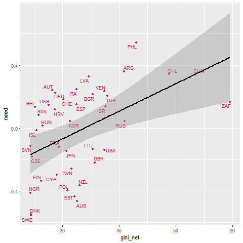
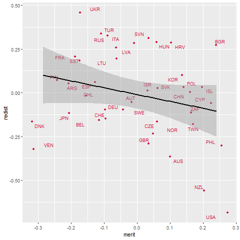

Hacer una descripcion de la linea de trabajo en general. 

```{r eval=FALSE, include=FALSE}
rmarkdown::render(input = "production/prod_analysis-cfa.rmd",output_format = "html_document"); browseURL(url = "production/prod_analysis-cfa.html")
```

```{r include=FALSE}
knitr::opts_chunk$set(warning = FALSE,message = FALSE, cache = TRUE)
knitr::opts_knit$set(root.dir = "../")
options(scipen=999)
rm(list=ls())
options(knitr.kable.NA = '')
```

**Libraries**
```{r}
library(sjPlot)
library(sjmisc) # several functions,ej read_stata
library(descr)
library(memisc)  # codebook
library(psych) # cor2latex
library(corrplot) # graph correlations
library(lavaan)
library(stargazer) 
library(semTools)
library(plyr) # count
library(dplyr)
library(car) # recode
library(ggplot2)
library(Hmisc)
library(tidyverse)
library(data.table)
library(stringr)
library(countrycode)
library(lme4)
library(texreg)
library(mice)
library(ggrepel) # for scatter labels in sjp.scatter	
library(semPlot)
library(haven)
library(sjlabelled) 
library(kableExtra)

```

**Load data**

```{r}
load(file = "input/data/proc/redistrib.rda")
```

# Descriptives
```{r results='asis'}
  # Summary table to latex
    sink("output/results/desctab_red.html")
    stargazer(redistrib[-c(1,2)], type="html"); sink()
```

## plot likert 
```{r echo=FALSE}
     # short var labels
    items <- c("Gov. reduce income dif.", "Gov. decent unemp.",
               "High income taxes", "Buy better health", 
               "Buy better education") 
    
    # cambiar orden para la leyenda  
    labels= c("Strongly agree", "Agree", "Disagree",
              "Strongly disagree", "(neither/nor)" )  ### E
    png<-sjPlot::plot_likert((redistrib[3:7]), 
                        axis.labels   = items,
                        legend.labels = labels,
                        cat.neutral   = 5, # identifica a indiferentes
                        geom.colors   = c("#9ecae1", "#6baed6","#4292c6", 
                                          "#2171b5"), # colorbrewer2.org 
                        sort.frq      = "neg.asc", # sort descending)
                        title         = "Agree / disagree ...",
                        intercept.line.color = "white", # vertical middle
                        expand.grid   = F, # no inner margins in plot
                        show.n        = FALSE, # hide N's in axis labels
                        grid.range    = 1.8,
                        geom.size = 0.6) # expand axis 130% )
    
    
    
    # Save
    ggsave(png,filename = "output/images/plotlikert.png",device = "png", width=25, units = "cm")

```


# Estimación del modelo

```{r}
	
	load("input/data/proc/redistrib.rda")  

	cfa_red1 <- '
	# latent variables
	redist =~ income_dif + unemployed + taxes 
	accum  =~ health + educ'
	
	
	fit_red1 <- cfa(cfa_red1,data=redistrib, missing = "ML") 
#summary(fit_red1, fit.measures=TRUE,standardized=TRUE)   

#fitmeasures(fit_red1)

```

### Measurement structure 

```{r}
		# Path 
			semPlot::semPaths(fit_red1,layout = "tree2", rotation = 2, 
	  	intercepts = FALSE,	style = "lisrel", curvePivot = TRUE,
	  	cardinal = TRUE)
	#	  dev.copy(png,"output/results/path_red1.png",width=750,height=600)
		#  dev.off()	  	  	 
## ## ## ## ### ##                                            ### ## ## ## ##ARREGLAR LOS DIAGRAMAS. 

```

## Fit cfa model
```{r}

sum_fit<- bind_rows(fitmeasures(fit_red1)[c("chisq","df","cfi","rmsea","rmsea.ci.lower","rmsea.ci.upper")])
sum_fit

colnames <- c("$\\chi2$","df","CFI","RMSEA","RMSEA CI lower", "RMSEA CI upper")

sumtable01<- kable(sum_fit,digits = 3,format = "html",row.names = F,booktabs=T, caption = "Summary fit indices wave 01",col.names = colnames,escape = FALSE) %>%
  kable_styling(full_width = F)  %>%
      collapse_rows(columns = 1,valign = "middle");sumtable01
```

```{r}
		# Path - with results
		  semPlot::semPaths(fit_red1,"std",layout = "tree2", rotation = 2, 
	  	intercepts = FALSE,	style = "lisrel", curvePivot = TRUE,
	  	cardinal = TRUE, edge.color = "black", residScale = 10)
#		  dev.copy(png,"output/results/path_red1_res.png",
#		  	width=750,height=600); dev.off()		
		  
	# Categorical	  
		fit_red1c <- cfa(cfa_red1,data=redistrib, 
			ordered = c("income_dif","unemployed","taxes", "health", 
			"educ")) 
	#	summary(fit_red1c, fit.measures=TRUE,standardized=TRUE)
# 	                                      
```


### 2.4 Factor scores 
```{r}
	# Multiple imputation (para recuperar missings en scores)
  
	  # generate 5 multiple complete datasets 
		out <- mice(redistrib[3:7], m=5) 
		D1 <- complete(out, 1) 
		D2 <- complete(out, 2) 
		D3 <- complete(out, 3) 
		D4 <- complete(out, 4) 
		D5 <- complete(out, 5) 
			
		# fit model for each complete dataset 
		fit1 <- cfa(cfa_red1, data=D1) 
		fit2 <- cfa(cfa_red1, data=D2) 
		fit3 <- cfa(cfa_red1, data=D3) 
		fit4 <- cfa(cfa_red1, data=D4) 
		fit5 <- cfa(cfa_red1, data=D5) 
		
	# predict scores for all models 
		p1 <- predict(fit1) 
		p2 <- predict(fit2) 
		p3 <- predict(fit3) 
		p4 <- predict(fit4) 
	p5 <- predict(fit5) 

# compute 'average' across 5 sets of scores: 
		scores <- (p1 + p2 + p3 + p4 + p5)/5 

 #Generate factor scores      
   scores_dat=as.data.frame(scores)
    dim(scores_dat)
    str(scores_dat)
    
# Adaptar base para agregar factor scores (sacar todos NA)  
    dim(redistrib)
   redistrib_m=redistrib[rowSums(is.na(redistrib[3:7]))!=5,]
    dim(redistrib_m)

# Merge with factor scores
	  redistrib_sco=cbind(redistrib,scores)
	    
	  # Check
	    summary(redistrib_sco$redist)
	    summary(redistrib_sco$accum)
	
	# Save  factor scores
	 # save(redistrib_sco, file="input/data/proc/redistrib_sco.rda")
	
```

# MODELS A:  MERIT & REDISTRIB
```{r}
# 4.1 Merge objects --------------------- ---- 
	load("input/data/proc/redistrib.rda")
	load("input/data/proc/getahead.rda")                       
	load("input/data/proc/detearn.rda")

	aux1 <- merge(getahead,redistrib,by=c("id","v5"))
  merit_redist=merge(aux1,detearn,by=c("id","v5"))

```

```{r}
# 4.2 Measurement & structural model ---- --------

  # Measurement simple 
	  cfa_mer_red1 <- '
	  # latent variables
		  merit =~ hwork + ambition 
		  parent=~ wealthy + pareduc
		  backg=~ race + gender
			network=~ people + polcone
		  bmerit =~ welljob + hardjob 
		  need=~ family + child
			redist =~ income_dif + unemployed + taxes 
	  	accum  =~ health + educ'        
	
	  fit_mer_red1 <- cfa(cfa_mer_red1,data=merit_redist, 
	  	missing = "ML") 
	 
	
#	 summary(fit_mer_red1, fit.measures=TRUE,standardized=TRUE)
	    
	  	# Path
	 		  semPlot::semPaths(fit_mer_red1,layout = "circle", rotation = 3, 
			  	intercepts = FALSE, style = "lisrel", curvePivot = TRUE,
			  	sizeMan = 4, sizeLat = 6)
	# 		  dev.copy(png,"output/results/path_mer_red1.png",width=800,
	#	    	height=650);  dev.off()
	 		  
	  fit_mer_redc <- cfa(cfa_mer_red1,data=merit_redist,
	  	ordered = names(merit_redist[3:10,19:29]))
	#	summary(fit_mer_redc, fit.measures=TRUE,standardized=TRUE)

```

```{r}

		
	# CFA with secon order unmerit

	  cfa_mer_red2 <- '
	  # latent variables
		  merit =~ hwork + ambition 
		  parent=~ wealthy + pareduc
		  backg=~ race + gender
			network=~ people + polcone
		  bmerit =~ welljob + hardjob 
		  need=~ family + child
			redist =~ income_dif + unemployed + taxes 
	  	accum  =~ health + educ
			unmerit =~ parent + backg + network
	  '     
	  fit_mer_red2 <- cfa(cfa_mer_red2,data=merit_redist, 
	  	missing = "ML") 
#	  summary(fit_mer_red2, fit.measures=TRUE,standardized=TRUE)
```


```{r}
sum_fit<- bind_rows(fitmeasures(fit_mer_redc)[c("chisq","df","cfi","rmsea","rmsea.ci.lower","rmsea.ci.upper")],
                    fitmeasures(fit_mer_red2)[c("chisq","df","cfi","rmsea","rmsea.ci.lower","rmsea.ci.upper")])
sum_fit$mod <- c("Model 1","Model 2")
sum_fit$est <- c("MLR","DWLS")
#sum_fit <- select(sum_fit,mod,est,everything())
colnames <- c("Model","Estimator","$\\chi2$","df","CFI","RMSEA","RMSEA CI lower", "RMSEA CI upper")
 sum_fit

sumtable01<- kable(sum_fit,digits = 3,format = "html",row.names = F,booktabs=T, caption = "Summary fit indices wave 01",col.names = colnames,escape = FALSE) %>%
  kable_styling(full_width = F)  %>%
      collapse_rows(columns = 1,valign = "middle")  %>%
      footnote(number = c("Model 1: Continue item",
                          "Model 2: Ordered item)"));sumtable01

```
  


```{r}

	    # Factor scores
	  fscores <- as.data.frame(lavPredict(fit_mer_red2))

	  
	    # Correlations
	  cormat=cor(fscores[c(7,8,1,9,5,6)],
	             use="pairwise.complete.obs")
	  corrplot.mixed(cormat)
	  #save
	#  dev.copy(png,"output/results/corplot_totscores.png",width=600,
	 #          height=600); dev.off()
	  
	  
	  #  Path
	 		  semPlot::semPaths(fit_mer_red2,layout = "tree", rotation = 2, 
			  	intercepts = FALSE, style = "lisrel", curvePivot = TRUE,
			  	sizeMan = 4, sizeLat = 6)
	 		#  dev.copy(png,"output/results/path_mer_red2.png",width=800,
		   # 	height=650);  dev.off()	  	  
	  
	# Structural model
	  sem_mer_red1 <- '
	  # latent variables
		  merit =~ hwork + ambition 
		  parent=~ wealthy + pareduc
		  backg=~ race + gender
			network=~ people + polcone
		  bmerit =~ welljob + hardjob 
		  need=~ family + child
			redist =~ income_dif + unemployed + taxes 
	  	accum  =~ health + educ
			unmerit =~ parent + backg + network
		# regressions
			redist + accum ~ merit + unmerit + bmerit + need
	  '     
  
	  fitsem_mer_red1 <- sem(sem_mer_red1,data=merit_redist, 
	  	missing = "ML") 
#	  summary(fitsem_mer_red1, fit.measures=TRUE,standardized=TRUE)
	  
	  
	  
	  
	  	# Path
	 		  semPlot::semPaths(fitsem_mer_red1,layout = "tree", rotation = 2, 
			  	intercepts = FALSE, style = "lisrel", curvePivot = TRUE,
		  	sizeMan = 4, sizeLat = 6)
	 	 # dev.copy(png,"output/results/path_mer_red2.png",width=800,
		  #	height=650);  dev.off()
	 	
	# saque este argumento del codigo de abajo  op=="~"
	  
	 	# Table
	 	tabreg=subset(standardizedsolution(fitsem_mer_red1)	,op=="~", select=c(lhs,rhs,est.std,z)) 
	 	tabreg2=subset(tabreg, select=c(lhs,rhs,est.std,z))
	 	tabredist=subset(tabreg2,lhs=="redist",
	 		select=rhs:z)
	 	tabaccumt=subset(tabreg2,lhs=="accum",select=est.std:z)	
	 	tabtot=cbind(tabredist,tabaccumt)
	 	tabtot2=rbind(tabtot$est.std,tabtot$z)
	 		  
	 		  
	 		  	  
# End sec 4 ----------------------------- 

```

#  Descriptives 

```{r}

	load("input/data/proc/pref.rda")

  # Adjust data
    pref_agg=aggregate(pref, by=list(pref$v5c),
    	FUN=mean, na.rm=TRUE)
    names(pref_agg)[names(pref_agg)=="Group.1"] <- "v5c"
    	
  # Macro descriptives
    
    
    hist(pref_agg$gini_net)
    table(pref_agg$accum)   ############# no encuentro esta variable accum
    
  #  plot_scatter(pref_agg, gini_net, accum, 
   #	dot.labels = pref_agg$v5c,
  	#fit.line = "lm",
  	#show.ci = TRUE)
  
    #table(pref_agg$redis)
    
    #plot_scatter(pref_agg, gini_net, redist, 
   	#dot.labels = pref_agg$v5c,
	#fit.line = TRUE,
 	#show.ci = TRUE 	)
    
    # Sin ZAF outlier (igual, no cambia)
  #  	pref_agg2 <- pref_agg[which(pref_agg$v5c!='ZAF'), ]
	#	    plot_scatter(pref_agg2$gini_net,pref_agg2$redist, 
	#    	dot.labels = pref_agg2$v5c,
	#    	fit.line = TRUE,
	#    	show.ci = TRUE
	#	   	)

```


# Models
```{r}


  #  Models SEM simple
  
  sem_b <- '
  	# latent variables
    redist =~ income_dif + unemployed + taxes 
    accum  =~ health + educ
		redist + accum ~ univ + quintile + sstatus + gini_market'
  
    fit_2c <- sem(sem_b,data=pref, ordered = c("income_dif",
      "unemployed","taxes", "health", "educ"))
    #summary(fit_2c, fit.measures=TRUE,standardized=TRUE)
    
    
#cnames <- c("Factor","Indicator","Loading (MLR)","Loading (DWLS)")
#kable(left_join(x = standardizedsolution(fit_2c) %>% filter(op=="=~") %>% select(lhs,rhs,est.std),y = #standardizedsolution(fit_2c) %>% filter(op=="=~") %>% select(lhs,rhs,est.std),c("lhs","rhs")),format = #"markdown",digits = 2,col.names = cnames, caption = "Factor loadings")
    

sum_fit<- bind_rows(fitmeasures(fit_red1)[c("chisq","df","cfi","rmsea","rmsea.ci.lower","rmsea.ci.upper")])
sum_fit

colnames <- c("$\\chi2$","df","CFI","RMSEA","RMSEA CI lower", "RMSEA CI upper")

sumtable01<- kable(sum_fit,digits = 3,format = "html",row.names = F,booktabs=T, caption = "Summary fit indices wave 01",col.names = colnames,escape = FALSE) %>%
  kable_styling(full_width = F)  %>%
      collapse_rows(columns = 1,valign = "middle");sumtable01


# Multilevel (with factor scores) #No funciono nada de este apartado. 
	# check simple regresion
	#ols_prefred=lm(redist ~ univ + quintile + sstatus + gini_market)
	# summary(ols_prefred) # ok, similar SEM, scores OK
    
  # Multilevel models redist
	  
	  # Null
	 # 	mlprefred_0 = lmer(redist ~ 1 + (1 | v5c))
	#		screenreg(mlprefred_0) # de library texreg  
	#		
#			# Graph
#			sjp.lmer(mlprefred_0, sort.est="(Intercept)")
#	  
			# ICC
#			varcomp=as.data.frame(VarCorr(mlprefred_0))
#			tau00=varcomp[1,4]
#			sigma2=varcomp[2,4]
#			tau00/(tau00+sigma2)
		
		# Individual level vars
#			mlprefred_1 = lmer(redist_n ~ 1 + univ + 
#					as.factor(quintile_miss) +	sstatus + sex + age + 
#					(1 | v5))
#			screenreg(mlprefred_1)
#			
#		# Macro level vars
#			mlprefred_2 = lmer(redist ~ 1 + univ + 
#					as.factor(quintile_miss)+ sstatus + gini_market + 
#					univ_g + (1 | v5))
#			screenreg(mlprefred_2)
#			
#	# Multilevel models accumulation
#			
	  # Null
#	  	mlaccum_0 = lmer(accum ~ 1 + (1 | v5c))
#			screenreg(mlaccum_0) # de library texreg  
#	  
			# Graph
#			sjp.lmer(mlaccum_0, sort.est="(Intercept)")
#			
			# ICC
#			varcomp=as.data.frame(VarCorr(mlaccum_0))
#			tau00=varcomp[1,4]
#			sigma2=varcomp[2,4]
#			tau00/(tau00+sigma2)
#		
#		# Individual level vars
#			mlaccum_1 = lmer(accum ~ 1 + univ + as.factor(quintile_miss) +	
#					sstatus + sex + age + univ*sex + age*age + (1 | v5))
#			screenreg(mlaccum_1)
#			
		# Macro level vars
#			mlaccum_2 = lmer(accum ~ 1 + univ_g + as.factor(quintile_miss) +
#					(sstatus -f_sstatus) + gini_net + (1 | v5))
#			screenreg(mlaccum_2)
			
		# Random slope & cross-level
#			mlaccum_3 = lmer(accum ~ 1 + univ_g + f_sstatus + gini_net + 
#					gini_net* f_sstatus +	(1 + f_sstatus | v5))
			
#			screenreg(mlaccum_3)	
			
#			# Graphs
#			sjp.lmer(mlaccum_3, sort.est = "(Intercept)")
#			sjp.lmer(mlaccum_3, type = "rs.ri")
#			
#			mlaccum_4 = lmer(accum ~ 1 + univ + f_sstatus + gini_net + gini_net*f_sstatus + hhincome +	(1 + hhincome | v5))
#			screenreg(mlaccum_4)	
			
# End sec. 5 ----------------------------			

```

#  MODELS C: MERITOCRACY
##  Descriptives


```{r}
    load("input/data/proc/meritocracy.rda")
 	  
  # Adjust data
    merit_agg=aggregate(meritocracy, by=list(meritocracy$v5c),
    	FUN=mean, na.rm=TRUE)
    names(merit_agg)[names(merit_agg)=="Group.1"]="v5c"
 #   names(merit_agg)
  #  dim(merit_agg)
    	
  # Macro descriptives
    
    # agregar Polichoric.
    # Macro level corr
    
      corMat <- cor(merit_agg[c("merit","unmerit","bmerit","need","gini_net","gini_market","j_fi_index")], use="pairwise.complete.obs") # estimar matriz pearson
      options(digits=2)
      corMat # muestra matriz
      
 #     M=cor(merit_agg) # matriz simple 
      corrplot.mixed(corMat)	
    

```
 

```{r}

    plot_scatter(merit_agg, gini_net, bmerit, 
    	dot.labels = merit_agg$v5c,
    	fit.line = "lm",
    	show.ci = TRUE)
      
    
    
  # Save
  # dev.copy(png,"output/results/gini_bmerit.png"); dev.off()
    
    
  plot_scatter(merit_agg, gini_net,unmerit, 
  dot.labels = merit_agg$v5c,
  fit.line = "lm",
  show.ci = TRUE)    

  
  plot_scatter(merit_agg, gini_net,need, 
  	dot.labels = merit_agg$v5c,
 	fit.line = "lm",
	show.ci = TRUE)  

         # Save
      #dev.copy(png,"output/results/fi_need.png"); dev.off()
   
  
   
```



```{r}
   plot_scatter(merit_agg, j_fi_index, need, 
    	dot.labels = merit_agg$v5c,
    	fit.line = "lm",
    	show.ci = TRUE)     
      # Save
     # dev.copy(png,"output/results/gini_fi.png"); dev.off()  Este objeto tampoco estaba en la carpeta.
```


#### Graficos sin outliers
```{r}

    
  	merit_agg2 <- merit_agg[which(merit_agg$v5c!="ZAF" & merit_agg$v5c!="CHN" &  merit_agg$v5c!="CHL" ), ]
    
  plot_scatter(merit_agg2, gini_net, unmerit, 
  	dot.labels = merit_agg2$v5c,
  	fit.line = TRUE,
  	show.ci = TRUE
	  	)  
    
```

##  Models 


```{r results='asis'}


# Multilevel (with factor scores)
   
  load("input/data/proc/meritocracy.rda")

    # Adjust some variables
    	meritocracy$Quintile=as.factor(meritocracy$quintile_miss)
     	levels(meritocracy$Quintile)[6] <- "miss"
  
	# check simple regresion
	  ols_merit=lm(merit ~ univ + Quintile + sstatus + gini_net, data = meritocracy)
	  stargazer(ols_merit, type ="html") # ok, similar SEM, scores OK
```


```{r results='asis' , message= F}
    
    
  # Multilevel models merit
	  
	  # Null
	  	mlmerit_0 = lmer(merit ~ 1 + (1 | v5c), data = meritocracy)
			htmlreg(mlmerit_0) # de library texreg  
			
			# Graph
		#	sjp.lmer(mlmerit_0, sort.est="(Intercept)")   No encuentro el paquete.
	  
			# ICC
			varcomp=as.data.frame(VarCorr(mlmerit_0))
			tau00=varcomp[1,4]
			sigma2=varcomp[2,4]
			tau00/(tau00+sigma2)
  		
  		# Individual level vars
  			mlmerit_1 = lmer(merit ~ 1 + univ +	quintile_miss +	
  					sstatus + sex + age + (1 | v5), data = meritocracy)
  			htmlreg(mlmerit_1)
  			
		# Macro level vars
			mlmerit_2 = lmer(bmerit ~ 1 + gini_net + (1 | v5), data = meritocracy)
		htmlreg(mlmerit_2)    
        

			
# Models meritocracy and preferences
			
  load("input/data/proc/meritocracy.rda")
  load("input/data/proc/redistrib_sco.rda")
  			
  	mer_pref=merge(meritocracy, redistrib_sco, by=c("id"))
 #   names(mer_pref)
    
  mer_pref_agg=aggregate(mer_pref, by=list(mer_pref$v5c),
    	FUN=mean, na.rm=TRUE)
      names(mer_pref_agg)[names(mer_pref_agg)=="Group.1"]="v5c"
	 #  names(mer_pref_agg)
  #  dim(mer_pref_agg)

    # Graphs    # mismo problemas de subindices.
  
    plot_scatter(mer_pref_agg,merit , bmerit, 
   	  dot.labels = mer_pref_agg$v5c,
  	  fit.line = lm,
      show.ci = TRUE)
  
    plot_scatter(mer_pref_agg, merit, redist, 
        dot.labels = mer_pref_agg$v5c,
       	fit.line = lm,
      	show.ci = TRUE) 
           
        
      # Save
  #    dev.copy(png,"loc_merit_pref_int/results/merit_redis.png"); dev.off()
 
     plot_scatter(mer_pref_agg, unmerit,redist, 
    	dot.labels = mer_pref_agg$v5c,
    	fit.line = "lm",
    	show.ci = TRUE)      
       # Save
     # dev.copy(png,"loc_merit_pref_int/results/unmerit_redis.png"); dev.off()

  #    plot_scatter(mer_pref_agg$redist,mer_pref_agg$accum)
      
   plot_scatter(mer_pref_agg, redist,accum, 
  	dot.labels = mer_pref_agg$v5c,
  	fit.line = "lm",
  	show.ci = TRUE)  

```


