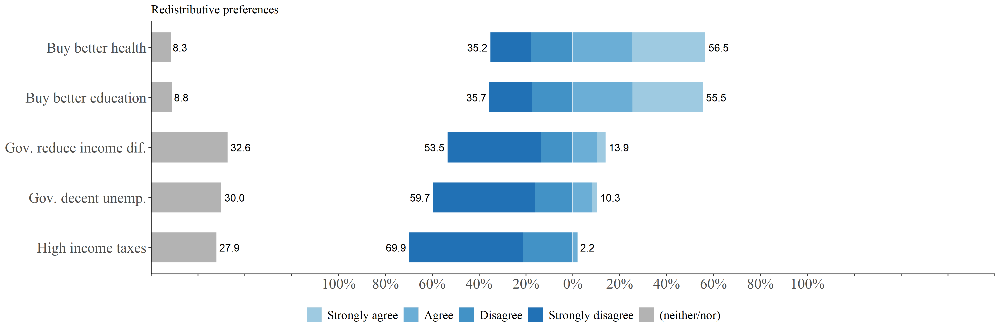
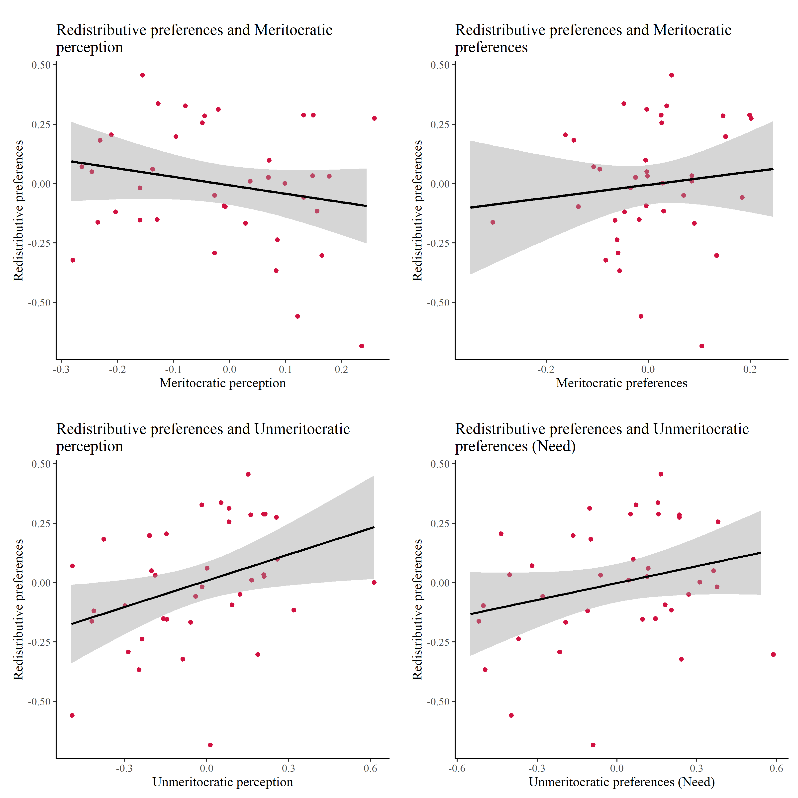
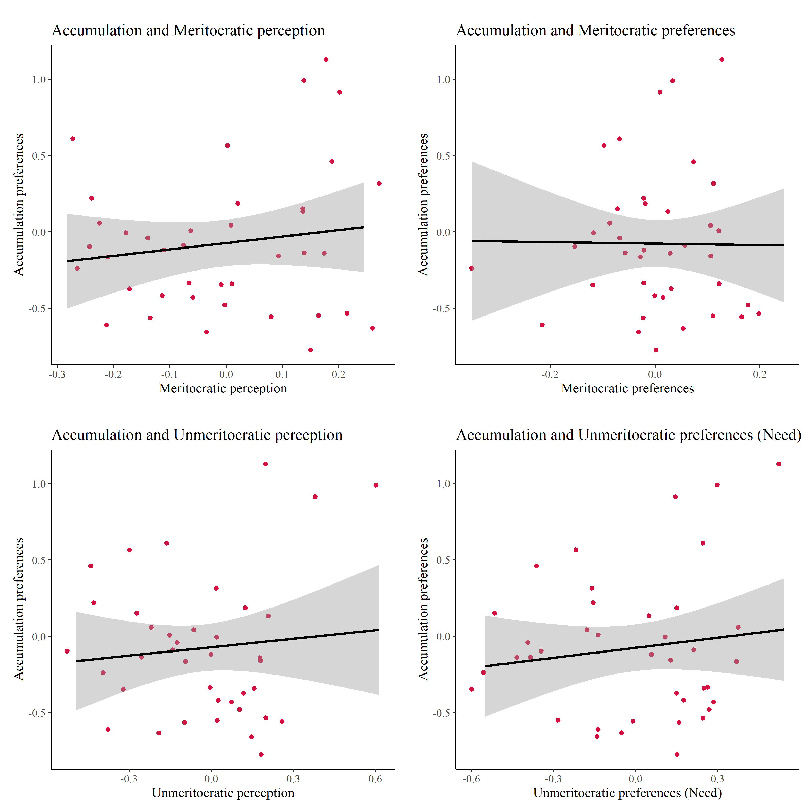
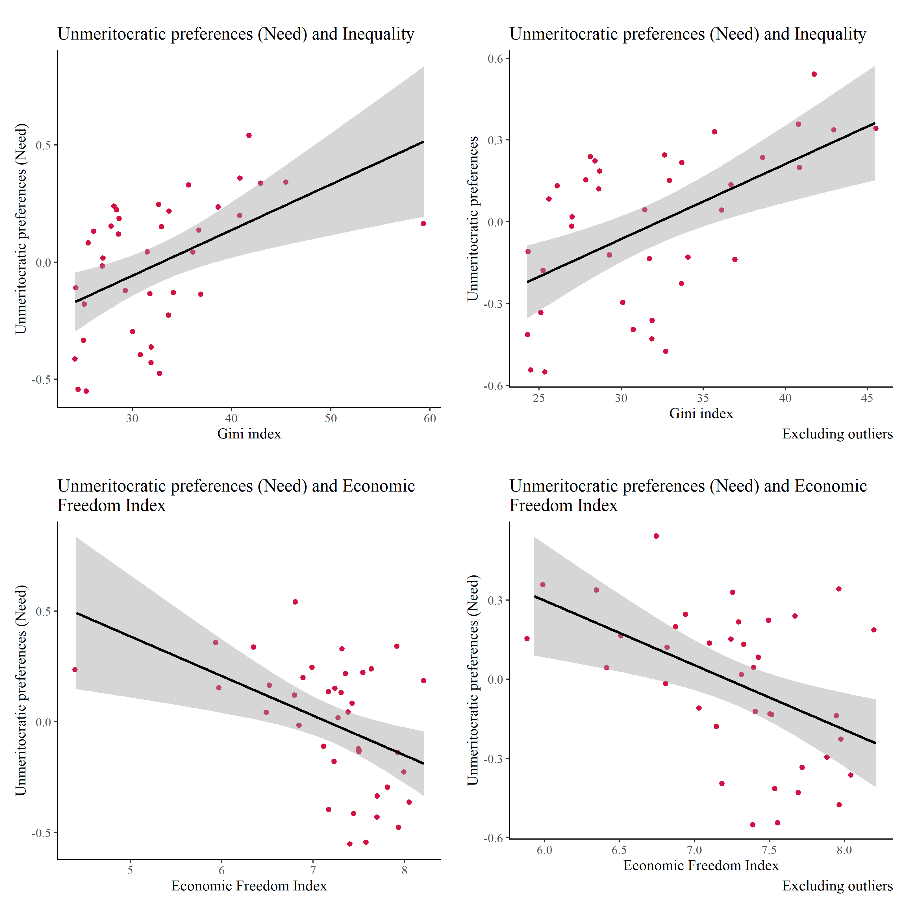

<div style="text-align: justify">

En el presente documento se exponen los análisis realizados a la base de datos creada en data-prep. 

En la primera sección se entregan análisis descriptivos de las principales variables dependientes e independientes.

En la segunda sección se exponen los análisis factoriales a partir de los cuales se imputan valores  para utilizar en la seccion de analisis multinivel. Además, en la segunda sección se incorpora un análisis de invarianza de medida y una ecuación estructural que resume los modelos a testear. 

En la tercera sección se presentan los modelos multinivel que son utilizados para el artículo. Se calcula la correlación intraclase, se evalúan los efectos de las variables nacionales e individuales, para posteriormente evaluar pendientes aleatorias e interacciones entre niveles. 

resultados. 
pese a que la educacion y la sal son formas de redistribucion la gente no lo considera lo mismo.

***

```{r eval=FALSE, include=FALSE}
rmarkdown::render(input = "production/prod_analysis-cfa.rmd",output_format = "html_document"); browseURL(url = "production/prod_analysis-cfa.html")
```

```{r include=FALSE}
knitr::opts_chunk$set(warning = FALSE,message = FALSE, cache = TRUE)
knitr::opts_knit$set(root.dir = "../")
options(scipen=999)
rm(list=ls())
options(knitr.kable.NA = '')
```

**Libraries**
```{r}
library(sjPlot)
library(sjmisc) # several functions,ej read_stata
library(descr)
library(memisc)  # codebook
library(psych) # cor2latex
library(corrplot) # graph correlations
library(lavaan)
library(stargazer) 
library(semTools)
library(plyr) # count
library(dplyr)
library(car) # recode
library(ggplot2)
library(Hmisc)
library(tidyverse)
library(data.table)
library(stringr)
library(countrycode)
library(lme4)
library(texreg)
library(mice)
library(ggrepel) # for scatter labels in sjp.scatter	
library(semPlot)
library(haven)
library(sjlabelled) 
library(kableExtra)
library(ggeffects)

```

**Load data**

```{r}
load(file = "input/data/proc/redistrib.rda")
load(file="input/data/proc/mer_pref.rda")
	load("input/data/proc/redistrib.rda")
	load("input/data/proc/getahead.rda")                       
	load("input/data/proc/detearn.rda")

```

# Descriptives
```{r results='asis'}
  # Summary table to latex
    sink("output/results/desctab_red.html")
    stargazer(redistrib[-c(1,2)], type="html"); sink()
```


```{r echo=FALSE}
     # short var labels
    items <- c("Gov. reduce income dif.", "Gov. decent unemp.",
               "High income taxes", "Buy better health", 
               "Buy better education") 
    
    # cambiar orden para la leyenda  
    labels= c("Strongly agree", "Agree", "Disagree",
              "Strongly disagree", "(neither/nor)" )  ### E
    png<-sjPlot::plot_likert((redistrib[3:7]), 
                        axis.labels   = items,
                        legend.labels = labels,
                        cat.neutral   = 5, # identifica a indiferentes
                        geom.colors   = c("#9ecae1", "#6baed6","#4292c6", 
                                            "#2171b5"), # colorbrewer2.org 
                        sort.frq      = "neg.asc", # sort descending)
                        title         = "Redistribution preferences.",
                        intercept.line.color = "white", # vertical middle
                        expand.grid   = F, # no inner margins in plot
                        show.n        = FALSE, # hide N's in axis labels
                        grid.range    = 1.8,
                        geom.size = 0.6) # expand axis 130% )
    
    
    
    # Save
    ggsave(png,filename = "output/images/plotlikert.png",device = "png", width=10, height=5)

```


 
```{r echo=FALSE}
     # short var labels

    # cambiar orden para la leyenda  
    labels= c("Strongly agree", "Agree", "Disagree",
              "Strongly disagree", "(neither/nor)" )  ### E
    png<-sjPlot::plot_likert((getahead[3:8]), 
                        legend.labels = labels,
                        cat.neutral   = 5, # identifica a indiferentes
                        geom.colors   = c("#9ecae1", "#6baed6","#4292c6", 
                                            "#2171b5"), # colorbrewer2.org 
                        sort.frq      = "neg.asc", # sort descending)
                        title         = "Get Ahead scale",
                        intercept.line.color = "white", # vertical middle
                        expand.grid   = F, # no inner margins in plot
                        show.n        = FALSE, # hide N's in axis labels
                        grid.range    = 1.8,
                        geom.size = 0.6) # expand axis 130% )
    
    
    
    # Save
    ggsave(png,filename = "output/images/plotlikert_getahead.png",device = "png", width=10, height=5)

```

 


```{r echo=FALSE}
     # short var labels

    # cambiar orden para la leyenda  
    labels= c("Essential", "Very important", "Fairly important",
              "Not very important", "Not important at all" )  ### E
    png<-sjPlot::plot_likert((detearn[3:8]), 
                        legend.labels = labels,
                        cat.neutral = 3,
                        geom.colors   = c("#9ecae1", "#6baed6","#4292c6", "#2171b5"), # colorbrewer2.org 
                        sort.frq      = "neg.asc", # sort descending)
                        title         = "Pay preferences",
                        intercept.line.color = "white", # vertical middle
                        expand.grid   = F, # no inner margins in plot
                        show.n        = FALSE, # hide N's in axis labels
                        grid.range    = 1.8,
                        geom.size = 0.6) # expand axis 130% )
    
    
    
    # Save
    ggsave(png,filename = "output/images/plotlikert_detearn.png",device = "png", width=10, height=5)

```


# Modelos de medida {.tabset .tabset-fade .tabset-pills}

```{r}
# 4.1 Merge objects --------------------- ---- 
	load("input/data/proc/redistrib.rda")
	load("input/data/proc/getahead.rda")                       
	load("input/data/proc/detearn.rda")

	aux1 <- merge(getahead,redistrib,by=c("id","v5"))
  merit_redist=merge(aux1,detearn,by=c("id","v5"))

```


## Redistribution preferences.

```{r}
cfa_red1 <- '
	# latent variables
	redist =~ income_dif + unemployed + taxes 
	accum  =~ health + educ
	'
fit_mer_redis <- cfa(cfa_red1,data=merit_redist, 
	  	missing = "ML") 
#	 summary(fit_mer_red1, fit.measures=TRUE,standardized=TRUE)
	 		  
fit_mer_redisc <- cfa(cfa_red1,data=merit_redist,
	  	ordered = names(merit_redist[3:10,19:23]))
	#	summary(fit_mer_redc, fit.measures=TRUE,standardized=TRUE)

fit_mer_redisc_group <- cfa(cfa_red1,data=merit_redist, group = "v5")
#summary(fit_mer_redisc_group, fit.measures=TRUE,standardized=TRUE)
	  
sum_fit<- bind_rows(fitmeasures(fit_mer_redis)[c("chisq","df","cfi","rmsea","rmsea.ci.lower","rmsea.ci.upper")],
                    fitmeasures(fit_mer_redisc)[c("chisq","df","cfi","rmsea","rmsea.ci.lower","rmsea.ci.upper")],    
                    fitmeasures(fit_mer_redisc_group)[c("chisq","df","cfi","rmsea","rmsea.ci.lower","rmsea.ci.upper")])

sum_fit$mod <- c("Model 1","Model 2", "Model 3")
sum_fit$est <- c("MLR","DWLS", "MLR")
sum_fit <- sum_fit %>% dplyr::select("mod","est","chisq","df","cfi","rmsea","rmsea.ci.lower","rmsea.ci.upper")


colnames <- c("Model","Estimator","$\\chi2$","df","CFI","RMSEA","RMSEA CI lower", "RMSEA CI upper")
	  
sumtable01<- kable(sum_fit,digits = 3,format = "html",row.names = F,booktabs=T, caption = "Summary fit",col.names = colnames,escape = FALSE) %>%
  kable_styling(full_width = F)  %>%
      collapse_rows(columns = 1,valign = "middle")  %>%
      footnote(number = c("Model 1: Continue item",
                          "Model 2: Ordered item",
                          "Model 3: multigroup"));sumtable01
     
  semPlot::semPaths(fit_mer_redis,layout = "tree", rotation = 3, 
			  	intercepts = FALSE, style = "lisrel", curvePivot = TRUE,
			  	sizeMan = 4, sizeLat = 6)
  
```

> A partir del buen ajuste de lo modelos se infiere que la dimensionalidad propuesta posee evidencia de valides. No existe gran diferencia entre los resultados de los distintos estimadores. Podemos decir ademas, en función del modelo que incluye grupos, que esta dimensionalidad funciona en distintos países. 


```{r}

# por paises   
merit_redist_arg<-  merit_redist %>% filter(v5==32)
fit_mer_redis_arg <- cfa(cfa_red1,data=merit_redist_arg,missing = "ML")
merit_redist_australia<-  merit_redist %>% filter(v5==36)
fit_mer_redis_australia <- cfa(cfa_red1,data=merit_redist_australia,missing = "ML")
merit_redist_austria<-  merit_redist %>% filter(v5==40)
fit_mer_redis_austria <- cfa(cfa_red1,data=merit_redist_austria,missing = "ML")
merit_redist_belgium<-  merit_redist %>% filter(v5==56)
fit_mer_redis_belgium <- cfa(cfa_red1,data=merit_redist_belgium,missing = "ML")
merit_redist_bulgaria<-  merit_redist %>% filter(v5==100)
fit_mer_redis_bulgaria <- cfa(cfa_red1,data=merit_redist_bulgaria,missing = "ML")
merit_redist_chile<-  merit_redist %>% filter(v5==152)
fit_mer_redis_chile <- cfa(cfa_red1,data=merit_redist_chile,missing = "ML")
merit_redist_china <-  merit_redist %>% filter(v5==156)
fit_mer_redis_china <- cfa(cfa_red1,data=merit_redist_china,missing = "ML")
merit_redist_taiwan <-  merit_redist %>% filter(v5==158)
fit_mer_redis_taiwan <- cfa(cfa_red1,data=merit_redist_taiwan,missing = "ML")
merit_redist_croatia <-  merit_redist %>% filter(v5==191)
fit_mer_redis_croatia <- cfa(cfa_red1,data=merit_redist_croatia,missing = "ML")


#merit_redist_cyprus <-  merit_redist %>% filter(v5==196)
#fit_mer_redis_cyprus <- cfa(cfa_red1,data=merit_redist_cyprus,missing = "ML")

#merit_redist_cyprus <-  merit_redist %>% filter(v5==196)
#fit_mer_redis_cyprus <- cfa(cfa_red1,data=merit_redist_cyprus, ordered = names(merit_redist[3:10,19:23]))


merit_redist_chequia <-  merit_redist %>% filter(v5==203)
fit_mer_redis_chequia <- cfa(cfa_red1,data=merit_redist_chequia,missing = "ML")
merit_redist_denmark <-  merit_redist %>% filter(v5==208)
fit_mer_redis_denmark <- cfa(cfa_red1,data=merit_redist_denmark,missing = "ML")
merit_redist_est <-  merit_redist %>% filter(v5==233)
fit_mer_redis_est <- cfa(cfa_red1,data=merit_redist_est,missing = "ML")
merit_redist_finlandia <-  merit_redist %>% filter(v5==246)
fit_mer_redis_finlandia <- cfa(cfa_red1,data=merit_redist_finlandia,missing = "ML")
merit_redist_francia <-  merit_redist %>% filter(v5==250)
fit_mer_redis_francia <- cfa(cfa_red1,data=merit_redist_francia,missing = "ML")
merit_redist_deutschland <-  merit_redist %>% filter(v5==276)
fit_mer_redis_deutschland <- cfa(cfa_red1,data=merit_redist_deutschland,missing = "ML")
merit_redist_hunria <-  merit_redist %>% filter(v5==348)
fit_mer_redis_hunria <- cfa(cfa_red1,data=merit_redist_hunria,missing = "ML")
merit_redist_islandia <-  merit_redist %>% filter(v5==352)
fit_mer_redis_islandia <- cfa(cfa_red1,data=merit_redist_islandia,missing = "ML")
merit_redist_israel <-  merit_redist %>% filter(v5==376)
fit_mer_redis_israel <- cfa(cfa_red1,data=merit_redist_israel,missing = "ML")
merit_redist_italia <-  merit_redist %>% filter(v5==380)
fit_mer_redis_italia <- cfa(cfa_red1,data=merit_redist_italia,missing = "ML")
merit_redist_japon <-  merit_redist %>% filter(v5==392)
fit_mer_redis_japon <- cfa(cfa_red1,data=merit_redist_japon,missing = "ML")
merit_redist_letonia <-  merit_redist %>% filter(v5==428)
fit_mer_redis_letonia <- cfa(cfa_red1,data=merit_redist_letonia,missing = "ML")
merit_redist_lituania <-  merit_redist %>% filter(v5==440)
fit_mer_redis_lituania <- cfa(cfa_red1,data=merit_redist_lituania,missing = "ML")
merit_redist_nuevazelanda <-  merit_redist %>% filter(v5==554)
fit_mer_redis_nuevazelanda <- cfa(cfa_red1,data=merit_redist_nuevazelanda,missing = "ML")
merit_redist_noruega <-  merit_redist %>% filter(v5==578)
fit_mer_redis_noruega <- cfa(cfa_red1,data=merit_redist_noruega,missing = "ML")
merit_redist_filipinas <-  merit_redist %>% filter(v5==608)
fit_mer_redis_filipinas <- cfa(cfa_red1,data=merit_redist_filipinas,missing = "ML")
merit_redist_polonia <-  merit_redist %>% filter(v5==616)
fit_mer_redis_polonia <- cfa(cfa_red1,data=merit_redist_polonia,missing = "ML")
merit_redist_rusia <-  merit_redist %>% filter(v5==643)
fit_mer_redis_rusia <- cfa(cfa_red1,data=merit_redist_rusia,missing = "ML")
merit_redist_eslovaquia <-  merit_redist %>% filter(v5==703)
fit_mer_redis_eslovaquia <- cfa(cfa_red1,data=merit_redist_eslovaquia,missing = "ML")
merit_redist_eslovenia <-  merit_redist %>% filter(v5==705)
fit_mer_redis_eslovenia <- cfa(cfa_red1,data=merit_redist_eslovenia,missing = "ML")
merit_redist_sudafrica <-  merit_redist %>% filter(v5==710)
fit_mer_redis_sudafrica <- cfa(cfa_red1,data=merit_redist_sudafrica,missing = "ML")
merit_redist_sudafrica <-  merit_redist %>% filter(v5==710)
fit_mer_redis_sudafrica <- cfa(cfa_red1,data=merit_redist_sudafrica,missing = "ML")
merit_redist_espana <-  merit_redist %>% filter(v5==724)
fit_mer_redis_espana <- cfa(cfa_red1,data=merit_redist_espana,missing = "ML")
merit_redist_suecia <-  merit_redist %>% filter(v5==752)
fit_mer_redis_suecia <- cfa(cfa_red1,data=merit_redist_suecia,missing = "ML")
merit_redist_suiza <-  merit_redist %>% filter(v5==756)
fit_mer_redis_suiza <- cfa(cfa_red1,data=merit_redist_suiza,missing = "ML")
merit_redist_turquia<-  merit_redist %>% filter(v5==792)
fit_mer_redis_turquia <- cfa(cfa_red1,data=merit_redist_turquia,missing = "ML")
merit_redist_ucrania<-  merit_redist %>% filter(v5==804)
fit_mer_redis_ucrania <- cfa(cfa_red1,data=merit_redist_ucrania,missing = "ML")
merit_redist_reinounido<-  merit_redist %>% filter(v5==826)
fit_mer_redis_reinounido <- cfa(cfa_red1,data=merit_redist_reinounido,missing = "ML")
merit_redist_estadosunidos<-  merit_redist %>% filter(v5==840)
fit_mer_redis_estadosunidos <- cfa(cfa_red1,data=merit_redist_estadosunidos,missing = "ML")


#merit_redist_venezuela<-  merit_redist %>% filter(v5==862)
#fit_mer_redis_venezuela <- cfa(cfa_red1,data=merit_redist_venezuela,missing = "ML")


#merit_redist_venezuela<-  merit_redist %>% filter(v5==862)
#fit_mer_redis_venezuela <- cfa(cfa_red1,data=merit_redist_venezuela,ordered = names(merit_redist[3:10,19:23]))


sum_fit<- bind_rows(fitmeasures(fit_mer_redis_arg)[c("chisq","df","cfi","rmsea","rmsea.ci.lower","rmsea.ci.upper")],    
                    fitmeasures(fit_mer_redis_australia)[c("chisq","df","cfi","rmsea","rmsea.ci.lower","rmsea.ci.upper")],
                    fitmeasures(fit_mer_redis_austria)[c("chisq","df","cfi","rmsea","rmsea.ci.lower","rmsea.ci.upper")],
                    fitmeasures(fit_mer_redis_belgium)[c("chisq","df","cfi","rmsea","rmsea.ci.lower","rmsea.ci.upper")],
                    fitmeasures(fit_mer_redis_bulgaria)[c("chisq","df","cfi","rmsea","rmsea.ci.lower","rmsea.ci.upper")],
                    fitmeasures(fit_mer_redis_chile)[c("chisq","df","cfi","rmsea","rmsea.ci.lower","rmsea.ci.upper")],
                    fitmeasures(fit_mer_redis_china)[c("chisq","df","cfi","rmsea","rmsea.ci.lower","rmsea.ci.upper")],
                    fitmeasures(fit_mer_redis_taiwan)[c("chisq","df","cfi","rmsea","rmsea.ci.lower","rmsea.ci.upper")],
                    fitmeasures(fit_mer_redis_croatia)[c("chisq","df","cfi","rmsea","rmsea.ci.lower","rmsea.ci.upper")],
#                   fitmeasures(fit_mer_redis_cyprus)[c("chisq","df","cfi","rmsea","rmsea.ci.lower","rmsea.ci.upper")],
                    fitmeasures(fit_mer_redis_chequia)[c("chisq","df","cfi","rmsea","rmsea.ci.lower","rmsea.ci.upper")],
                    fitmeasures(fit_mer_redis_denmark)[c("chisq","df","cfi","rmsea","rmsea.ci.lower","rmsea.ci.upper")],
                    fitmeasures(fit_mer_redis_est)[c("chisq","df","cfi","rmsea","rmsea.ci.lower","rmsea.ci.upper")],
                    fitmeasures(fit_mer_redis_finlandia)[c("chisq","df","cfi","rmsea","rmsea.ci.lower","rmsea.ci.upper")],
                    fitmeasures(fit_mer_redis_francia)[c("chisq","df","cfi","rmsea","rmsea.ci.lower","rmsea.ci.upper")],
                    fitmeasures(fit_mer_redis_deutschland)[c("chisq","df","cfi","rmsea","rmsea.ci.lower","rmsea.ci.upper")],
#                   fitmeasures(fit_mer_redis_venezuela)[c("chisq","df","cfi","rmsea","rmsea.ci.lower","rmsea.ci.upper")],
                    fitmeasures(fit_mer_redis_islandia)[c("chisq","df","cfi","rmsea","rmsea.ci.lower","rmsea.ci.upper")],
                    fitmeasures(fit_mer_redis_israel)[c("chisq","df","cfi","rmsea","rmsea.ci.lower","rmsea.ci.upper")],
                    fitmeasures(fit_mer_redis_italia)[c("chisq","df","cfi","rmsea","rmsea.ci.lower","rmsea.ci.upper")],
                    fitmeasures(fit_mer_redis_japon)[c("chisq","df","cfi","rmsea","rmsea.ci.lower","rmsea.ci.upper")],
                    fitmeasures(fit_mer_redis_letonia)[c("chisq","df","cfi","rmsea","rmsea.ci.lower","rmsea.ci.upper")],
                    fitmeasures(fit_mer_redis_lituania)[c("chisq","df","cfi","rmsea","rmsea.ci.lower","rmsea.ci.upper")],
                    fitmeasures(fit_mer_redis_nuevazelanda)[c("chisq","df","cfi","rmsea","rmsea.ci.lower","rmsea.ci.upper")],
                    fitmeasures(fit_mer_redis_noruega)[c("chisq","df","cfi","rmsea","rmsea.ci.lower","rmsea.ci.upper")],
                    fitmeasures(fit_mer_redis_filipinas)[c("chisq","df","cfi","rmsea","rmsea.ci.lower","rmsea.ci.upper")],
                    fitmeasures(fit_mer_redis_polonia)[c("chisq","df","cfi","rmsea","rmsea.ci.lower","rmsea.ci.upper")],
                    fitmeasures(fit_mer_redis_rusia)[c("chisq","df","cfi","rmsea","rmsea.ci.lower","rmsea.ci.upper")],
                    fitmeasures(fit_mer_redis_eslovaquia)[c("chisq","df","cfi","rmsea","rmsea.ci.lower","rmsea.ci.upper")],
                    fitmeasures(fit_mer_redis_eslovenia)[c("chisq","df","cfi","rmsea","rmsea.ci.lower","rmsea.ci.upper")],
                    fitmeasures(fit_mer_redis_sudafrica)[c("chisq","df","cfi","rmsea","rmsea.ci.lower","rmsea.ci.upper")],
                    fitmeasures(fit_mer_redis_espana)[c("chisq","df","cfi","rmsea","rmsea.ci.lower","rmsea.ci.upper")],
                    fitmeasures(fit_mer_redis_suecia)[c("chisq","df","cfi","rmsea","rmsea.ci.lower","rmsea.ci.upper")],
                    fitmeasures(fit_mer_redis_suiza)[c("chisq","df","cfi","rmsea","rmsea.ci.lower","rmsea.ci.upper")],
                    fitmeasures(fit_mer_redis_turquia)[c("chisq","df","cfi","rmsea","rmsea.ci.lower","rmsea.ci.upper")],
                    fitmeasures(fit_mer_redis_ucrania)[c("chisq","df","cfi","rmsea","rmsea.ci.lower","rmsea.ci.upper")],
                    fitmeasures(fit_mer_redis_reinounido)[c("chisq","df","cfi","rmsea","rmsea.ci.lower","rmsea.ci.upper")],
                    fitmeasures(fit_mer_redis_estadosunidos)[c("chisq","df","cfi","rmsea","rmsea.ci.lower","rmsea.ci.upper")])

sum_fit$mod <- c("Argentina","Australia","Austria", "Belguim","Bulgaria","Chile","China","Taiwan", "Croatia", "Chequia","Dinamarca","EST","Finlandia","Francia","Deutschland", "Islandia", "Israel","Italia", "Japon", "Letonia","Lituania","Nueva Zelanda", "Noruega", "Filipinas", "Polonia", "Rusia","Eslovequia","Eslovenia","Sudafrica", "España","Suecia","Suiza","Truquia","Ucrania","Reino Unido", "Estados Unidos.")

colnames <- c("Model","$\\chi2$","df","CFI","RMSEA","RMSEA CI lower", "RMSEA CI upper")
	  sum_fit <- sum_fit %>% dplyr::select("mod","chisq","df","cfi","rmsea","rmsea.ci.lower","rmsea.ci.upper")
sumtable01<- kable(sum_fit,digits = 3,format = "html",row.names = F,booktabs=T, caption = "Summary fit  countries",col.names = colnames,escape = FALSE) %>%
  kable_styling(full_width = F)  %>%
      collapse_rows(columns = 1,valign = "middle");sumtable01
     


```

> El modelo no converge ni en Chipre ni en Venezuela (ni utilizando ordinales) 

## Meritocratic beliefs 
```{r}


	  cfa_perpref2 <- '
	  # latent variables
	  merit =~ hwork + ambition
	  parent=~ wealthy + pareduc
	  backg=~ race + gender
		network=~ people + polcone
		unmerit=~ parent + backg + network # 2nd order
	  bmerit =~ welljob + hardjob
	  need=~ family + child
	    '

fit_mer_mer <- cfa(cfa_perpref2,data=merit_redist, 
	  	missing = "ML") 
#	 summary(fit_mer_red1, fit.measures=TRUE,standardized=TRUE)
	 		  
fit_mer_merc <- cfa(cfa_perpref2,data=merit_redist,
	  	ordered = names(merit_redist[3:10,19:23]))
	#	summary(fit_mer_redc, fit.measures=TRUE,standardized=TRUE)

fit_mer_mer_group <- cfa(cfa_perpref2,data=merit_redist, group = "v5")
#summary(fit_mer_redisc_group, fit.measures=TRUE,standardized=TRUE)


	  
sum_fit<- bind_rows(fitmeasures(fit_mer_mer)[c("chisq","df","cfi","rmsea","rmsea.ci.lower","rmsea.ci.upper")],
                    fitmeasures(fit_mer_merc)[c("chisq","df","cfi","rmsea","rmsea.ci.lower","rmsea.ci.upper")],    
                    fitmeasures(fit_mer_mer_group)[c("chisq","df","cfi","rmsea","rmsea.ci.lower","rmsea.ci.upper")])

sum_fit$mod <- c("Model 1","Model 2", "Model 3")
sum_fit$est <- c("MLR","DWLS", "MLR")
sum_fit <- sum_fit %>% dplyr::select("mod","est","chisq","df","cfi","rmsea","rmsea.ci.lower","rmsea.ci.upper")


colnames <- c("Model","Estimator","$\\chi2$","df","CFI","RMSEA","RMSEA CI lower", "RMSEA CI upper")
	  
sumtable01<- kable(sum_fit,digits = 3,format = "html",row.names = F,booktabs=T, caption = "Summary fit",col.names = colnames,escape = FALSE) %>%
  kable_styling(full_width = F)  %>%
      collapse_rows(columns = 1,valign = "middle")  %>%
      footnote(number = c("Model 1: Continue item",
                          "Model 2: Ordered item",
                          "Model 3: multigroup"));sumtable01
     
  semPlot::semPaths(fit_mer_mer,layout = "tree", rotation = 3, 
			  	intercepts = FALSE, style = "lisrel", curvePivot = TRUE,
			  	sizeMan = 4, sizeLat = 6)
```

> A partir del buen ajuste de lo modelos se infiere que la dimensionalidad propuesta posee evidencia de valides. No existe gran diferencia entre los resultados de los distintos estimadores. Podemos decir ademas, en función del modelo que incluye grupos, que esta dimensionalidad funciona en distintos países.


```{r}

# por paises   
merit_redist_arg<-  merit_redist %>% filter(v5==32)
fit_mer_redis_arg <- cfa(cfa_perpref2,data=merit_redist_arg,missing = "ML")
merit_redist_australia<-  merit_redist %>% filter(v5==36)
fit_mer_redis_australia <- cfa(cfa_perpref2,data=merit_redist_australia,missing = "ML")
merit_redist_austria<-  merit_redist %>% filter(v5==40)
fit_mer_redis_austria <- cfa(cfa_perpref2,data=merit_redist_austria,missing = "ML")
merit_redist_belgium<-  merit_redist %>% filter(v5==56)
fit_mer_redis_belgium <- cfa(cfa_perpref2,data=merit_redist_belgium,missing = "ML")
merit_redist_bulgaria<-  merit_redist %>% filter(v5==100)
fit_mer_redis_bulgaria <- cfa(cfa_perpref2,data=merit_redist_bulgaria,missing = "ML")
merit_redist_chile<-  merit_redist %>% filter(v5==152)
fit_mer_redis_chile <- cfa(cfa_perpref2,data=merit_redist_chile,missing = "ML")
merit_redist_china <-  merit_redist %>% filter(v5==156)
fit_mer_redis_china <- cfa(cfa_perpref2,data=merit_redist_china,missing = "ML")
merit_redist_taiwan <-  merit_redist %>% filter(v5==158)
fit_mer_redis_taiwan <- cfa(cfa_perpref2,data=merit_redist_taiwan,missing = "ML")
merit_redist_croatia <-  merit_redist %>% filter(v5==191)
fit_mer_redis_croatia <- cfa(cfa_perpref2,data=merit_redist_croatia,missing = "ML")
merit_redist_cyprus <-  merit_redist %>% filter(v5==196)
fit_mer_redis_cyprus <- cfa(cfa_perpref2,data=merit_redist_cyprus,missing = "ML")
merit_redist_chequia <-  merit_redist %>% filter(v5==203)
fit_mer_redis_chequia <- cfa(cfa_perpref2,data=merit_redist_chequia,missing = "ML")
merit_redist_denmark <-  merit_redist %>% filter(v5==208)
fit_mer_redis_denmark <- cfa(cfa_perpref2,data=merit_redist_denmark,missing = "ML")
merit_redist_est <-  merit_redist %>% filter(v5==233)
fit_mer_redis_est <- cfa(cfa_perpref2,data=merit_redist_est,missing = "ML")
merit_redist_finlandia <-  merit_redist %>% filter(v5==246)
fit_mer_redis_finlandia <- cfa(cfa_perpref2,data=merit_redist_finlandia,missing = "ML")
merit_redist_francia <-  merit_redist %>% filter(v5==250)
fit_mer_redis_francia <- cfa(cfa_perpref2,data=merit_redist_francia,missing = "ML")
merit_redist_deutschland <-  merit_redist %>% filter(v5==276)
fit_mer_redis_deutschland <- cfa(cfa_perpref2,data=merit_redist_deutschland,missing = "ML")
merit_redist_hunria <-  merit_redist %>% filter(v5==348)
fit_mer_redis_hunria <- cfa(cfa_perpref2,data=merit_redist_hunria,missing = "ML")
merit_redist_islandia <-  merit_redist %>% filter(v5==352)
fit_mer_redis_islandia <- cfa(cfa_perpref2,data=merit_redist_islandia,missing = "ML")
merit_redist_israel <-  merit_redist %>% filter(v5==376)
fit_mer_redis_israel <- cfa(cfa_perpref2,data=merit_redist_israel,missing = "ML")
merit_redist_italia <-  merit_redist %>% filter(v5==380)
fit_mer_redis_italia <- cfa(cfa_perpref2,data=merit_redist_italia,missing = "ML")
merit_redist_japon <-  merit_redist %>% filter(v5==392)
fit_mer_redis_japon <- cfa(cfa_perpref2,data=merit_redist_japon,missing = "ML")
merit_redist_letonia <-  merit_redist %>% filter(v5==428)
fit_mer_redis_letonia <- cfa(cfa_perpref2,data=merit_redist_letonia,missing = "ML")
merit_redist_lituania <-  merit_redist %>% filter(v5==440)
fit_mer_redis_lituania <- cfa(cfa_perpref2,data=merit_redist_lituania,missing = "ML")
merit_redist_nuevazelanda <-  merit_redist %>% filter(v5==554)
fit_mer_redis_nuevazelanda <- cfa(cfa_perpref2,data=merit_redist_nuevazelanda,missing = "ML")
merit_redist_noruega <-  merit_redist %>% filter(v5==578)
fit_mer_redis_noruega <- cfa(cfa_perpref2,data=merit_redist_noruega,missing = "ML")
merit_redist_filipinas <-  merit_redist %>% filter(v5==608)
fit_mer_redis_filipinas <- cfa(cfa_perpref2,data=merit_redist_filipinas,missing = "ML")
merit_redist_polonia <-  merit_redist %>% filter(v5==616)
fit_mer_redis_polonia <- cfa(cfa_perpref2,data=merit_redist_polonia,missing = "ML")
merit_redist_rusia <-  merit_redist %>% filter(v5==643)
fit_mer_redis_rusia <- cfa(cfa_perpref2,data=merit_redist_rusia,missing = "ML")
merit_redist_eslovaquia <-  merit_redist %>% filter(v5==703)
fit_mer_redis_eslovaquia <- cfa(cfa_perpref2,data=merit_redist_eslovaquia,missing = "ML")
merit_redist_eslovenia <-  merit_redist %>% filter(v5==705)
fit_mer_redis_eslovenia <- cfa(cfa_perpref2,data=merit_redist_eslovenia,missing = "ML")
merit_redist_sudafrica <-  merit_redist %>% filter(v5==710)
fit_mer_redis_sudafrica <- cfa(cfa_perpref2,data=merit_redist_sudafrica,missing = "ML")
merit_redist_sudafrica <-  merit_redist %>% filter(v5==710)
fit_mer_redis_sudafrica <- cfa(cfa_perpref2,data=merit_redist_sudafrica,missing = "ML")
merit_redist_espana <-  merit_redist %>% filter(v5==724)
fit_mer_redis_espana <- cfa(cfa_perpref2,data=merit_redist_espana,missing = "ML")
merit_redist_suecia <-  merit_redist %>% filter(v5==752)
fit_mer_redis_suecia <- cfa(cfa_perpref2,data=merit_redist_suecia,missing = "ML")
merit_redist_suiza <-  merit_redist %>% filter(v5==756)
fit_mer_redis_suiza <- cfa(cfa_perpref2,data=merit_redist_suiza,missing = "ML")
merit_redist_turquia<-  merit_redist %>% filter(v5==792)
fit_mer_redis_turquia <- cfa(cfa_perpref2,data=merit_redist_turquia,missing = "ML")
merit_redist_ucrania<-  merit_redist %>% filter(v5==804)
fit_mer_redis_ucrania <- cfa(cfa_perpref2,data=merit_redist_ucrania,missing = "ML")
merit_redist_reinounido<-  merit_redist %>% filter(v5==826)
fit_mer_redis_reinounido <- cfa(cfa_perpref2,data=merit_redist_reinounido,missing = "ML")
merit_redist_estadosunidos<-  merit_redist %>% filter(v5==840)
fit_mer_redis_estadosunidos <- cfa(cfa_perpref2,data=merit_redist_estadosunidos,missing = "ML")
merit_redist_venezuela<-  merit_redist %>% filter(v5==862)
fit_mer_redis_venezuela <- cfa(cfa_perpref2,data=merit_redist_venezuela,missing = "ML")


sum_fit<- bind_rows(fitmeasures(fit_mer_redis_arg)[c("chisq","df","cfi","rmsea","rmsea.ci.lower","rmsea.ci.upper")],    
                    fitmeasures(fit_mer_redis_australia)[c("chisq","df","cfi","rmsea","rmsea.ci.lower","rmsea.ci.upper")],
                    fitmeasures(fit_mer_redis_austria)[c("chisq","df","cfi","rmsea","rmsea.ci.lower","rmsea.ci.upper")],
                    fitmeasures(fit_mer_redis_belgium)[c("chisq","df","cfi","rmsea","rmsea.ci.lower","rmsea.ci.upper")],
                    fitmeasures(fit_mer_redis_bulgaria)[c("chisq","df","cfi","rmsea","rmsea.ci.lower","rmsea.ci.upper")],
                    fitmeasures(fit_mer_redis_chile)[c("chisq","df","cfi","rmsea","rmsea.ci.lower","rmsea.ci.upper")],
                    fitmeasures(fit_mer_redis_china)[c("chisq","df","cfi","rmsea","rmsea.ci.lower","rmsea.ci.upper")],
                    fitmeasures(fit_mer_redis_taiwan)[c("chisq","df","cfi","rmsea","rmsea.ci.lower","rmsea.ci.upper")],
#                   fitmeasures(fit_mer_redis_croatia)[c("chisq","df","cfi","rmsea","rmsea.ci.lower","rmsea.ci.upper")],
#                   fitmeasures(fit_mer_redis_cyprus)[c("chisq","df","cfi","rmsea","rmsea.ci.lower","rmsea.ci.upper")],
                    fitmeasures(fit_mer_redis_chequia)[c("chisq","df","cfi","rmsea","rmsea.ci.lower","rmsea.ci.upper")],
                    fitmeasures(fit_mer_redis_denmark)[c("chisq","df","cfi","rmsea","rmsea.ci.lower","rmsea.ci.upper")],
                    fitmeasures(fit_mer_redis_est)[c("chisq","df","cfi","rmsea","rmsea.ci.lower","rmsea.ci.upper")],
                    fitmeasures(fit_mer_redis_finlandia)[c("chisq","df","cfi","rmsea","rmsea.ci.lower","rmsea.ci.upper")],
                    fitmeasures(fit_mer_redis_francia)[c("chisq","df","cfi","rmsea","rmsea.ci.lower","rmsea.ci.upper")],
                    fitmeasures(fit_mer_redis_deutschland)[c("chisq","df","cfi","rmsea","rmsea.ci.lower","rmsea.ci.upper")],
                    fitmeasures(fit_mer_redis_venezuela)[c("chisq","df","cfi","rmsea","rmsea.ci.lower","rmsea.ci.upper")],
                    fitmeasures(fit_mer_redis_islandia)[c("chisq","df","cfi","rmsea","rmsea.ci.lower","rmsea.ci.upper")],
                    fitmeasures(fit_mer_redis_israel)[c("chisq","df","cfi","rmsea","rmsea.ci.lower","rmsea.ci.upper")],
#                   fitmeasures(fit_mer_redis_italia)[c("chisq","df","cfi","rmsea","rmsea.ci.lower","rmsea.ci.upper")],
                    fitmeasures(fit_mer_redis_japon)[c("chisq","df","cfi","rmsea","rmsea.ci.lower","rmsea.ci.upper")],
#                   fitmeasures(fit_mer_redis_letonia)[c("chisq","df","cfi","rmsea","rmsea.ci.lower","rmsea.ci.upper")],
                    fitmeasures(fit_mer_redis_lituania)[c("chisq","df","cfi","rmsea","rmsea.ci.lower","rmsea.ci.upper")],
                    fitmeasures(fit_mer_redis_nuevazelanda)[c("chisq","df","cfi","rmsea","rmsea.ci.lower","rmsea.ci.upper")],
                    fitmeasures(fit_mer_redis_noruega)[c("chisq","df","cfi","rmsea","rmsea.ci.lower","rmsea.ci.upper")],
                    fitmeasures(fit_mer_redis_filipinas)[c("chisq","df","cfi","rmsea","rmsea.ci.lower","rmsea.ci.upper")],
                    fitmeasures(fit_mer_redis_polonia)[c("chisq","df","cfi","rmsea","rmsea.ci.lower","rmsea.ci.upper")],
                    fitmeasures(fit_mer_redis_rusia)[c("chisq","df","cfi","rmsea","rmsea.ci.lower","rmsea.ci.upper")],
                    fitmeasures(fit_mer_redis_eslovaquia)[c("chisq","df","cfi","rmsea","rmsea.ci.lower","rmsea.ci.upper")],
                    fitmeasures(fit_mer_redis_eslovenia)[c("chisq","df","cfi","rmsea","rmsea.ci.lower","rmsea.ci.upper")],
                    fitmeasures(fit_mer_redis_sudafrica)[c("chisq","df","cfi","rmsea","rmsea.ci.lower","rmsea.ci.upper")],
                    fitmeasures(fit_mer_redis_espana)[c("chisq","df","cfi","rmsea","rmsea.ci.lower","rmsea.ci.upper")],
                    fitmeasures(fit_mer_redis_suecia)[c("chisq","df","cfi","rmsea","rmsea.ci.lower","rmsea.ci.upper")],
                    fitmeasures(fit_mer_redis_suiza)[c("chisq","df","cfi","rmsea","rmsea.ci.lower","rmsea.ci.upper")],
                    fitmeasures(fit_mer_redis_turquia)[c("chisq","df","cfi","rmsea","rmsea.ci.lower","rmsea.ci.upper")],
                    fitmeasures(fit_mer_redis_ucrania)[c("chisq","df","cfi","rmsea","rmsea.ci.lower","rmsea.ci.upper")],
                    fitmeasures(fit_mer_redis_reinounido)[c("chisq","df","cfi","rmsea","rmsea.ci.lower","rmsea.ci.upper")],
                    fitmeasures(fit_mer_redis_estadosunidos)[c("chisq","df","cfi","rmsea","rmsea.ci.lower","rmsea.ci.upper")])

sum_fit$mod <- c("Argentina","Australia","Austria", "Belguim","Bulgaria","Chile","China","Taiwan", "Chequia","Dinamarca","EST","Finlandia","Francia","Deutschland", "Venezuela#", "Islandia", "Israel", "Japon","Lituania","Nueva Zelanda", "Noruega", "Filipinas", "Polonia", "Rusia","Eslovequia","Eslovenia","Sudafrica", "España","Suecia","Suiza","Truquia","Ucrania","Reino Unido", "Estados Unidos.")

colnames <- c("Model","$\\chi2$","df","CFI","RMSEA","RMSEA CI lower", "RMSEA CI upper")
	  sum_fit <- sum_fit %>% dplyr::select("mod","chisq","df","cfi","rmsea","rmsea.ci.lower","rmsea.ci.upper")
sumtable01<- kable(sum_fit,digits = 3,format = "html",row.names = F,booktabs=T, caption = "Summary fit country",col.names = colnames,escape = FALSE) %>%
  kable_styling(full_width = F)  %>%
      collapse_rows(columns = 1,valign = "middle");sumtable01
     


```

El modelo no converge ni en croatia, Chipre, Italia ni Letonia


## Meritocracy and Redistribution.  
```{r}
		
	# CFA with secon order unmerit

	  cfa_mer_red2 <- '
	  # latent variables
		  merit =~ hwork + ambition 
		  parent=~ wealthy + pareduc
		  backg=~ race + gender
			network=~ people + polcone
		  bmerit =~ welljob + hardjob 
		  need=~ family + child
			redist =~ income_dif + unemployed + taxes 
	  	accum  =~ health + educ
			unmerit =~ parent + backg + network
	  '     
	  fit_mer_red2 <- cfa(cfa_mer_red2,data=merit_redist, 
	  	missing = "ML") 
#	 summary(fit_mer_red1, fit.measures=TRUE,standardized=TRUE)
	    
	 		  
	  fit_mer_red2c <- cfa(cfa_mer_red2,data=merit_redist,
	  	ordered = names(merit_redist[3:10,19:29]))
	#	summary(fit_mer_redc, fit.measures=TRUE,standardized=TRUE)
	  
	  
	  
sum_fit<- bind_rows(fitmeasures(fit_mer_red2)[c("chisq","df","cfi","rmsea","rmsea.ci.lower","rmsea.ci.upper")],
                    fitmeasures(fit_mer_red2c)[c("chisq","df","cfi","rmsea","rmsea.ci.lower","rmsea.ci.upper")])
sum_fit$mod <- c("Model 1","Model 2")
sum_fit$est <- c("MLR","DWLS")
sum_fit <- sum_fit %>% dplyr::select("mod","est","chisq","df","cfi","rmsea","rmsea.ci.lower","rmsea.ci.upper")


colnames <- c("Model","Estimator","$\\chi2$","df","CFI","RMSEA","RMSEA CI lower", "RMSEA CI upper")
	  
sumtable01<- kable(sum_fit,digits = 3,format = "html",row.names = F,booktabs=T, caption = "Summary fit",col.names = colnames,escape = FALSE) %>%
  kable_styling(full_width = F)  %>%
      collapse_rows(columns = 1,valign = "middle")  %>%
      footnote(number = c("Model 1: Continue item",
                          "Model 2: Ordered item)"));sumtable01
     
  semPlot::semPaths(fit_mer_red2,layout = "circle", rotation = 3, 
			  	intercepts = FALSE, style = "lisrel", curvePivot = TRUE,
			  	sizeMan = 4, sizeLat = 6)
```
  


## Correlation factor scores

```{r}
	    # Factor scores
	  fscores <- as.data.frame(lavPredict(fit_mer_red2))

	  
	    # Correlations
	  cormat=cor(fscores[c(7,8,1,9,5,6)],
	             use="pairwise.complete.obs")

	  corrplot.mixed(cormat) 
	  
	  #save
	png("output/results/corplot_totscores.png",width=600,height=600)
	
	dev.off()
	  
```


# Macro Bivariados. {.tabset .tabset-fade .tabset-pills}


## Macro level corr

```{r, results='hide'}

#Se agrega la base de datos dejando paises como
  mer_pref_agg=aggregate(mer_pref, by=list(mer_pref$v5c),
    	FUN=mean, na.rm=TRUE)
      names(mer_pref_agg)[names(mer_pref_agg)=="Group.1"]="v5c"


load("input/data/proc/meritocracy.rda")

 	  
  # Adjust data
    merit_agg=aggregate(meritocracy, by=list(meritocracy$v5c),
    	FUN=mean, na.rm=TRUE)
    names(merit_agg)[names(merit_agg)=="Group.1"]="v5c"
 #   names(merit_agg)
  #  dim(merit_agg)

load("input/data/proc/mer_pref_polycor.rda")

corMat <- cor(mer_pref_polycor, use="pairwise.complete.obs")

corrplot.mixed(corMat)

```


## Preferencias redistributivas. 

```{r results='hide'}
plotredistgini<-plot_scatter(mer_pref_agg, gini_neto, redist, 
    title = "Desigualdad ",
    	#dot.labels = merit_agg$v5c,
    	fit.line = "lm",
    	show.ci = TRUE) + theme_classic() 

mer_pref_agg_zaf <- mer_pref_agg[which(mer_pref_agg$v5c!='ZAF'), ]
		  
plotredistgini_outliers <- plot_scatter(mer_pref_agg_zaf, gini_neto, redist, 
	    	title = "Desigualdad (sin outliers)",
    	 fit.line = lm,
	    	show.ci = TRUE
		   	) + theme_classic()

plotredistfi<-plot_scatter(mer_pref_agg,  fi_index, redist, 
    title = "Libertad economica",
    	#dot.labels = merit_agg$v5c,
    	fit.line = "lm",
    	show.ci = TRUE) + theme_classic()

mer_pref_agg_ven <- mer_pref_agg[which(mer_pref_agg$v5c!='VEN'), ]

plotredistfi_outliers<-plot_scatter(mer_pref_agg_ven,  fi_index, redist, 
    title = "Libertad economica (sin outliers)",
    	#dot.labels = merit_agg$v5c,
    	fit.line = "lm",
    	show.ci = TRUE) + theme_classic()


ggsave(plot = plot_grid(list(plotredistgini, plotredistgini_outliers, plotredistfi, plotredistfi_outliers),margin = c(0.3,0.3,0.3,0.3), tags = c(" ", " ", " ", " ", " ", " ")), filename = "output/results/plot_redistmacro.png", width = 10, height = 10, dpi= "retina")
```


```{r results='hide'}
plotredistmerit <- plot_scatter(mer_pref_agg,  merit, redist, 
    title = "Percepcion meritocratica",
    #	dot.labels = merit_agg$v5c,
    	fit.line = "lm",
    	show.ci = TRUE)  + theme_classic()

plotredistbmerit <-plot_scatter(mer_pref_agg,  bmerit, redist, 
    title = "Preferencias meritocraticas",
    #	dot.labels = merit_agg$v5c,
    	fit.line = "lm",
    	show.ci = TRUE)  + theme_classic()

plotredistunmerit <-plot_scatter(mer_pref_agg,  unmerit, redist, 
    title = "Percepcion no meritocratica",
    	#dot.labels = merit_agg$v5c,
    	fit.line = "lm",
    	show.ci = TRUE)  + theme_classic()


plotredistneed <-plot_scatter(mer_pref_agg,  need, redist, 
    title = "Preferenciasno meritocraticas ",
    	#dot.labels = merit_agg$v5c,
    	fit.line = "lm",
    	show.ci = TRUE)  + theme_classic()


ggsave(plot = plot_grid(list(plotredistmerit, plotredistbmerit, plotredistunmerit, plotredistneed),margin = c(0.3,0.3,0.3,0.3), tags = c(" ", " ", " ", " ", " ", " ")), filename = "output/results/plot_redistmerit.png", width = 10, height = 10, dpi= "retina")

```




## Preferencias de Mercantilizacion.

```{r results='hide'}
plotaccumgini<-plot_scatter(mer_pref_agg, gini_neto, accum, 
    title = "Desigualdad ",
    	#dot.labels = merit_agg$v5c,
    	fit.line = "lm",
    	show.ci = TRUE)  + theme_classic()

mer_pref_agg_zaf <- mer_pref_agg[which(mer_pref_agg$v5c!='ZAF'), ]
		  
plotaccumgini_outliers <- plot_scatter(mer_pref_agg_zaf, gini_neto, accum, 
	    	title = "Desigualdad (sin outliers)",
    	 #dot.labels = merit_agg$v5c,
	    	fit.line = lm,
	    	show.ci = TRUE
		   	)  + theme_classic()


mer_pref_agg_ven <- mer_pref_agg[which(mer_pref_agg$v5c!='VEN'), ]

plotaccumfi<-plot_scatter(mer_pref_agg, fi_index, accum, 
    title = "Libertad economica",
    	#dot.labels = mer_pref_agg$v5c,
    	fit.line = "lm",
    	show.ci = TRUE)   + theme_classic()

plotaccumfi_outliers<-plot_scatter(mer_pref_agg_ven,  fi_index, accum, 
    title = "Libertad economica (sin outliers)",
    	#dot.labels = merit_agg$v5c,
    	fit.line = "lm",
    	show.ci = TRUE)   + theme_classic()


ggsave(plot = plot_grid(list(plotaccumgini, plotaccumgini_outliers, plotaccumfi, plotaccumfi_outliers),margin = c(0.3,0.3,0.3,0.3), tags = c(" ", " ", " ", " ", " ", " ")), filename = "output/results/plot_accumginifi.png", width = 10, height = 10, dpi= "retina")

```


```{r results='hide'}
plotaccummerit <- plot_scatter(mer_pref_agg,  merit, accum, 
    title = "Percepcion meritocratica",
    #	dot.labels = merit_agg$v5c,
    	fit.line = "lm",
    	show.ci = TRUE) + theme_classic() 

plotaccumbmerit <-plot_scatter(mer_pref_agg,  bmerit, accum, 
    title = "Preferencias meritocraticas",
    #	dot.labels = merit_agg$v5c,
    	fit.line = "lm",
    	show.ci = TRUE) + theme_classic()
plotaccumunmerit <-plot_scatter(mer_pref_agg,  unmerit, accum, 
    title = "Percepcion no meritocratica",
    	#dot.labels = merit_agg$v5c,
    	fit.line = "lm",
    	show.ci = TRUE) + theme_classic()
plotaccumneed <-plot_scatter(mer_pref_agg,  need, accum, 
    title = "Preferenciasno meritocraticas ",
    	#dot.labels = merit_agg$v5c,
    	fit.line = "lm",
    	show.ci = TRUE) + theme_classic()


ggsave(plot = plot_grid(list(plotaccummerit, plotaccumbmerit, plotaccumunmerit, plotaccumneed),margin = c(0.3,0.3,0.3,0.3), tags = c(" ", " ", " ", " ", " ", " ")), filename = "output/results/plot_accummerit.png", width = 10, height = 10, dpi= "retina")

```




## Creencias meritocraticas. 

```{r results='hide'}

plotginimerit <- plot_scatter(mer_pref_agg,gini_neto,  merit,  
    title = "Percepcion meritocratica y desigualdad",
    #dot.labels = merit_agg$v5c,
    	fit.line = "lm",
    	show.ci = TRUE)  + theme_classic()


mer_pref_agg_zaf <- mer_pref_agg[which(mer_pref_agg$v5c!='ZAF'), ]

plotginimerit_out <- plot_scatter(mer_pref_agg_zaf,gini_neto,  merit,  
    title = "Percepcion meritocratica y desigualdad (sin outliers)",
    	#dot.labels = merit_agg$v5c,
    	fit.line = "lm",
    	show.ci = TRUE)  + theme_classic()

plotgfimerit <- plot_scatter(mer_pref_agg,fi_index,  merit,  
    title = "Percepcion meritocratica y libertad economica",
    #dot.labels = mer_pref_agg$v5c,
    	fit.line = "lm",
    	show.ci = TRUE)  + theme_classic()


mer_pref_agg_ven <- mer_pref_agg[which(mer_pref_agg$v5c!='VEN'), ]

plotgfimerit_out<- plot_scatter(mer_pref_agg_ven,fi_index,  merit,  
    title = "Percepcion meritocratica y libertad economica (sin outliers)",
    #	dot.labels = mer_pref_agg_ven$v5c,
    	fit.line = "lm",
    	show.ci = TRUE)  + theme_classic()


ggsave(plot = plot_grid(list(plotginimerit, plotginimerit_out, plotgfimerit, plotgfimerit_out),margin = c(0.3,0.3,0.3,0.3), tags = c(" ", " ", " ", " ", " ", " ")), filename = "output/results/plot_meritginifi.png", width = 10, height = 10, dpi= "retina")

```


```{r results='hide' }

plotginibmerit <- plot_scatter(mer_pref_agg,gini_neto,  bmerit,  
    title = "Preferencias meritocraticas y desigualdad",
    #dot.labels = mer_pref_agg$v5c,
    	fit.line = "lm",
    	show.ci = TRUE) + theme_classic()


mer_pref_agg_zaf <- mer_pref_agg[which(mer_pref_agg$v5c!='ZAF'), ]

plotginibmerit_out<- plot_scatter(mer_pref_agg_zaf,gini_neto,  bmerit,  
    title = "Preferencias meritocraticas y desigualdad (sin outliers)",
    #	dot.labels = mer_pref_agg$v5c,
    	fit.line = "lm",
    	show.ci = TRUE) + theme_classic()

plotfibmerit <- plot_scatter(mer_pref_agg,fi_index,  bmerit,  
    title = "Preferencias meritocraticas y libertad economica",
    #dot.labels = mer_pref_agg$v5c,
    	fit.line = "lm",
    	show.ci = TRUE) + theme_classic()


mer_pref_agg_ven <- mer_pref_agg[which(mer_pref_agg$v5c!='VEN'), ]

plotfibmerit_out <- plot_scatter(mer_pref_agg_ven,fi_index,  bmerit,  
    title = "Preferencias meritocraticas y libertad economica (sin outliers)",
    #	dot.labels = mer_pref_agg_ven$v5c,
    	fit.line = "lm",
    	show.ci = TRUE) + theme_classic()


ggsave(plot = plot_grid(list(plotginibmerit, plotginibmerit_out, plotfibmerit, plotfibmerit_out),margin = c(0.3,0.3,0.3,0.3), tags = c(" ", " ", " ", " ", " ", " ")), filename = "output/results/plot_bmeritginifi.png", width = 10, height = 10, dpi= "retina")

```


```{r results='hide'}

plotginiunmerit <- plot_scatter(mer_pref_agg,gini_neto,  unmerit,  
    title = "Percepcion no meritocratica y desigualdad",
    dot.labels = mer_pref_agg$v5c,
    	fit.line = "lm",
    	show.ci = TRUE) + theme_classic()


mer_pref_agg_zaf <- mer_pref_agg[which(mer_pref_agg$v5c!='ZAF'), ]

plotginiunmerit_out<- plot_scatter(mer_pref_agg_zaf,gini_neto,  unmerit,  
    title = "Percepcion no meritocratica y desigualdad (sin outliers)",
    #	dot.labels = mer_pref_agg$v5c,
    	fit.line = "lm",
    	show.ci = TRUE)  + theme_classic()

plotfiunmerit <- plot_scatter(mer_pref_agg,fi_index,  unmerit,  
    title = "Percepcion no meritocratica y libertad economica",
    #dot.labels = mer_pref_agg$v5c,
    	fit.line = "lm",
    	show.ci = TRUE)  + theme_classic()


mer_pref_agg_ven <- mer_pref_agg[which(mer_pref_agg$v5c!='VEN'), ]

plotfiunmerit_out <- plot_scatter(mer_pref_agg_ven,fi_index,  unmerit,  
    title = "Percepcion no meritocratica y libertad economica (sin outliers)",
    #	dot.labels = mer_pref_agg_ven$v5c,
    	fit.line = "lm",
    	show.ci = TRUE)  + theme_classic()


ggsave(plot = plot_grid(list(plotginiunmerit, plotginiunmerit_out, plotfiunmerit, plotfiunmerit_out),margin = c(0.3,0.3,0.3,0.3), tags = c(" ", " ", " ", " ", " ", " ")), filename = "output/results/plot_unmeritginifi.png", width = 10, height = 10, dpi= "retina")

```


```{r results='hide'}

plotginineed <- plot_scatter(mer_pref_agg,gini_neto,  need,  
    title = "Preferencia no meritocratica y desigualdad",
    #dot.labels = mer_pref_agg$v5c,
    	fit.line = "lm",
    	show.ci = TRUE) + theme_classic()


mer_pref_agg_zaf <- mer_pref_agg[which(mer_pref_agg$v5c!='ZAF'), ]

plotginineed_out<- plot_scatter(mer_pref_agg_zaf,gini_neto,  need,  
    title = "Preferencia no meritocratica y desigualdad (sin outliers)",
    #	dot.labels = mer_pref_agg$v5c,
    	fit.line = "lm",
    	show.ci = TRUE)  + theme_classic()

plotfineed <- plot_scatter(mer_pref_agg,fi_index,  need,  
    title = "Preferencia no meritocratica y libertad economica",
    #dot.labels = mer_pref_agg$v5c,
    	fit.line = "lm",
    	show.ci = TRUE)  + theme_classic()


mer_pref_agg_ven <- mer_pref_agg[which(mer_pref_agg$v5c!='VEN'), ]

plotfineed_out <- plot_scatter(mer_pref_agg_ven,fi_index,  need,  
    title = "Preferencia no meritocratica y libertad economica (sin outliers)",
    #	dot.labels = mer_pref_agg_ven$v5c,
    	fit.line = "lm",
    	show.ci = TRUE)  + theme_classic()


ggsave(plot = plot_grid(list(plotginineed, plotginineed_out, plotfineed, plotfineed_out),margin = c(0.3,0.3,0.3,0.3), tags = c(" ", " ", " ", " ", " ", " ")), filename = "output/results/plot_needginifi.png", width = 10, height = 10, dpi= "retina")

```




# Modelos Multivariable Multinivel  {.tabset .tabset-fade .tabset-pills}

## Modelos nulos: correlacion intraclase.

```{r results='asis'}
load(file="input/data/proc/mer_pref.rda")
# Modelo nulo
results_0_redist  = lmer(redist ~ 1 + (1| v5c), data = mer_pref, REML=F)
# Correlacion intraclase redist
htmlreg(results_0_redist)

reghelper::ICC(results_0_redist)

```

> Aproximadamente un 15% de la varianza de las preferencias redistributivas se encuentra entre paises.

```{r results='asis'}
# Modelo nulo
results_0_accum = lmer(accum ~ 1 + (1| v5c), data = mer_pref, REML=F)
# Correlacion intraclases accum
htmlreg(results_0_accum)


reghelper::ICC(results_0_accum)
```

> Aproximadamente un 18% de la varianza de las preferencias redistributivas se encuentra entre paises.


## Modelos de Preferencias redistributivas. 

```{r results='asis'} 
results_1_redist__1  = lmer(redist ~  gini_neto + fi_index + 1 + (1| v5c), data = mer_pref, REML=F)

results_1_redist__2  = lmer(redist ~  gini_neto + fi_index + 1 + (1| v5c), data = mer_pref, REML=F)

results_1_redist_3 = lmer(redist ~ merit + 1 +  (1| v5c), data = mer_pref, REML=F)

results_1_redist_4 = lmer(redist ~  merit + bmerit + 1 +  (1| v5c), data = mer_pref, REML=F)

results_1_redist_5 = lmer(redist ~  merit + bmerit + unmerit + 1 +  (1| v5c), data = mer_pref, REML=F)

results_1_redist_6 = lmer(redist ~ merit + bmerit + unmerit + need + 1 +  (1| v5c), data = mer_pref, REML=F)

results_1_redist_7 = lmer(redist ~ gini_neto + fi_index + merit + bmerit + unmerit + need + 1 +  (1| v5c), data = mer_pref, REML=F)

results_1_redist_8 = lmer(redist ~ gini_neto + fi_index + merit + bmerit + unmerit + need + sstatus + as.factor(movstatus) + 1 +  (1| v5c), data = mer_pref, REML=F)

results_1_redist_9 = lmer(redist ~ gini_neto + fi_index + merit + bmerit + unmerit + need + sstatus + as.factor(movstatus) + univ + as.factor(quintile_miss)  + sex + age  + 1 +  (1| v5c), data = mer_pref, REML=F)

htmlreg(list(results_1_redist__1,results_1_redist__2, results_1_redist_3,results_1_redist_4,results_1_redist_5,results_1_redist_6,results_1_redist_7, results_1_redist_8, results_1_redist_9),caption = "Modelos con predictores", omit.coef = "(sstatus)|(movstatus)|(univ)|(quintile_miss)|(age)|(sex)")


```

> __Variables macroeconómicas__:solo la libertad económica posee el efecto negativo esperado sobre las preferencias redistributivas, según un criterio del 95% de confianza. No obstante, este efecto deja de ser significativo al ser controlado por las cuatro variables de creencias meritocraticas, lo cual sugiere la posibilidad de una mediación, en la cual un contexto de mayor libre mercado fomenta creencias meritocraticas que afectan negativamente las preferencias redistributivas. 

> __Creencias meritocraticas__: la variable percepcion meritocratica no posee un efecto significativo sobre la variable preferencias redistributivas hasta ser controlada por las preferencias meritocraticas, las cuales tienen un efecto positivo sobre la preferencia por la redistribucion. Esto destaca la importancia de diferenciar en los modelos de medidas percepciones y preferencias pues pueden tener efectos contrarios sobre una misma variable, anulando la significación de dicho efecto.  En términos sustantivos esto indica que lo importante es la percepcion de distribucion según talento y esfuerzo,  separado de la creencia de que el mundo debería funcionar así. El efecto de esta variable vuelve a crecer cuando se controla por las percepciones no meritocraticas, pero disminuye considerablemente al incorporar la variable preferencia no meritocratica de pago según necesidades. Esta ultima variable, es aquella que mayor efecto posee sobre las preferencias redistributivas, lo cual nos sugiere que la preferencia por un estado que promueva la igualdad está relacionada con la consideracion de las necesidades de las personas a la hora de distribuir recursos. 

> __Estatus subjetivo__: puede verse que ambas poseen un efecto significativo incluso según un criterio de 99,9% de confianza. El Efecto de la variable estatus subjetivo es negativo, es decir, una persona que se considera en una posición subjetiva alta posee una menor preferencia por al redistribucion. Por su parte, la movilidad subjetiva posee un efecto positivo sobre las preferencias redistributivas, cuando esta esta controladas por el estatus subjetivo individual y las creencias meritocraticas.  Quizás, el contacto con grupos desfavorecidos puede generar mayor empatía. 

> __Variables demográficas__: Estas variables son todas significativas. Además, su inclusión en el modelo multinivel no anula la significación de las variables sustantivas del modelo. Entre ellas destaca la variable quintil de ingreso, según la cual, pertenecer al quintil más rico, implica una menor preferencia por la redistribucion. 


```{r results='asis'}

results_1_redist_dem  = lmer(redist ~ univ + as.factor(quintile_miss) +	sstatus + as.factor(movstatus) + sex + age + 1 + (1| v5c), data = mer_pref, REML=F)

results_1_redist_indsust = lmer(redist ~ univ + as.factor(quintile_miss) +	sstatus + as.factor(movstatus) + sex + age  + merit + bmerit + unmerit + need + 1 +  (1| v5c), data = mer_pref, REML=F)

results_1_redist_macro = lmer(redist ~ univ + as.factor(quintile_miss) +	sstatus + as.factor(movstatus) + sex + age  + merit + bmerit + unmerit + need + gini_neto + fi_index + 1 +  (1| v5c), data = mer_pref, REML=F)

results_2_redist_macro_bv = lmer(redist ~ univ + as.factor(quintile_miss) +	sstatus + as.factor(movstatus) + sex + age  + merit + bmerit + unmerit + need + gini_neto + fi_index + 1 +  (1 + merit| v5c), data= mer_pref, REML=F)

results_3_redist_macro_bvi = lmer(redist ~ univ + as.factor(quintile_miss) +	sstatus + as.factor(movstatus) + sex + age  + merit + bmerit + unmerit + need + merit*gini_neto + fi_index + 1 +  (1 + merit| v5c), data = mer_pref, REML=F)


results_3_redist_macro_bvi_2 = lmer(redist ~ univ + as.factor(quintile_miss) +	sstatus + as.factor(movstatus) + sex + age  + merit + bmerit + unmerit + need + merit*fi_index + gini_neto + 1 +  (1 + merit| v5c), data = mer_pref, REML=F)

htmlreg(list(results_1_redist_macro,results_2_redist_macro_bv, results_3_redist_macro_bvi,results_3_redist_macro_bvi_2), caption = "Pendiente aleatorea e interaccion entre niveles", omit.coef = "(sstatus)|(movstatus)|(univ)|(quintile_miss)|(age)|(sex)")

```

> Al aleatorizar la pendientre entre percepcion de meritocracia y preferencias redistributivas mejora significativamente el modelo, lo cual se debe a las diferencias entre paises en torno a dicha relacion. Comos se ejemplifica en el grafico de pendientes aleatorias, las relaciones incluso cambian de sentido de un pais a otro. 

> Al incluir la interaccion entre niveles el modelo mejora signifiicativamente. En alguna medida, lo que hace variar la pendiente de la relacion, es la desigualdad del pais. 

```{r}
sjPlot::plot_model(results_3_redist_macro_bvi, type="std", title = "Modelo final con predictores, pendiente aleatoria e interaccion.")
    png("output/results/results_1_redist_macro.png")
sjPlot::plot_model(results_1_redist_macro, type="std")
    dev.off()

graf2=ggpredict(results_2_redist_macro_bv, terms = c("merit","v5c [sample = 9]"), type="re")
plot(graf2)
    png("output/results/mer_pref_mu.png")
plot(graf2)
    dev.off()

sjPlot::plot_model(results_3_redist_macro_bvi, type = c("int"), title = "Interaccion desigualdad")
    png("output/results/mer_redist_int_gini.png")
sjPlot::plot_model(results_3_redist_macro_bvi, type = c("int")) 
    dev.off()

    
sjPlot::plot_model(results_3_redist_macro_bvi_2, type = c("int"), title = "Interaccion libertad economica")

    
```

```{r}
#analisis de casos influyentes
```


## Modelos de Preferencias por marketizacion (accu).

```{r results='asis'}
results_1_accum__1  = lmer(accum ~  gini_neto + fi_index + 1 + (1| v5c), data = mer_pref, REML=F)

results_1_accum__2  = lmer(accum ~  gini_neto + fi_index + 1 + (1| v5c), data = mer_pref, REML=F)

results_1_accum_3 = lmer(accum ~ merit + 1 +  (1| v5c), data = mer_pref, REML=F)

results_1_accum_4 = lmer(accum ~  merit + bmerit + 1 +  (1| v5c), data = mer_pref, REML=F)

results_1_accum_5 = lmer(accum ~  merit + bmerit + unmerit + 1 +  (1| v5c), data = mer_pref, REML=F)

results_1_accum_6 = lmer(accum ~ merit + bmerit + unmerit + need + 1 +  (1| v5c), data = mer_pref, REML=F)

results_1_accum_7 = lmer(accum ~ gini_neto + fi_index + merit + bmerit + unmerit + need + 1 +  (1| v5c), data = mer_pref, REML=F)

results_1_accum_8 = lmer(accum ~ gini_neto + fi_index + merit + bmerit + unmerit + need + sstatus + as.factor(movstatus) + 1 +  (1| v5c), data = mer_pref, REML=F)

results_1_accum_9 = lmer(accum ~ gini_neto + fi_index + merit + bmerit + unmerit + need + sstatus + as.factor(movstatus) + univ + as.factor(quintile_miss)  + sex + age  + 1 +  (1| v5c), data = mer_pref, REML=F)

htmlreg(list(results_1_accum__1,results_1_accum__2, results_1_accum_3,results_1_accum_4,results_1_accum_5,results_1_accum_6,results_1_accum_7, results_1_accum_8, results_1_accum_9), caption = "Modelos con predictores")

```

> __Variables macroeconómicas__: Solo la desigualdad posee un efecto positivo sobre las preferencias de acumulación, es decir, en países donde existen mayores diferencias de ingresos la población tiende a validar la desigualdad económica en el acceso a salud y educación. Por su parte, la libertad económica no genera un efecto positivo como podría esperarse sobre las preferencias por acumulación. 

> __Creencias meritocraticas__: La variable percepciones meritocraticas posee un efecto significativo, el cual crece al ser controlado por preferencias meritocraticas y percepciones no meritocraticas.  En función de esto podemos decir que creer que la gente de mayores recursos fue más esforzada que la gente de menores recursos posee una relación significativa con justificar desigualdades socioeconómicas en el acceso a salud y educación. Por su parte, las preferencias meritocraticas poseen un efecto negativo sobre estas creencias. Dado que las preferencias están controladas por las percepciones meritocraticas, podemos decir que quienes prefieren una distribucion según merito, pero no la perciben,  poseen una mayor preferencia redistributiva, lo cual podría explicarse por su sentimiento de injusticia (_esta idea es similar a los decepcionados de Reynols) .  

> __Estatus subjetivo__: puede verse que ambas poseen un efecto significativo incluso según un criterio de 99,9% de confianza. El Efecto de la variable estatus subjetivo es positivo, es decir, una persona que se considera en una posición subjetiva alta posee una mayor preferencia por a la desigualdad de acceso a servicios básicos. Por su parte, la movilidad subjetiva posee un efecto negativo sobre las preferencias de acumulación, cuando esta está controlada por el estatus subjetivo individual y las creencias meritocraticas.  Quizás, el contacto con grupos desfavorecidos puede generar mayor empatía. 

> __Variables demográficas__: Estas variables son todas significativas. Además, su inclusión en el modelo multinivel no anula la significación de las variables sustantivas del modelo. Entre ellas destaca la variable quintil de ingreso.


```{r results='asis'}
results_1_accum_macro = lmer(accum ~ univ + as.factor(quintile_miss) +	sstatus + as.factor(movstatus) + sex + age  + merit + bmerit + unmerit + need + gini_neto + fi_index + 1 +  (1| v5c), data = mer_pref, REML=F)

results_2_accum_macro_bv = lmer(accum ~ univ + as.factor(quintile_miss) +	sstatus + as.factor(movstatus) + sex + age  + merit + bmerit + unmerit + need +  gini_neto + fi_index + 1 +  (1 + merit| v5c), data = mer_pref, REML=F)

results_3_accum_macro_bvi = lmer(accum ~ univ + as.factor(quintile_miss) +	sstatus + as.factor(movstatus) + sex + age  + merit + bmerit + unmerit + need +  gini_neto + merit*fi_index + 1 +  (1 + merit| v5c), data = mer_pref, REML=F)

results_3_accum_macro_bvi_2 = lmer(accum ~ univ + as.factor(quintile_miss) +	sstatus + as.factor(movstatus) + sex + age  + merit + bmerit + unmerit + need +  fi_index + merit*gini_neto + 1 +  (1 + merit| v5c), data = mer_pref, REML=F)

htmlreg(list(results_1_accum_macro,results_2_accum_macro_bv,results_3_accum_macro_bvi, results_3_accum_macro_bvi_2))


```


> Cada modelo es significativamente mejor que el anterior. Respecto al modelo anterior si bien los efectos son menores, puede verse un efecto mucho más claro de una variable macro, el gini_neto (Esto va en la linea de la h: un pais más desigual fomenta preferencia por )

> Al aleatorizar la pendientre entre percepcion de meritocracia y preferencias por la merkantilizacion mejora significativamente el modelo, lo cual se debe a las diferencias entre paises en torno a dicha relacion, comos e ejemplifica en el grafico de pendientes aleatorias, las relaciones incluso cambian de sentido de un pais a otro. 

> Al incluir la interaccion entre niveles el modelo mejora signifiicativamente. En alguna medida, lo que hace variar la pendiente de la relacion , el grado de mercantilizacion de la economia. 

```{r}
sjPlot::plot_model(results_3_accum_macro_bvi, type="std", title = "Modelo de pendiente aleatoria e interaccion (desigualdad)")

    png("output/results/results_3_accum_macro_bvi_model")
sjPlot::plot_model(results_3_accum_macro_bvi, type="std")
    dev.off()

    graf2=ggpredict(results_2_accum_macro_bv, terms = c("merit","v5c [sample = 9]"), type="re")
plot(graf2)

    png("output/results/mer_accum_mu.png")
plot(graf2)
    dev.off()
    

    sjPlot::plot_model(results_3_accum_macro_bvi, type = c("int"), title = "Interaccion Libertad economica" )
    png("output/results/mer_accum_int_fi.png")
    dev.off()

    
    sjPlot::plot_model(results_3_accum_macro_bvi_2, type = c("int"), title = "Interaccion Desigualdad" )
    png("output/results/mer_accum_int_fi.png")
    dev.off()

    
```


```{r}
# guardar tablas


#redis 
save(results_1_redist_macro, file = "output/results/results_1_redist_macro.rdata")
save(results_2_redist_macro_bv, file = "output/results/results_2_redist_macro_bv.rdata")
save(results_3_redist_macro_bvi, file = "output/results/results_3_redist_macro_bvi.rdata")


#accum
save(results_1_accum_macro, file = "output/results/results_1_accum_macro.rdata")
save(results_2_accum_macro_bv, file = "output/results/results_2_accum_macro_bv.rdata")
save(results_3_accum_macro_bvi, file = "output/results/results_3_accum_macro_bvi.rdata")


```

# Analisis de robustes Modelos Multinivel

## Regresiones finales sin paises en los que no comverge el modelo de medida. 

 venezuela croatia, Chipre, Italia ni Letonia
```{r}

results_1_accum_9 = lmer(accum ~ gini_neto + fi_index + merit + bmerit + unmerit + need + sstatus + as.factor(movstatus) + univ + as.factor(quintile_miss)  + sex + age  + 1 +  (1| v5c), data = mer_pref, REML=F)

mer_pref_sinnonconvr<- mer_pref[which(mer_pref$v5c!='VEN'), ]
mer_pref_sinnonconvr<- mer_pref_sinnonconvr[which(mer_pref_sinnonconvr$v5!=191), ]
mer_pref_sinnonconvr <- mer_pref_sinnonconvr[which(mer_pref_sinnonconvr$v5c!='CYP'), ]
mer_pref_sinnonconvr <- mer_pref_sinnonconvr[which(mer_pref_sinnonconvr$v5!=380), ]
mer_pref_sinnonconvr <- mer_pref_sinnonconvr[which(mer_pref_sinnonconvr$v5!=428), ]


results_1_accum_9_sinnocon = lmer(accum ~ gini_neto + fi_index + merit + bmerit + unmerit + need + sstatus + as.factor(movstatus) + univ + as.factor(quintile_miss)  + sex + age  + 1 +  (1| v5c), data = mer_pref_sinnonconvr, REML=F)


```

```{r results='asis'}
htmlreg(list(results_1_accum_9, results_1_accum_9_sinnocon))
```


```{r}
estex.m23 <- influence(results_1_accum_9, "v5c") 

estex.m23_2 <- influence(results_1_accum_9_sinnocon, "v5c") 


plot(estex.m23, which="cook",
     cutoff=.17, sort=TRUE,
     xlab="Cooks Distance",
     ylab="Contries")
plot(estex.m23_2, which="cook",
     cutoff=.17, sort=TRUE,
     xlab="Cooks Distance without non-converge",
     ylab="Contries")
```

```{r}

results_1_redist_9 = lmer(redist ~ gini_neto + fi_index + merit + bmerit + unmerit + need + sstatus + as.factor(movstatus) + univ + as.factor(quintile_miss)  + sex + age  + 1 +  (1| v5c), data = mer_pref, REML=F)

mer_pref_sinnonconvr<- mer_pref[which(mer_pref$v5c!='VEN'), ]
mer_pref_sinnonconvr<- mer_pref_sinnonconvr[which(mer_pref_sinnonconvr$v5!=191), ]
mer_pref_sinnonconvr <- mer_pref_sinnonconvr[which(mer_pref_sinnonconvr$v5c!='CYP'), ]
mer_pref_sinnonconvr <- mer_pref_sinnonconvr[which(mer_pref_sinnonconvr$v5!=380), ]
mer_pref_sinnonconvr <- mer_pref_sinnonconvr[which(mer_pref_sinnonconvr$v5!=428), ]


results_1_redist_9_sinconvr = lmer(redist ~ gini_neto + fi_index + merit + bmerit + unmerit + need + sstatus + as.factor(movstatus) + univ + as.factor(quintile_miss)  + sex + age  + 1 +  (1| v5c), data = mer_pref, REML=F)


```

```{r results='asis'}
htmlreg(list(results_1_redist_9, results_1_redist_9_sinconvr))
```


```{r}
estex.m23 <- influence(results_1_redist_9, "v5c") 

estex.m23_2 <- influence(results_1_redist_9_sinconvr, "v5c") 

plot(estex.m23, which="cook",
     cutoff=.17, sort=TRUE,
     xlab="Cooks Distance",
     ylab="Contries")
plot(estex.m23_2, which="cook",
     cutoff=.17, sort=TRUE,
     xlab="Cooks Distance without non-converge",
     ylab="Contries")


```

## Casos influyentes 

### Redis 
```{r}
#Redis
pacman::p_load(influence.ME,
               lattice, # dotplot
               dplyr,
               texreg
                )

estex.m23 <- influence(results_3_redist_macro_bvi, "v5c") 

plot(estex.m23, which="cook",
     cutoff=.17, sort=TRUE,
     xlab="Cooks Distance",
     ylab="Contries")


```


 zaf > 0.1 (4/40)


```{r results='asis'}
mer_pref_sininfl <- mer_pref[which(mer_pref$v5c!='ZAF'), ]
mer_pref_sininfl <- mer_pref_sininfl[which(mer_pref_sininfl$v5c!='CYP'), ]
mer_pref_sininfl <- mer_pref_sininfl[which(mer_pref_sininfl$v5c!='TUR'), ]
mer_pref_sininfl <- mer_pref_sininfl[which(mer_pref_sininfl$v5c!='TWN'), ]
mer_pref_sininfl <- mer_pref_sininfl[which(mer_pref_sininfl$v5c!='UKR'), ]
mer_pref_sininfl <- mer_pref_sininfl[which(mer_pref_sininfl$v5c!='CZE'), ]
mer_pref_sininfl <- mer_pref_sininfl[which(mer_pref_sininfl$v5c!='FRA'), ]
mer_pref_sininfl <- mer_pref_sininfl[which(mer_pref_sininfl$v5c!='AUS'), ]
mer_pref_sininfl <- mer_pref_sininfl[which(mer_pref_sininfl$v5c!='DNK'), ]
mer_pref_sininfl <- mer_pref_sininfl[which(mer_pref_sininfl$v5c!='USA'), ]
mer_pref_sininfl <- mer_pref_sininfl[which(mer_pref_sininfl$v5c!='VEN'), ]
mer_pref_sininfl <- mer_pref_sininfl[which(mer_pref_sininfl$v5c!='PHL'), ]
mer_pref_sininfl <- mer_pref_sininfl[which(mer_pref_sininfl$v5c!='POL'), ]
mer_pref_sininfl <- mer_pref_sininfl[which(mer_pref_sininfl$v5c!='CHN'), ]


results_1_redist_9_sininf = lmer(redist ~ gini_neto + fi_index + merit + bmerit + unmerit + need + sstatus + as.factor(movstatus) + univ + as.factor(quintile_miss)  + sex + age  + 1 +  (1| v5c), data = mer_pref_sininfl, REML=F)

htmlreg(list(results_1_redist_9, results_1_redist_9_sininf))
```

Al excluir los casos influyentes la mayoria de las variable no cambia drasticamente significaciones ni sentidos. La variable fi_index pasa a ser significativa.  A mayor libertad economica menor preferencia redistributiva. 

## Accum

```{r}
estex.m23 <- influence(results_3_accum_macro_bvi, "v5c") 

plot(estex.m23, which="cook",
     cutoff=.17, sort=TRUE,
     xlab="Cooks Distance",
     ylab="Contries")

mer_pref_sininfl <- mer_pref[which(mer_pref$v5c!='ZAF'), ]
mer_pref_sininfl <- mer_pref_sininfl[which(mer_pref_sininfl$v5c!='VEN'), ]
mer_pref_sininfl <- mer_pref_sininfl[which(mer_pref_sininfl$v5c!='FRA'), ]
mer_pref_sininfl <- mer_pref_sininfl[which(mer_pref_sininfl$v5c!='CHN'), ]
mer_pref_sininfl <- mer_pref_sininfl[which(mer_pref_sininfl$v5c!='UKR'), ]
mer_pref_sininfl <- mer_pref_sininfl[which(mer_pref_sininfl$v5c!='ISR'), ]
mer_pref_sininfl <- mer_pref_sininfl[which(mer_pref_sininfl$v5c!='CHL'), ]
mer_pref_sininfl <- mer_pref_sininfl[which(mer_pref_sininfl$v5c!='AUS'), ]
mer_pref_sininfl <- mer_pref_sininfl[which(mer_pref_sininfl$v5c!='DNK'), ]
mer_pref_sininfl <- mer_pref_sininfl[which(mer_pref_sininfl$v5c!='LVA'), ]
mer_pref_sininfl <- mer_pref_sininfl[which(mer_pref_sininfl$v5c!='VEN'), ]
mer_pref_sininfl <- mer_pref_sininfl[which(mer_pref_sininfl$v5c!='PHL'), ]
mer_pref_sininfl <- mer_pref_sininfl[which(mer_pref_sininfl$v5c!='POL'), ]
mer_pref_sininfl <- mer_pref_sininfl[which(mer_pref_sininfl$v5c!='CZE'), ]


results_3_accum_macro_bvi_sininfl = lmer(accum ~ univ + as.factor(quintile_miss) +	sstatus + as.factor(movstatus) + sex + age  + merit + bmerit + unmerit + need +  gini_neto + merit*fi_index + 1 +  (1 + merit| v5c), data = mer_pref_sininfl, REML=F)

```

```{r results='asis'}

htmlreg(list(results_3_accum_macro_bvi, results_3_accum_macro_bvi_sininfl))
```
Considerando las variables sustantivas, al eliminar quellos paises con una distancia de cook por sobre el punto de corte (0.1 = 4/40), la variable percepcion meritocratica pierde significacion aunque gana potencia, manteniendose el rechazo a la hipotesis nula con un 95% de confianza. La variable percepcion no meritocrtica pierde la mitad de su efecto y desja de ser significativa. En consideracion de esta evaluacion podemos decir que las relaciones señaladas son provocadas en alguna medida por los 13 paises que se 
