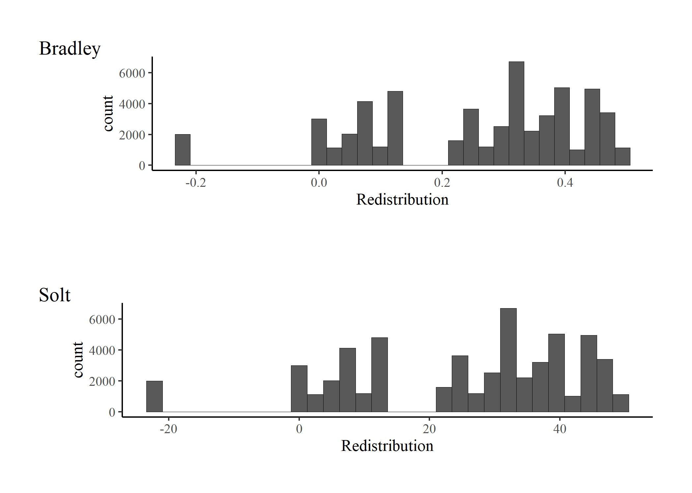

```{r eval=FALSE, include=FALSE}
rmarkdown::render(input = "production/prod_prep-data-A.Rmd",output_format = "html_document",output_dir = "production/");browseURL(url = "production/prod_prep-data-A.html")
```

```{r include=FALSE}
knitr::opts_chunk$set(warning = FALSE,message = FALSE, cache = TRUE,results = "hold")
knitr::opts_knit$set(root.dir = "../")
options(scipen=999)
rm(list=ls())
options(knitr.kable.NA = '')
```

# Document content: Data preparation

In this site the production and adjustment of the databases that are used for the multilevel analysis are exposed. The work in general focuses on selecting and recoding variables obtained from international databases such as the International Social Survey (ISSP) and the Standardized World Income Income Inequality Database (SWIID). In addition, factor analyzes are performed to subsequently impute predicted values that represent the estimated latent variables.

In the first section, in addition to selecting and recoding ISSP variables, factor analyzes are performed to evaluate and create the latent variables of preferences about redistribution and inequality. In section 2, international SWIID, GOQ and World bank data  are collected and added together with ISSP data, which includes predicted values for latent variables of meritocratic perceptions and preferences.


### load packages

```{r}
library(sjPlot)
library(sjmisc) # several functions,ej read_stata
library(descr)
library(memisc)  # codebook
library(psych) # cor2latex
library(corrplot) # graph correlations
library(lavaan)
library(stargazer)
library(semTools)
library(plyr) # count
library(dplyr)
#library(car) # recode
library(ggplot2)
#library(Hmisc)
library(tidyverse)
library(data.table)
library(stringr)
library(countrycode)
library(lme4)
library(texreg)
library(mice)
library(ggrepel) # for scatter labels in sjp.scatter
#library(semPlot)
library(haven)
library(sjlabelled)
library(kableExtra)
library(summarytools)
library(tidyselect)
library(magrittr)
library(semPlot)
#library(Hmisc)
library(knitr)

```

# Section 1: Preparation individual variables ISSP

## 1.1 General preparation ISSP

 - change variable names to lowercase
 - Generate new sequential id individuals by country to merge

```{r results='hide'}
load(file = "input/data/original/issp.rda")
#load(url('https://raw.githubusercontent.com/franciscomeneses/bases/master/issp.rda'))

# Check data  
#names(issp2009)

#sjPlot::view_df(issp2009)

### change variable names to lowercase
names(issp2009) <- tolower(names(issp2009)) 

### Check & generate IDs (v4: respondent, v5: country)
### Generate new sequential id individuals by country to merge
issp2009$id <- sequence(tabulate(issp2009$v5))
issp2009$idtem=issp2009$v5*10000  
issp2009$id=issp2009$idtem + issp2009$id
```

##  1.2 Preparation-data of the redistributive preference scales: redistrib.rda    

| Code | New Code   | Variable                                                                                                        |
|------|------------|-----------------------------------------------------------------------------------------------------------------|
| v33  | income_dif | Gov. resp to reduce differences in income                                                                       |
| v34  | unemployed | Gov. resp to provide decent s andard of living for unemployed                                                   |
| v36  | taxes      | People with high income should pay a larger / same smaller sha3re of income in taxes than those with low income |
| v38  | health     | ok if people with high income can buy better health                                                             |
| v39  | educ       | ok if people with high income can buy better education                                                          |                     Table:`Items for latent variables`                                   

### 1.2.1 Preparation

- Rename & define object
 
```{r results='asis'}
# select
redistrib=issp2009[,c("v5","v33","v34","v36","v38","v39","id")]
   
# new names(issp2009)
redistrib$income_dif = redistrib$v33
redistrib$unemployed = redistrib$v34
redistrib$taxes     = redistrib$v36
redistrib$health    = redistrib$v38
redistrib$educ      = redistrib$v39

#Delete old variables
redistrib = redistrib[-c(2:6)]
stargazer(redistrib[-c(1,2)], type="html")  
```


- Recode NAs (9)

```{r results='asis'}
redistrib[3:7][redistrib[3:7] > 5] <- NA
stargazer(redistrib[-c(1,2)], type="html") 
```

```{r}
dim(redistrib)
```

- adjust labels NAs

```{r}
get_labels(redistrib$income_dif)
redistrib[,3:7] <-sjlabelled::set_na(redistrib[,c("income_dif","unemployed", "taxes", "health", "educ")], na = c(8,9))  
```

-  Reverse code for SEM models

```{r}
redistrib[3:7]=6-redistrib[3:7]
```

### 1.2.2 Factor scores 

```{r cache=TRUE, results='hide'}
cfa_red1 <- '
	# latent variables
	redist =~ income_dif + unemployed + taxes
	accum  =~ health + educ
	'
```

 - generate 5 multiple complete datasets
 - fit model for each complete dataset
 - predict scores for all model
 - compute 'average' across 5 sets of scores

```{r include=FALSE, cache=TRUE}
# generate 5 multiple complete datasets
out <- mice(redistrib[3:7], m = 5)

D1 <- complete(out, 1)
D2 <- complete(out, 2)
D3 <- complete(out, 3)
D4 <- complete(out, 4)
D5 <- complete(out, 5)

# fit model for each complete dataset
fit1 <- cfa(cfa_red1, data = D1)
fit2 <- cfa(cfa_red1, data = D2)
fit3 <- cfa(cfa_red1, data = D3)
fit4 <- cfa(cfa_red1, data = D4)
fit5 <- cfa(cfa_red1, data = D5)

# predict scores for all models
p1 <- predict(fit1)
p2 <- predict(fit2)
p3 <- predict(fit3)
p4 <- predict(fit4)
p5 <- predict(fit5)

# compute 'average' across 5 sets of scores:
scores <- (p1 + p2 + p3 + p4 + p5) / 5

#Generate factor scores
scores_dat = as.data.frame(scores)

# Adaptar base para agregar factor scores (sacar todos NA)
redistrib_m = redistrib[rowSums(is.na(redistrib[3:7])) != 5, ]

# Merge with factor scores
redistrib_sco = cbind(redistrib, scores)

# Check
stargazer(redistrib_sco[, 8:9], type = "text")

# Save  factor scores
save(redistrib_sco, file = "input/data/proc/redistrib_sco.rda")
```

redistrib_sco [56021,9]

```{r}
print(dfSummary(redistrib_sco, valid.col = FALSE, graph.magnif = 1),
      max.tbl.height = 300, method = "render")
```

## 1.3 Prepare individual level variables.

```{r results='asis'}
### Select
indepvar= issp2009 %>% dplyr::select(contains("_inc"), "sex","age","degree", "hompop", "v44", "v45", "movstatus"="v46", "v5","id")

### Recode sex
sex_plotbefore <- sjPlot::plot_frq(indepvar$sex, title ="Gender before") + xlab("Sex")

indepvar$sex=ifelse(indepvar$sex==1,0,ifelse(indepvar$sex==2,1,NA))  

sex_plotafter <- sjPlot::plot_frq(indepvar$sex, title ="Gender after") + xlab("Sex")

cowplot::plot_grid(sex_plotbefore, sex_plotafter, ncol=2)

### Recode Age
  # Age
agebefore<-sjPlot::plot_frq(indepvar$age, title = "Age before",show.mean = T , show.values = F,show.n = F, axis.labels = NULL, type = c("histogram")) + xlab("Age")

#which(indepvar$age > 85) # / 461 casos !
#which(indepvar$age < 15) # / 0 casos !
indepvar$age[indepvar$age > 85] = NA

# Categorical age
indepvar$age_c=indepvar$age
indepvar$age_c[indepvar$age_c <= 25] = 1
indepvar$age_c[indepvar$age_c > 25 & indepvar$age_c <=35] = 2
indepvar$age_c[indepvar$age_c > 35 & indepvar$age_c <=45] = 3
indepvar$age_c[indepvar$age_c > 45 & indepvar$age_c <=55] = 4
indepvar$age_c[indepvar$age_c > 55 & indepvar$age_c <=65] = 5
indepvar$age_c[indepvar$age_c > 65] = 6

ageafter <- sjPlot::plot_frq(indepvar$age_c, title = "Age after", show.na = T, axis.labels =   c("18-25","25 -35", "35-45", "45-55", "55,65", "65-85","NA(>85)")) + xlab("Age") 

cowplot::plot_grid(agebefore, ageafter, ncol=2)
 

### Recode Education
degrebefore <-sjPlot::plot_frq(indepvar$degree, coord.flip = TRUE, title = "Degree before") 
  # Recode. Values over 5 are removed
indepvar$degree[indepvar$degree > 5]=NA

#### Dummy university
# Dummy university
indepvar$univ=indepvar$degree
indepvar$univ=ifelse(indepvar$univ<=4,0,
ifelse(indepvar$univ==5,1,NA))

degreafter<- sjPlot::plot_frq(indepvar$univ, coord.flip = TRUE, title = "Dummy university") + xlab("University education")

cowplot::plot_grid(degrebefore, degreafter, ncol=2)


### Recode Income

#stargazer(indepvar[1:41], type="html")

# Income (variables finish in _inc)
# Continuo
   
   # Recode missings
      # Para todos los paises, recode missings.  
indepvar[1:41][indepvar[1:41] >= 9999990] <- NA
indepvar[1:41][indepvar[1:41] == 999990] =NA
indepvar[1:41][indepvar[1:41] == 999997] =NA
indepvar[1:41][indepvar[1:41] == 999998] =NA
indepvar[1:41][indepvar[1:41] == 999999] =NA
 

# Identificar ceros (para poder diferenciar de los NAs luego)
indepvar[1:41][indepvar[1:41] == 0] <- 111111

# Agregar ahora todos en un solo vector
indepvar$income=rowSums(indepvar[1:41],na.rm = TRUE)
indepvar$income[indepvar$income ==0]=NA
indepvar$income[indepvar$income ==1111]=0

#stargazer(indepvar[1:41], type="html")

#summary(indepvar$income)

### Recode Household income
# Household income

# Preparar numero de personas en household
indepvar$hompop[indepvar$hompop==99]=NA

# Ahora dividir el vector income por n° de personas en hogar
indepvar$hhincome=indepvar$income/indepvar$hompop
#summary(indepvar$hhincome)
 
# Y ajustar NAs de la variable final ingreso continuo
indepvar$hhincome[indepvar$hhincome==0]= NA
indepvar$hhincome[indepvar$income==111111]= 0
indepvar$hhincome[indepvar$hompop==0]= NA

#Wsummary(indepvar$hhincome)

# check
income=indepvar[c("v5", "ar_inc", "hompop","income",
"hhincome")]
# View(income)  

# Generar quintiles de ingreso
indepvar %>% group_by(v5) %>% mutate(quintile =
ntile(hhincome,5)) ->indepvar

# Check
#prop.table(table(indepvar$v5,indepvar$quintile),1)*100


# Generar quintiles con NA como categoria
indepvar$quintile_miss=indepvar$quintile
indepvar$quintile_miss[is.na(indepvar$quintile_miss)] = 6

sjPlot::plot_frq(indepvar$quintile_miss, coord.flip = TRUE, title = "income quintiles" , axis.labels=c("quintile 1","quintile 2","quintile 3","quintile 4","quintile 5","Miss")) + xlab("Income quintiles")

#stargazer(indepvar$quintile_miss, type = "html")

### Recode Subjetive status

# Subjective status
   
# Individual
#freq(indepvar$v44)
indepvar$sstatus=indepvar$v44
indepvar$sstatus[indepvar$ssttus>10]=NA
  #freq(indepvar$sstatus)
   
# Family
#freq(indepvar$v45)
indepvar$f_sstatus=indepvar$v45
indepvar$f_sstatus[indepvar$f_sstatus>10]=NA
#freq(indepvar$f_sstatus)

movestatusbefore <- sjPlot::plot_frq(indepvar$movstatus, coord.flip = TRUE, title = "Subjective Mobility before")    

indepvar$movstatus[indepvar$movstatus>=8]= NA
indepvar$movstatus <- car::recode(indepvar$movstatus,recodes ="c(1,2)=2;3=1;c(4,5)=3;c(6,7)=4")

indepvar$movstatus <- set_labels(indepvar$movstatus,labels = c("No mobility"=1,
                                                                "Upward mobility"=2,
                                                                    "Upward mobility"=3,
                                                                    "Indeterminate"=4))

movestatusafter <- sjPlot::plot_frq(indepvar$movstatus, coord.flip = TRUE, title = "Subjective mobility after")     
cowplot::plot_grid(movestatusbefore, movestatusafter, ncol=2) + xlab("Subjective status mobility")
```

```{r}
#Codigos por incorporar: se deben hacer ajustes de moneda y partidos por pais. 

# Home value (ver Nota 3)
#summary(indepvar$v67)

  # Party
    #freq(issp2009$party_lr)
#prop.table(table(indepvar$v5,indepvar$party_lr),1)*100
# paises sin datos: CL, CN, CY, HU, IL, TW
#freq(indepvar$cl_prty) # estan
#freq(indepvar$cn_prty) # no
#freq(indepvar$cy_prty) # si
#freq(indepvar$hu_prty) # si
#freq(indepvar$il_prty) # si
#freq(indepvar$tw_prty) # si

# para usarlas habría que clasificar partidos de esos países
```

```{r}
#Eliminar income por paises. 
indepvar=indepvar[-c(1:41)]
dim(indepvar)
View(indepvar)
```

```{r}
#indepvar_graph<-as.data.frame(indepvar[,2:16])
print(dfSummary(indepvar[-c(8)], valid.col = FALSE, graph.magnif = 1),
      max.tbl.height = 300, method = "render")
```


## 1.4 Measurement Merit & Getting ahead

| Code  	| New Code  	| Variable              	|
|-------	|-----------	|-----------------------	|
| v6    	| wealthy   	| wealthy family        	|
| v7    	| pareduc   	| educated parents      	|
| v9    	| ambition  	| ambition              	|
| v10   	| hwork     	| hard work             	|
| v11   	| people    	| right people          	|
| v12   	| polcone   	| political connections 	|
| v14   	| race      	| race                  	|
| v16   	| gender    	| gender                	|
| v5    	| -         	| Country               	|
| id    	| -         	| inividual id          	|


```{r results='hide'}
    # Rename
getahead = issp2009[, c("v6", "v7", "v9", "v10", "v11", "v12",
                        "v14", "v16", # get ahead
                        "v5", "id")]

getahead$wealthy = getahead$v6
getahead$pareduc = getahead$v7
getahead$ambition = getahead$v9
getahead$hwork = getahead$v10
getahead$people = getahead$v11
getahead$polcone = getahead$v12
getahead$race = getahead$v14
getahead$gender = getahead$v16

getahead = getahead[-c(1:8)]

# recode values 8 9 to NA
#freq(getahead$wealthy)
getahead[3:10][getahead[3:10] > 5] <- NA
#freq(getahead$gender) # check ok
stargazer(getahead, type = "html")

# adjust labels
get_labels(getahead$wealthy)
getahead[, 3:10][getahead[, 3:10] >= 8] <- NA
get_labels(getahead[3:10]) # check

# Reverse code for SEM models
getahead[3:10] = 6 - getahead[3:10]

# Generate variables with 3 values for getahead mess model categoric
#names(getahead)
getahead_temp = subset(getahead[c(2, 3:10)])
#names(getahead_temp)
getahead_temp[2:9][getahead_temp[2:9] <  4] <- 3
# freq(getahead_temp$hwork)
#freq(getahead$hwork)


colnames(getahead_temp) = paste("c3", colnames(getahead_temp),
                                sep = "")
names(getahead_temp)[names(getahead_temp) == "c3id"] <- "id"
getahead_temp2 = merge(getahead, getahead_temp, by = c("id"))
names(getahead_temp2) # ok
getahead = getahead_temp2
```

```{r likert-getahead}
plot_likert((getahead[,3:8]), 
                        geom.colors   = c("#9ecae1", "#6baed6","#4292c6", 
                                            "#2171b5"), # colorbrewer2.org 
                        sort.frq      = "neg.asc", # sort descending)
                        title         = "getahead",
                        intercept.line.color = "white", # vertical middle
                        expand.grid   = F, # no inner margins in plot
                        show.n        = FALSE, # hide N's in axis labels
                        grid.range    = 1.8,
                        geom.size = 0.6) # expand axis 130% )
```

```{r}
# Save object
#  save(getahead, file="../objects/getahead.rda")
```

### Detearn

```{r}
#names(issp2009)
detearn = issp2009[, c("v47", "v48", "v49", "v50", "v51",
                       "v52", "v5", "id")]
#names(detearn)
detearn$respons 	= detearn$v47
detearn$yeduc  	  = detearn$v48
detearn$family    = detearn$v49
detearn$child     = detearn$v50
detearn$welljob   = detearn$v51
detearn$hardjob   = detearn$v52
#names(detearn)
detearn = detearn[-c(1:6)]
#names(detearn)
# recode values 8 9 to NA
#summary(detearn)
# freq(detearn$respons)
detearn[3:8][detearn[3:8] > 5] <- NA

# freq(detearn$respons) # check ok

#knitr::kable(summary(detearn), "html")

# Out Portugal (no answer in well job item)
detearn[which(detearn$v5 == 620), ] = NA
# adjust labels ###PROB PORTUCAL!!!
#get_labels(detearn)
detearn[, 3:8][detearn[, 3:8] >= 8] <- NA
detearn$welljob <- sjlabelled::set_na(detearn$welljob, na = c(0))
#knitr::kable(summary(detearn), "html")
# freq(detearn$welljob) ## prob portugal
detearn$welljob[detearn$welljob == 0] = NA
#get_labels(detearn$welljob)
labels(detearn$welljob) = labels(detearn$respons)### PROB NOT SOLVED

# Reverse code for SEM models
detearn$respons <- as.numeric(detearn$respons)
detearn$yeduc <- as.numeric(detearn$yeduc)
detearn$family <- as.numeric(detearn$family)
detearn$child <- as.numeric(detearn$child)
detearn$welljob <- as.numeric(detearn$welljob)
detearn$hardjob <- as.numeric(detearn$hardjob)
```

```{r likert-detearn-before}
before_detearn<-sjPlot::plot_likert(detearn[,3:8],
                    geom.colors   = c("#9ecae1", "#6baed6", "#4292c6", "#2171b5"), # colorbrewer2.org
                    cat.neutral = 3,
                    sort.frq      = "neg.asc", # sort descending)
                    title         = "Before detearn",
                    intercept.line.color = "white", # vertical middle
                    expand.grid   = F, # no inner margins in plot
                    show.n        = FALSE, # hide N's in axis labels
                    grid.range    = 1.8,
                    geom.size = 0.6) # expand axis 130% ))
before_detearn

save(before_detearn, file="output/images/before_detearn.png")

```


```{r likert-detearn-after}

detearn$respons = as.numeric(6 - detearn$respons)
detearn$yeduc = as.numeric(6 - detearn$yeduc)
detearn$family = as.numeric(6 - detearn$family)
detearn$child = as.numeric(6 - detearn$child)
detearn$welljob = as.numeric(6 - detearn$welljob)
detearn$hardjob = as.numeric(6 - detearn$hardjob)
  
after_detearn<- sjPlot::plot_likert(detearn[,3:8],
                    geom.colors   = c("#9ecae1", "#6baed6", "#4292c6", "#2171b5"), # colorbrewer2.org
                    cat.neutral = 3,
                    sort.frq      = "neg.asc", # sort descending)
                    title         = "After detearn",
                    intercept.line.color = "white", # vertical middle
                    expand.grid   = F, # no inner margins in plot
                    show.n        = FALSE, # hide N's in axis labels
                    grid.range    = 1.8,
                    geom.size = 0.6) # expand axis 130% ))


save(after_detearn, file="output/images/after_detearn.png")
after_detearn
```


## 1.5 Measuring Beliefs & Perceptions: merit_pref_perc

 - 
Estimation of the model c / unmerit 2nd order


- 

```{r, cache=TRUE}
# 3. MEASURING BELIEFS & PERCEPTIONS ------ -

# 3.1 Define object --------------------- -------------------------------

#			load("./objects/getahead.rda")
#			load("./objects/detearn.rda")
		#	names(getahead)
		#	names(detearn)

merit_per_pref=merge(getahead,detearn, by=c("id","v5"))
		#	names(merit_per_pref)

		
  # Estimation of the model c / unmerit 2nd order
cfa_perpref2 <- '
	  # latent variables
	  merit =~ hwork + ambition
	  parent=~ wealthy + pareduc
	  backg=~ race + gender
		network=~ people + polcone
		unmerit=~ parent + backg + network # 2nd order
	  bmerit =~ welljob + hardjob
	  need=~ family + child
	  '
fit_perpref2 <- cfa(cfa_perpref2, data = merit_per_pref,missing = "ML")
#	  summary(fit_perpref2, fit.measures=TRUE,standardized=TRUE)
  # Path model
		  semPaths(fit_perpref2,layout = "tree", rotation = 2,
		  	intercepts = FALSE, style = "lisrel", curvePivot = TRUE,
		  	sizeMan = 3.5, sizeLat = 6)
```


### Factor scores fit_perpref2: merit_per_pref_sco

```{r cache=TRUE, results='hide'}
out <- mice(merit_per_pref[,c(3:10,19:24)], m=5)
```

 - generate 5 multiple complete datasets
 - fit model for each complete dataset
 - predict scores for all model
 - compute 'average' across 5 sets of scores
 - Generate factor scores

```{r results='hide', cache=TRUE}
# Multiple imputation (para recuperar missings en scores) - REVIEW THIS, command lavPredict from 2017 should predict with missing values therefore saving from multiple imputation

# generate 5 multiple complete datasets

D1 <- complete(out, 1)
D2 <- complete(out, 2)
D3 <- complete(out, 3)
D4 <- complete(out, 4)
D5 <- complete(out, 5)

# fit model for each complete dataset
fit1 <- cfa(cfa_perpref2, data = D1)
fit2 <- cfa(cfa_perpref2, data = D2)
fit3 <- cfa(cfa_perpref2, data = D3)
fit4 <- cfa(cfa_perpref2, data = D4)
fit5 <- cfa(cfa_perpref2, data = D5)

# predict scores for all models
p1 <- predict(fit1)
p2 <- predict(fit2)
p3 <- predict(fit3)
p4 <- predict(fit4)
p5 <- predict(fit5)

# compute 'average' across 5 sets of scores:
scores <- (p1 + p2 + p3 + p4 + p5) / 5

# Generate factor scores
scores_dat = as.data.frame(scores)
dim(scores_dat)
str(scores_dat)
summary(scores)

# Generate object with factor scores
dim(merit_per_pref)
dim(scores_dat)
merit_per_pref_sco = cbind(merit_per_pref, scores)

# Save object with factor scores
#	names(merit_per_pref_sco)
merit_per_pref_sco = merit_per_pref_sco[, c(1:2, 25:31)]
#	  save(merit_per_pref_sco,
#	  file="./objects/merit_per_pref_sco.rda")

```


In this section, 3 databases were created on sociodemographic variables, dependent latent variables (Redistributive preferences) and independent latent variables (Meritocratic beliefs).

Each one is indicated below and later they are unified.

Indepvar.rda: sociodemografic variables 
redistrib_sco: latent variables of redistributive preferences.
merit_perc_pref_sco: latent variables of meritocratic beliefs. 


## Merge variables indivuales. 

```{r}
indiv<- merge (indepvar, redistrib_sco, by = c("id"))
indiv <- merge (indiv,  merit_per_pref_sco, by = c("id"))
```


```{r}
print(dfSummary(indiv, valid.col = FALSE, graph.magnif = 1),
      max.tbl.height = 300, method = "render")
```

```{r}
save(indiv, file="input/data/proc/indiv.rda")
```


# Section 2: Multilevel preparation data. 

```{r}
agg_lm=aggregate(indiv, by=list(indiv$v5),FUN=mean, na.rm=TRUE)

colnames(agg_lm) <- paste("j", colnames(agg_lm), sep = "_")
table(agg_lm$j_v5)

agg_lm$v5=agg_lm$j_v5	
mer_pref=merge(indiv,agg_lm, by="v5")

dim(mer_pref)
```

```{r}
mer_pref$age_g = mer_pref$age - mer_pref$j_age
mer_pref$sex_g = mer_pref$sex - mer_pref$j_sex
mer_pref$univ_g = mer_pref$univ - mer_pref$j_univ
mer_pref$sstatus_g = mer_pref$sstatus - mer_pref$j_sstatus
summary(mer_pref$univ_g)
```


## 2.1: Standardized World Income Income Inequality Database (SWIID)
```{r}
# Inequality swiid (4)        
#load(url("https://raw.githubusercontent.com/franciscomeneses/bases/master/swiid8_3.rda"))
load("input/data/original/swiid8_3.rda")

# convertir desde formato original list a dataframe
swiid_summary <- swiid %>%  bind_rows() %>%
group_by(country, year) %>%  
summarize_all(funs(mean, sd)) %>%
ungroup() %>% dplyr::rename(.dots=setNames(names(.),
str_replace(names(.), "_mean", ""))) %>%  
dplyr::rename_(.dots=setNames(names(.),str_replace(names(.), "_sd", "_se")))

save(swiid_summary, file = "input/data/proc/swiid_summary.rda")
```

###  Filter only 2009
```{r}
summary(swiid_summary$.dots...year)
swiid_summary09=subset(swiid_summary, .dots...year==2009)
```


###  Merge with indepvar object

```{r}
# Generate equivalente country code
head(swiid_summary09$.dots...country)
as.numeric(swiid_summary09$country)
 
# Continuous variable

swiid_summary09$v5=countrycode(swiid_summary09$.dots...country,'country.name','iso3n')
str(swiid_summary09$v5)

# categorical variables

swiid_summary09$v5c=countrycode(swiid_summary09$.dots...country,'country.name','iso3c')
str(swiid_summary09$v5c)

# Merge
#indepvar <- merge(swiid_summary09,indepvar,by=c("v5"))
#summary(indepvar$.dots..._1_gini_disp)
```


```{r}
mer_pref<- merge(swiid_summary09,mer_pref, by=c("v5"))
```

```{r}
mer_pref$gini_neto<- mer_pref$.dots...gini_disp
mer_pref$gini_mkt <- mer_pref$.dots...gini_mkt
```

```{r}
mer_pref$redis_neto= as.numeric(mer_pref$gini_mkt - mer_pref$gini_neto)

mer_pref$redis_relativo = as.numeric(mer_pref$redis_neto / mer_pref$gini_mkt)

#hist(mer_pref$redis_relativo)
```

```{r}
mer_pref$redis_bradley  <- as.numeric((1- mer_pref$gini_neto / mer_pref$gini_mkt) *100)
#hist(mer_pref$redis_bradley)
```


Two ways of calculating the redistribution variable at the country level are presented below. Both proportionally equivalent.
   
   +  Calculation according to Bradley[(2003)](https://www.jstor.org/stable/25054218?seq=1) __(net gini/gini mkt)*100__
   
   + Calculation used by Solt in [SWIID](https://fsolt.org/swiid/) __(gini mkt - gini net)/gini mkt__


```{r }
### Recode Age
  # Age 
hist1 <- mer_pref %>% ggplot(aes(x=redis_relativo)) + geom_histogram() + xlab("Redistribution")
hist2 <- mer_pref %>% ggplot(aes(x=redis_bradley)) + geom_histogram() + xlab("Redistribution")
ggsave(plot_grid(list(hist1, hist2), tags = c("Bradley", "Solt")),  file ="output/images/redistriv_comparation.png")
```



## 2.2:  Quality of Government (QoG)

 - to download the database from your quote on github
 
```{r echo=FALSE, results='hide'}
# to download the database from your quote on github

#devtools::install_github("ropengov/rqog")
#library("rqog")

#qog2009_dta<-read_qog(
#  which_data = "standard",
#  data_type = "time-series",
#  year = 2009,
#  data_dir = NULL,
#  file_format = "csv",
#  download_only = FALSE,
#  cache = TRUE,
#  update_cache = FALSE
#)

```


```{r results='hide'}
load( file = "input/data/original/qog.rda")
#load(url('https://raw.githubusercontent.com/franciscomeneses/bases/master/qog.rda'))    

# Extract 2009 data
qog2009 = subset(qog, year == 2009)


# hist(qog$sgi_ectx) # Desempeño de las políticas: políticas económicas - impuestos 
# hist(qog$sgi_sogi) # Desempeño de las políticas: Políticas sociales - Desigualdades sociales globales


# Merge with ISSP countries for cleaning

load("input/data/proc/indepvar_contries.rda")
issp_countries =	aggregate(indepvar_contries[c("v5")],
                           list(indepvar_contries$country, indepvar_contries$v5c),
                           mean)

qog2009[c("ccode", "cname")] # check ISO codes
names(qog2009)[names(qog2009) == 'ccode'] <- 'v5'
qog2009_c = merge(issp_countries, qog2009, by = c("v5"))
dim(qog2009_c)
colSums(is.na(qog2009_c))

# Eliminar columnas con máximo 5 NAs
qog2009_c_na = qog2009_c[, colSums(is.na(qog2009_c)) < 6]

qog2009_c_na = qog2009_c %>% dplyr::select("v5", "fi_index") %>% as.data.frame()
# "sgi_ectx", "sgi_sogi" # Hasta ahora no hay valores, parece no haber para el 2009
```

__Economic fredom variable description:__ The index is founded upon objective components that reflect the presence (or absence) of economic freedom. The index comprises 21 components designed to identify the consistency of institutional arrangements and policies with economic freedom in five major areas: size of government (fi_sog), legal structure and security of property rights (fi_legprop), access to sound money (fi_sm), freedom to trade internationally (fi_ftradeint), regulation of credit, labor and business (fi_reg). The index ranges from 0-10 where 0 corresponds to less economic freedom and 10 to more economic freedom. This is the version of the index published at the current year of measurement, without taking methodological changes over time into account.

- Merge

```{r}
mer_pref <- merge(mer_pref, qog2009_c_na, by=c("v5"))
```


```{r}
sjPlot::plot_frq(mer_pref$fi_index, title = "Pib Per capita",show.mean = T , show.values = F,show.n = F, axis.labels = NULL, type = c("histogram")) +xlab("Economic freedom")
```

# Data Ban

Country data on their wealth and government effectiveness were obtained from World Bank data sets. This institution has an extensive set of data and a platform to facilitate its accessibility, which you can access [here](https://datos.bancomundial.org/).

## GDP per capita (current US $)

To access the data click [here](https://datos.bancomundial.org/indicador/NY.GDP.PCAP.CD)

```{r}
 library(readxl)
 pibpc <- read_excel("input/data/original/pibpc.xls", sheet = "Data")
 View(pibpc)

 pibpc$v5c<-pibpc$CountryCode

pibpc$pibpc <- pibpc$`PIB per cápita (US$ a precios actuales)`

mer_pref <- merge(mer_pref, pibpc, by=c("v5c"))


sjPlot::plot_frq(mer_pref$pibpc, title = "Pib Per capita",show.mean = T , show.values = F,show.n = F, axis.labels = NULL, type = c("histogram"))
```

Taiwan does not have information on GDP in the world bank, therefore the GDP per capita for this country was obtained from another source: [DatosMacro](https://datosmacro.expansion.com/pib/taiwan)


```{r}
save(mer_pref, file="input/data/proc/mer_pref.rda")
```


## Government effectiveness

```{r}
gov_effect <- read_excel("input/data/original/Data_Extract_From_Indicadores_mundiales_de_buen_gobierno.xlsx")

gov_effect$v5c<-gov_effect$`paiscode`

gov_effect$goveffect <- as.numeric(gov_effect$`2009 [YR2009]`)

mer_pref <- merge(mer_pref, gov_effect, by=c("v5c"))

sjPlot::plot_frq(mer_pref$goveffect, title = "government effectiveness",show.mean = T , show.values = F,show.n = F, axis.labels = NULL, type = c("histogram")) + xlab("Government effectiveness")
```

[World Bank](https://databank.bancomundial.org/databases/governance-effectiveness)

Government effectiveness captures perceptions of the quality of public services, the quality of civil service, and the degree
its independence from political pressures, the quality of policy formulation and implementation, and the credibility of the
government commitment to such policies. More information [here](https://info.worldbank.org/governance/wgi/pdf/ge.pdf)


```{r}
save(mer_pref, file="input/data/proc/mer_pref.rda")
```

```{r}
mer_pref_polycor <- mer_pref %>% dplyr::select( 
"j_redist", "j_accum" , "j_merit","j_unmerit","j_bmerit","j_need",".dots...gini_disp",".dots...gini_mkt","fi_index", "pibpc", "redis_relativo","goveffect")
save(mer_pref_polycor, file ="input/data/proc/mer_pref_polycor.rda")
```
